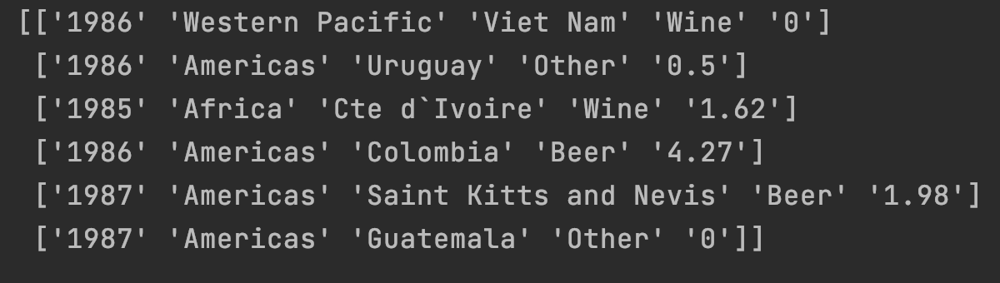
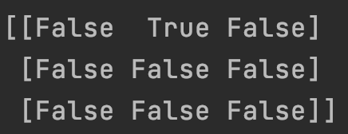
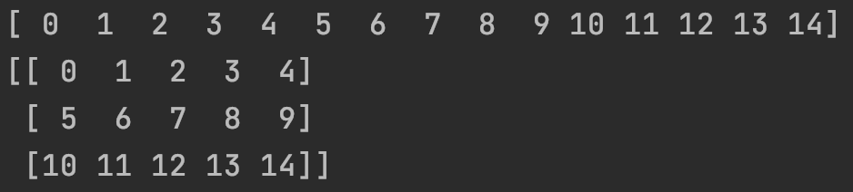

### 1.数据结构

```
print(help(xxx))    #help()  查询函数使用手册
```

#### **矩阵定义**
```
import numpy
vector = numpy.array[5,10,15,20]
matrix = numpy.array([[5,10,15],[20,25,30],[35,40,45]])
print(vector)
print(matrix)
```
<br/>

#### **.shape 打印维度**
```
vector = numpy.array([1,2,3,4])
print(vector.shape)     #.shape 打印变量的维度(几行，几列)

matrix = numpy.array([5,10,15],[20,25,30])
print(matrix.shape)
```
<br/>

#### **变量类型定义**
Each value in a Numpy array has to have the same data type.
Numpy will automatically figure out an approriate data type when reading in data or converting lists to array.
You can check the data type of a Numpy array using the dtype property.
```
import numpy
numbers = numpy.array([1,2,3,4.0])
print(numbers)
numbers.dtype       #打印Numpy数据类型
```
<br/>


#### **txt中读取数据/提取**

```
import numpy
world_alcohol = numpy.genfromtxt("./world_alcohol.txt",delimiter = ",", dtype = str, skip_header = 1)
print(world_alcohol)
```
<div align = center>



</div>

提取数据
```
uruguay_other_1986 = world_alcohol[1,4]
third_country = world_alcohol[2,2]
print(uruguay_other_1986)
print(third_country)
```
<div>

</div>
<br/>


#### **切片**

```
vector = numpy.array([5,10,15,20])
print(vector[0:3])
```
[ 5 10 15]

```
matrix = numpy.array([
    [5,10,15],
    [20,25,30],
    [35,40,45]
])
print(matrix[:,1])
```
[10 25 40]
```
matrix = numpy.array([
    [5,10,15],
    [20,25,30],
    [35,40,45]
])
print(matrix[1:3,0:2])
```

[[20 25]

 [30 40]]

 ***

### 2. 基本操作

#### **判断**
```
import numpy
matrix = numpy.array([[5,10,15],[20,25,30],[35,40,45]])
print(matrix == 10)
```
<div align = center>


</div>

```
import numpy
matrix = numpy.array([[5,10,15],[20,25,30],[35,40,45]])
vector = (matrix == 10)
print(vector)
print(matrix[vector])
```
传出符合条件的值
<div align = center>

</div>

<div align = center>

</div>

#### **判断（与或）**
```
vector = numpy.array([5,10,15,20])
equal_to_ten_and_five = (vector == 10) & (vector == 5)
print(equal_to_ten_and_five)
```
```
vector = numpy.array([5,10,15,20])
equal_to_ten_and_five = (vector == 10) | (vector == 5)
print(equal_to_ten_and_five)
```
```
vector = numpy.array([5,10,15,20])
equal_to_ten_and_five = (vector == 10) | (vector == 5)
vector[equal_to_ten_and_five] = 50
print(vector)
```
[50 50 15 20]

<br/>

#### **类型转换**

```
vector = numpy.array(["1","2","3"])
print(vector.dtype)
print(vector)
vector = vector.astype(float)
print(vector.dtype)
print(vector)
```
<div align = center>

</div>
<br/>

#### **最小值**
```
vector = numpy.array([5,10,15,20])
vector.min()
```

#### **sum行或列**
The axis dictates which dimension we perform the operation on
1 means that we want to perform the operation on each row, and 0 means on each column
```
matrix = numpy.array([
    [5,10,15],
    [20,25,30],
    [35,40,45]
])
matrix.sum(axis=1)
```
array([30, 75, 120])

***

### 3.矩阵属性

#### **创造矩阵**
```
import numpy as np
print(np.arange(15))
a = np.arange(15).reshape(3,5)
```
<div align = center>

</div>

`a.shape` ->（3，5）
\# the number of axes (dimensions) of the array
`a.ndim`   -> 2 

`a.dtype.name`  -> 'int32'

\# the total number of elements of the array
`a.size` -> '15'

\# 生成0矩阵
`np.zeros((3,4))`-> 生成三行四列0矩阵

\# 生成1矩阵
`np.ones((2,3,4),dtype=np.int32)`


