#1. 界面认识

**主界面：**

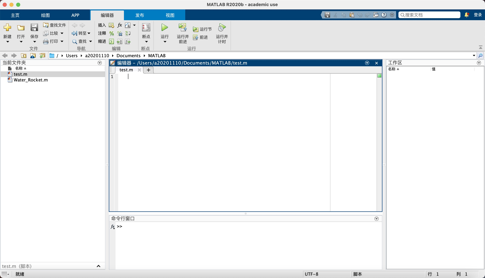

**预设：**  调节参数（字体）

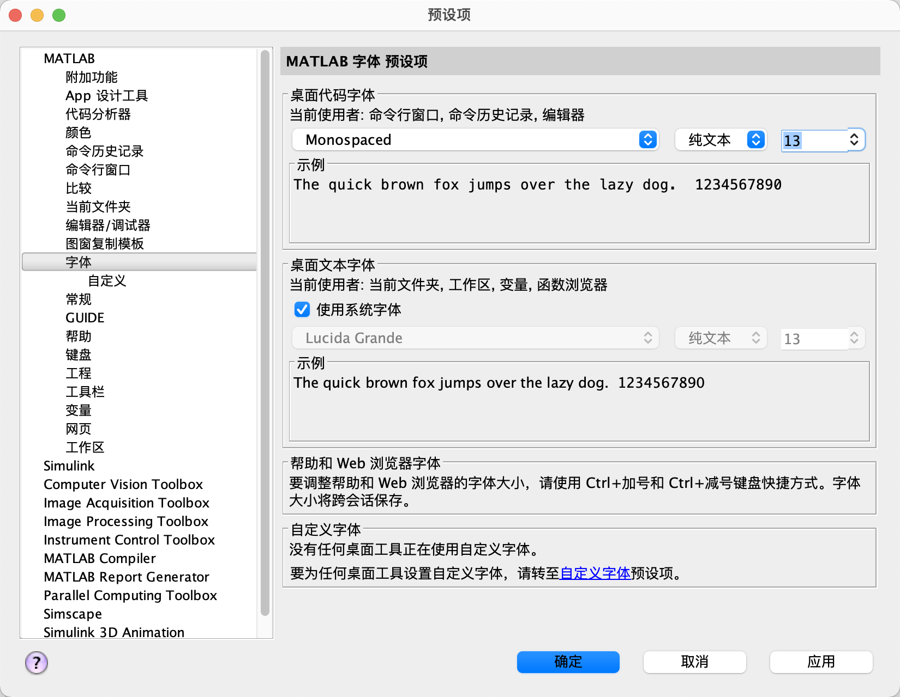

**命令行窗口：**
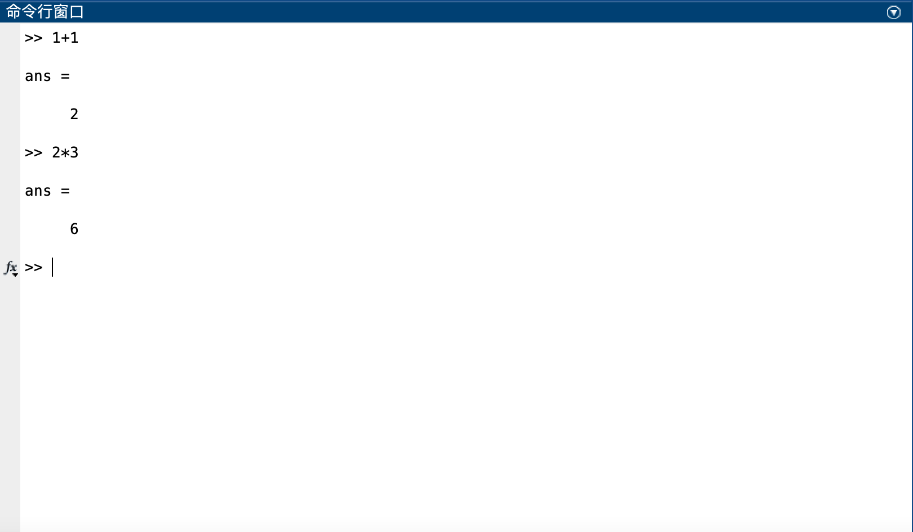
clc清除

**编辑器：**
新建--脚本

**Matlab命名规则**
· 变量名区分大小写
· 变量名长度不超过63位 （MATLAB R2012a 32bit和64bit计算机上测试结果）
· 变量名以字母开头，可以由字母、数字和下划线组成，但不能使用标点
· 变量名简洁明了，通过变量名可以直观看出变量所表示的物理意义

#2. 变量的命名

**Matlab 数据类型**
· 数字
· 字符和字符串
· 矩阵
· 元胞数组
· 结构体

**Matlab注释**
%       某个语句注释
%%      某个程序块注释

1. 清除环境变量及命令
    ```
    clear all       % 清除workspace中的所有变量
    clc             % 清除Command Window中的所有命令
    ```
***
2. 变量命名规则
   1. 变量名区分大小写
        ```
        A = 2
        a = 3
        ```
    2. 变量名长度不超过63位
    3. 变量名以字母开头，可以由字母、数字和下划线组成，但不能使用标点
    4. 变量名简洁明了，通过变量名可以直观看出变量所表示的物理意义
***
3. Matlab数据类型
   1. 数字
        ```
        1 2 3 4 5
        + - * /
        ```
    2. 字符与字符串(单引号定义)

        ```
        s = 'a'
        abs(s)          %ASCII码
        char(65)
        num2str(65)
        str = 'I love Matlab'
        
        length(str)

        doc num2str
        ```

    3. 矩阵
        ```
        A = [1 2 3; 4 5 6; 7 8 9]
        B = A'
        C = A(:)
        D = inv(A)
        A * D

        E = zeros(10,5,3)
        E(:,:,1) = rand(10,5)
        E(:,:,2) = randi(5,10,5)
        E(:,:,3) = randn(10,5)

        ```
        rand、randi和randn的区别
        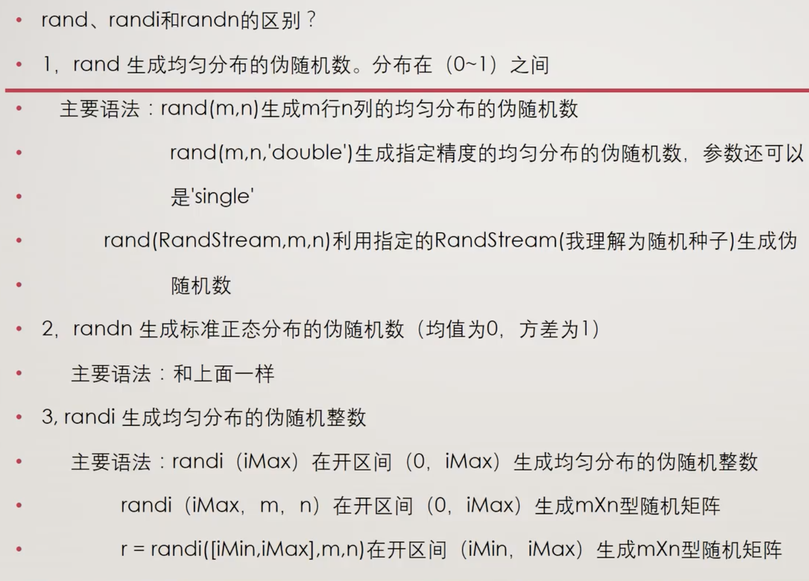

    4. 元胞数组
        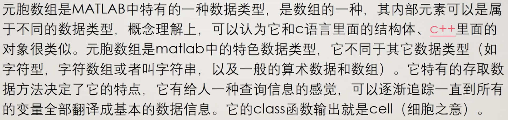

        ```
        A = cell(1, 6)
        A{2} = eye(3)       % Matlab索引从1开始
        A{5} = magic(5)
        B = A{5}

        ```
        **Magic**
        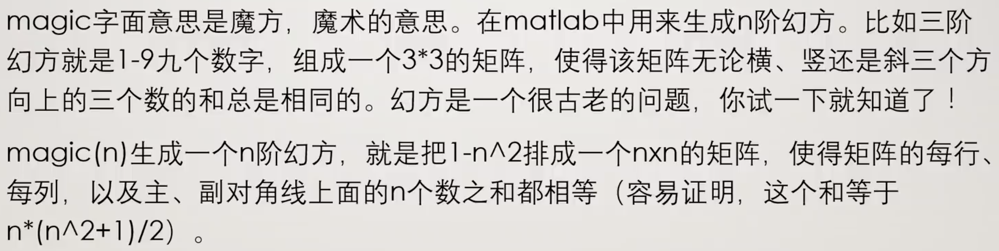

    5. 结构体
        ```
        books = struct('name',{{'Machine Learning','Data Mining'}},'price',[30 40])
        books.name          %属性
        books.name(1)       %取出为cell
        books.name{1}       %取出为string
        ```
***
4. Matlab举证操作
   1. 矩阵的定义与构造
        ```
        A = [1 2 3 5 8 5 4 6]
        B = 1:2:9
        C = repma(B, 3, 1)
        D = ones(2, 4)
        ```
    2. 矩阵的四则运算
        ```
        A = [1 2 3 4;5 6 7 8]
        B = [1 1 2 2;2 2 1 1]
        C = A + B
        D = A - B
        E = A * B'
        F = A .* B
        G = A / B
        H = A ./ B
        ```
    3. 矩阵的下标
        ```
        A = magic(5)
        B = A(2,3)
        C = A(3,:)
        D = A(:,4)
        [m,n] = find(A > 20) %找到大于20的序号值/矩阵
        ```

***

#3. 程序结构

###Matlab逻辑与流程控制

```
if...else...end
for...end
while...end
switch...case...end
```
1. 循环结构
   1. for 循环结构
        for循环语句允许按照给定的判断范围或给定的循环次数重复完成一次或多次运算。它从for开始，用end结束，也成为for...end结构，它的基本格式为：
            ```

            for 循环变量 = 初值：步长：终值
                执行语句1
                ...
                执行语句n
            end
        其中，步长的默认值为1，可以省略；初值、步长、终值可以是正数也可以是负数，还可以是整数，也可以是小数，只要符合数学逻辑即可。
        <br/>
        例1：求 $1^2+2^2+3^2+4^2+5^2$ 的和。
        程序设计为：
        ```
        sum = 0;
        for n = 1:5
            sum = sum + n^2;
            end
        ```
        <br/>

        例2：使用for循环求 $\displaystyle\sum_{i=1}^5i!$ 的值。
        程序设计为：
        ```
        sum = 0;
        for i = 1:5
            p = 1;
            for j = 1:i
            p = p * j;
            end
            sum = sum + p;
        end     %sum = 153
        ```
        <br/>

        例3：设计一个九九乘法表。
        程序设计为：
        ```
        for i = 1:9
            for j = 1:9
                a(i,j) = i.*j;
                end
            end
        a       
        ```

    2. while 循环结构
        MATLAB提供了另一种循环结构--while 循环结构。它根据给定的条件，决定是否以不确定的循环次数来执行循环语句体，该循环结构的基本格式为：
        ```
        while   条件表达式
                执行语句1
                ...
                执行语句n
        end
        ```
        其执行方式为：若条件表达式中的条件成立，则执行循环语句体；如果表达式不成立，则执行end后面的语句。
        <br/>

        例：求$1+2+3+4+5+...+10$的和。
        程序设计为：
        ```
        s = 0;
        n = 1;
        while n <= 10
            s = s + n;
            n = n + 1;
        end
        s       %s = 55;
        ```
        <br/>

        例：设计一段程序，求1~100 的奇数和。
        程序设计为：
        ```
        x = 1;
        sum = 0;
        while x < 101
            sum = sum + x;
            x = x + 2;
        end
        sum     %sum = 2500
        ```
        <br/>

        while 循环结构也可以实现嵌套，其结构为：
        ```
        while 条件表达式1
            循环语句体1;
                while 条件表达式2
                    循环语句体2；
                end
            循环语句体3
        end
        ```

    3. 分支结构
        除了前面介绍的顺序结构、循环结构外，MATLAB还提供了分支结构语句，使得MATLAB在编程过程中更灵活、更便于使用。
        1. if ... end 结构
            这种分支结构是该结构中最简单的一种应用形式，它的结构格式为：
            ```
            if 条件表达式
                ...
                语句体
                ...

            end
            ```
            该结构只有一个判断语句，当条件表达式为真的时候，就执行语句体；如果条件表达式为假，则跳出条件体，而执行end后面的语句。
            <br/>
        
            **例**：用 if...end 结构编写一段程序，要求满足条件时系统显示“成立”。
            在 MATLAB 的命令窗口中设计程序为：
            ```
            a = 100;
            b = 20;
            if a > b
                '成立'
            end
            ```
        <br/>

        2. if ... else ... end 结构
            这种分支结构为：
            ```
            if 表达式
                语句体 1
            else
                语句体 2
            end
            ```
            此时，如果表达式为真，则系统将执行语句体1；如果表达式为假，则系统将执行语句体2.
        <br/>

            **例**：使用 if ... else ... end 结构编写一段程序，要求满足条件时系统显示“成立”；不满足条件时系统显示“不成立”。
            程序设计为：
            ```
            a = 100;
            b = 20;
            if a > b
                '成立'
            else
                '不成立'
            end
            ```
        <br/>

        3. switch ... case ... end 结构
            switch ... case ... end 结构是通过与某个表达式的值进行比较，根据比较的结果做不同的选择，以实现程序的分支功能，它的结构格式为：
            ```
            switch  表达式（数字或字符串）
                    case 数值或者字符串1
                        语句体1；
                    case 数值或者字符串2
                        语句体2；
                        ...
                    otherwise
                        语句体n；
            end
            ```
            switch 后面表达式的值为数值变量或字符变量，通过这些值与 case 后面数值或字符串的值进行比较，与哪一个 case 的值相同就执行哪一个 case 下面的语句体，如果与所有的 case 的值都不相同，则执行 otherwise 下面的语句体。otherwise 语句可以省略，如果省略 otherwise， 所有 case 都不满足时，跳出分支结构，另外 Switch 必须与 end 配对使用。
            **例**：使用 switch ... case ... end 结构，判断输入数值符号的极性。
            在命令窗口输入以下命令，判断输入值的符号极性：
            ```
            input_num = input('输入数=')；
                switch input_num > 0;
                    case 0;
                        disp('输入数为负数')；
                        ...
            ```

 ***

 # 4.二维平面绘图

   1. 二维平面绘图
        ```
        x = 0:0.01:2*pi;
        y = sin(x);
        figure          %建立一个幕布
        plot(x,y)
        title('y = sin(x)')
        xlabel('x')
        ylabel('sin(x)')
        xlim([0 2*pi])
        ```

        共用坐标轴
        ```
        x = 0:0.01:20;
        y1 = 200*exp(-0.05*x).*sin(x);
        y2 = 0.8*exp(-0.5*x).*sin(10*x);
        figure
        [AX,H1,H2] = plotyy(x,y1,x,y2,'plot');
        set(get(AX(1),'Ylabel'),'String','Slow Decay')
        set(get(AX(2),'Ylabel'),'String','Fast Decay')
        xlabel('Time (\musec)')
        title('Multiple Decay Rates')
        set(H1,'LineStyle','--')
        set(H2,'LineStyle',':')

        ```
        [AX,H1,H2] = plotyy(___) 返回 AX 中创建的两个坐标区的句柄，以及 H1 和 H2 中每个绘图的图形对象的句柄。AX(1) 是左边的坐标区，AX(2) 是右边的坐标区

        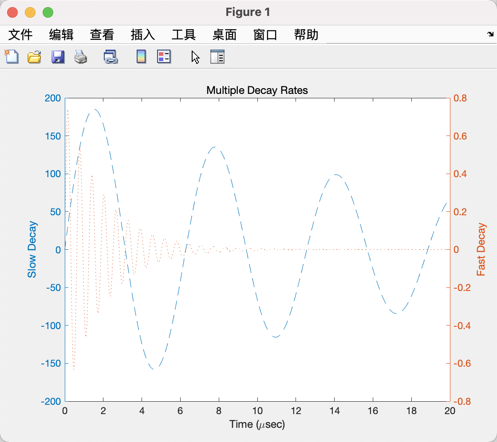

        <br/>


2. 三维立体画图
    ```
    t = 0:pi/50:10*pi;
    plot3(sin(t),cos(t),t)
    xlabel('sin(t)')
    ylabel('cos(t)')
    zlabel('t')
    grid on         %显示轴网格线
    axis square     %将当前坐标系图形设置为方形。横轴及纵轴比例为1：1
    ```    

    hold on/hold off

    **前者**的意思是，你在当前图的轴（坐标系）中画了一幅图，再画另一幅图时，原来的图还在，与新图共存，都看得到
    **后者**表达的是，你在当前图的轴（坐标系）中画了一幅图，此时，状态是hold off,则再画另一幅图时，原来的图就看不到了，在轴上绘制的是新图，原图被替换了

    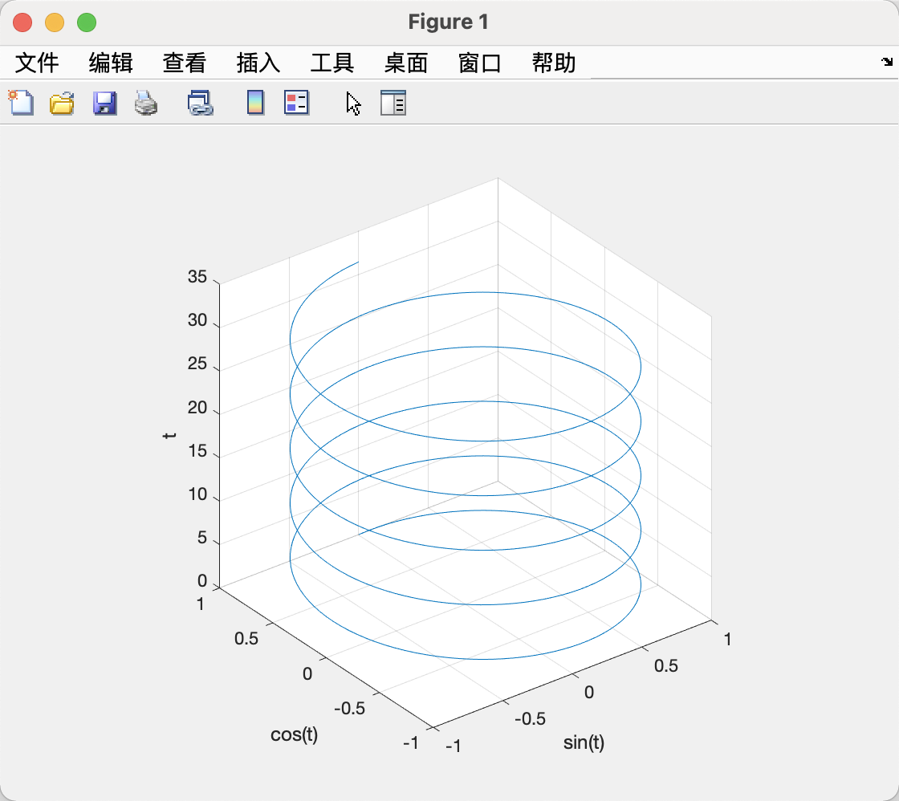


3. 图形的保存与导出
   
    (1). Edit -> Copy Figure
    (2). Toolbar -> Save
    (3). print('-depsc','-tiff','-r300','picturel')
    (4). File -> Export Setup

    <br/>
 
    *. mesh 函数
    
    ```
    [x,y,z] = peaks(30);
    mesh(x,y,z)
    grid
    ```
    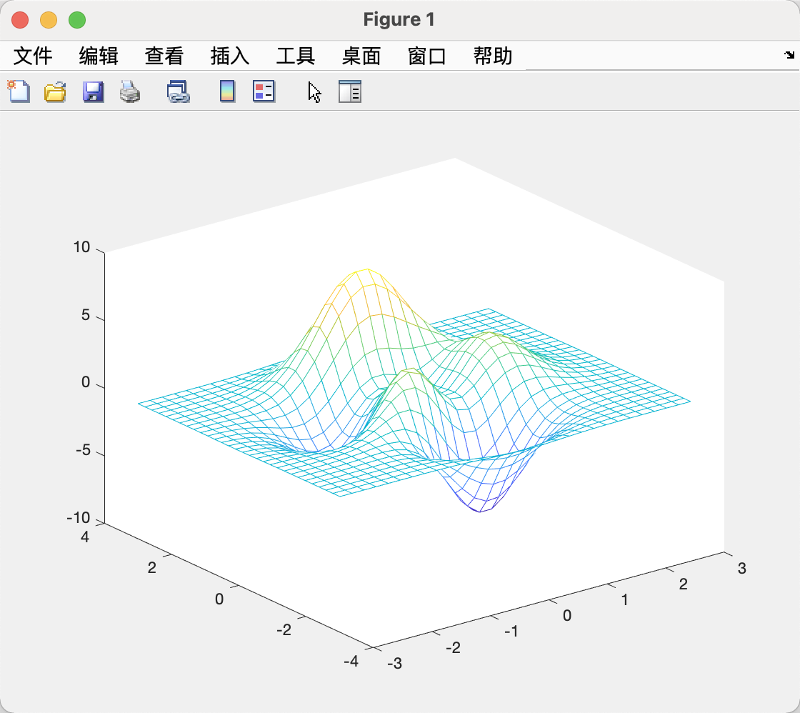

4. 图形窗口的分割

    ```
    x = linspace(0,2*pi,60);
    subplot(2,2,1)
    plot(x,sin(x)-1)
    title('sin(x)-1');axis([0,2*pi,-2,0])
    subplot(2,1,2)
    plot(x,cos(x)+1)
    title('cos(x)+1');axis([0,2*pi,0,2])
    subplot(4,4,3)
    plot(x,tan(x))
    title('tan(x)');axis([0,2*pi,-40,40])
    subplot(4,4,8)
    plot(x,cot(x))
    title('cot(x)');axis([0,2*pi,-35,35])
    ```

    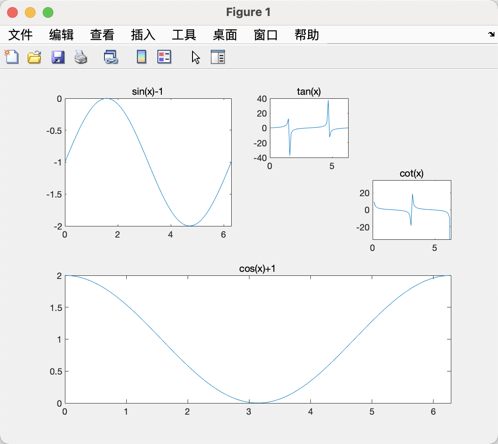
            

***

# 201 Matlab

### M1 Matlab Familiarisation

#### Matlab workspace basics
- The command to generate a row vector called "x" containing the numbers 1,2,3
`x = [1, 2, 3];`
<br/>
- Some basic Matlab syntax:
`clear` -> clear all variables from the workspace
`clear a*` -> clear only those starting with "a"
`clc` -> clear writing off the workspace screen (nothing is lost from memory)
`save('zz')` -> save workspace variables in Matlab format in a file called "zz"
<br/>

#### Matlab arithmetic
- The usual symbols and rules for arithmetic functions apply
`25+7*3-2^3/4` -> $25+(7\times3)-\frac{2^3}{4}$
<br/>
- You can do the same with variables
```
a = 25;
b = 7;
c = 3;
d = 2;
e = 4;
a + b * c - d ^ c / e
```
<br/>

- Complex numbers are handled correctly in arithmetic operations
`x = 5+j*2` -> will set the real part of x as 5 and the imaginary part as 2
`abs(x)` -> absolute value of x
`angle(x)` -> phase angle associated with complex number x

#### Matlab vectors and matrices

- Matrices or vectors add and subtract element-by-element
- The multiply and divide symbols define matrix operations. To get element-by-element operations use.
`*` -> for multiplication
`/` -> for division
`^` -> for power
<br/>
- To identify elements within a matrix use the indices.
`b = a(3,[2 4])` -> defines the variable b as a row vector[a(3,2) a(3,4)]
In this context, the colon means "all", therefore a(:,3) would be the third column of matrix a.
```
a = ([1,2,3,4,5;6,7,8,9,10;11,12,13,14,15])
b = a(3,[2 4])  -> output 12,14
b = a(3,:)      -> output 11,12,13,14,15
b = a(:,3)      -> output 3,8,13
```
<br/>

- To get the transpose $B = A^T$ , type the following command `B = A'`
<br/>

- Vecor dot and cross products can be evaluated using the appropriate functions.
```
c = dot(a,b)
d = cross(a,b)
```

#### Matlab scripts

- For repetitive tasks, it is sometimes more convenient to put a list of commands together into a program called a Script. This is a text file whose name ends with .m and does not start with a number.
<br/>
- To run a script, type the name of the file (without the ending) into the workspace.
    - For example, to run a script called antelope.m you would type antelope in the workspace.

<br/>

- Note that the script has to be in the Matlab current folder or in the workpath, for it to run.
    - The current folder is shown at the top of the Command window
    - The workpath can be changed using the "Enviroment" tab in the Command window

#### Matlab functions (1)

- A Function in Matlab is a Script that does not keep its variables in the workspace. Instead, it has define inputs and outputs.
<br/>

- It is useful in complex tasks with many intermediate steps when you do not want to fill up the workspace with lots of variables.
<br/>

- You can call the function from the workspace in the same way as a Scrpt, however in order to get any output to the workspace, you will have to define its inputs and outputs.
<br/>

  - To run it, in the workspace you might type `a = rand(5,2)`
  - This will assign the variable "a" as a 5x2 matrix of random numbers overwriting any value of a that was previously in the workspace.

#### Matlab function (2)

- Inputs to a function can be numeric values or variable names that are in the workspace. You will get an error message if you try to run a function without giving it all the inputs that it is looking for.
<br/>

- Outputs are new variables that have names you choose. They do not have to have the same name as they have inside the function
<br/>

- Typing `doc` and the function name in the workspace will give you information on how to use the function
  - e.g `doc plot` will explain how to use the `plot` command.
<br/>

- Information on any functions provided as part of MEC201 will be accessible in the same way.

#### Matlab figures - basic commands

- **The most common figure commands are ...**
    `plot(x,y)` -> plot vector (or matrix) y against vector (or matrix) x.
    `semilogy` -> same as plot but with log-scale on the y-axis.
    `loglog(x,y)` -> same as plot woth log-scale on both axes.
<br/>
- **Figures in Matlab can be modified using the user-interface but it is often quicker to use written commands in the workspace or in a script/function.**
    `plot (x1,y1,x2,y2)` -> plot two lines (or more) on the same graph
    `plot (x,y,'.-')` -> specify the line type (chain in this case).
    `xlabel('zzz')` -> add the label "zzz" to the x-axis, same format for ylabel
    `legend('aa','bb')` -> add a legend to the graph ; here the first line is called aa and the second bb

    <div align = center>

    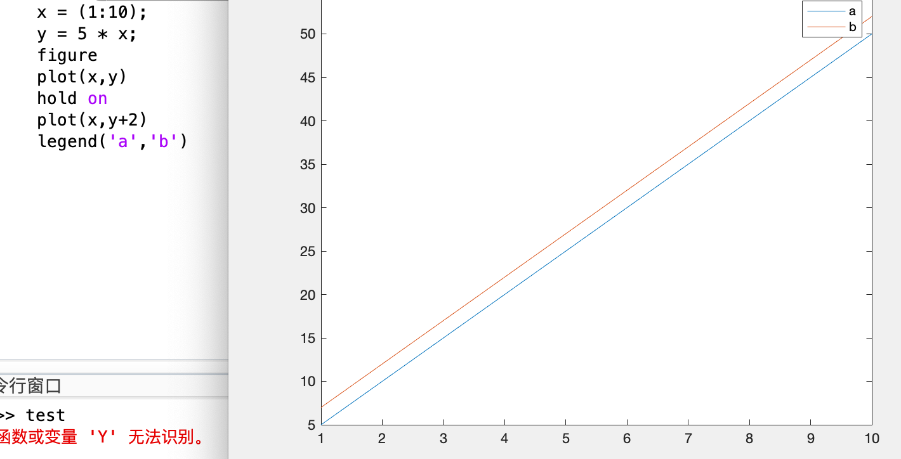

    </div>


    `clf` -> clear everything off the figure
    `grid on` -> include a grid (and grid off to remove)

    <div align = center>
    
    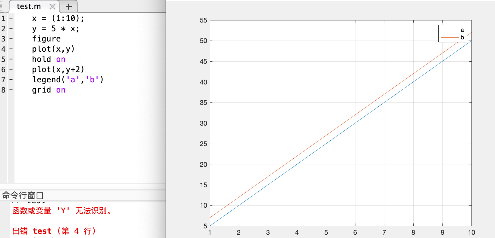
    </div>

    `axis([a b c d])` -> x-axis ranges from a to b and y axis ranges from c to d

    <div align = center>

    
    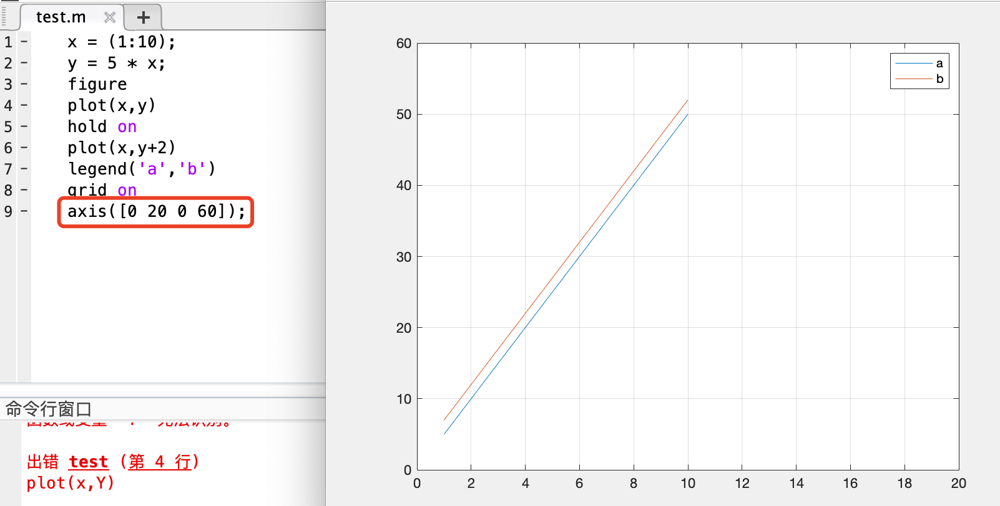
    </div>

#### Matlab figures - useful commands

- Matlab plots figures with very thin lines. You may want to make them thicker for reports and presentrations. Use the command below ...

    - `set(get(gca,'Children'),'LineWidth',2)`
    `get(gca,'Children)'` -> gets the reference numbers for all the lines in the current axis
    `'LineWidth',2` -> defines thickness of the line
    <div align = center>
    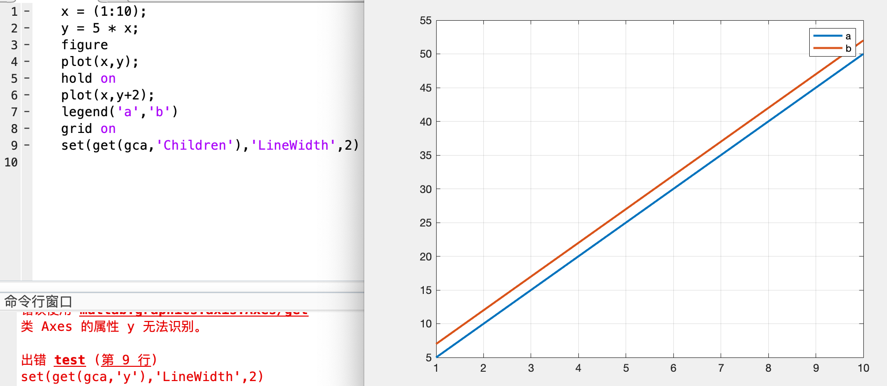
    </div>

    - To export a figure for use in an application like MS Powerpoint, first get what you want on the screen. Next tell Matlab that the image you want is what you see.
    `set(gcf,'PaperPositionMode','auto')`

    - Finally make an image file in the format you want
    `print XXX -dpng -r300`
    xxx -> name you want to give the figure
    -dpng -> image file format, could also have gif, tiff, jpg ...
    -r300 -> image resolution in dots per inch

---

### M2 Matlab Activity - Signals

#### MEC201 Week 1: Signals 

The Fourier Transform can be used to move between time and frequency domains. Looking at a signal in the frequency domain often provides useful additional information about it.

Special functions: `ft_forward`,`ft_inverse`

**Activity 1:**

Signal based on two sinusoids $x = sin(\omega_1t+\phi_1)+0.5sin(\omega_2t), \omega_1 = 2,\omega_2=10,\phi_1=\frac{\pi}{4}$
<br/>

```
t = linspace(0,4,500);      -> Creat a vector with 500 time points between 0 and 4 seconds
x = cos(2*pi*2*t+pi/4)+0.5*cos(2*pi*10*t);      -> Construct the signal
plot(t,x) , grid on     -> Plot the signal and add a grid
[whz, X] = ft_forward(t,x);     -> Generate and view the Fourier Transform
plot(whz,abs(X),'o-')
axis([0 15 0 1.5])      -> Zoom in on the peaks
[t1,x1] = ft_inverse(whz,x);        -> Inverse transform to check forward-backward transform consistency
plot(t,x,t1,x1,'.')

```

#### MEC201 Week 1: More signals

Create some different signals and use the Fourier Transform to investigate them 
Special function: `create_force_signal`

**Activity 2**

Investigate a square wave and a half-sine shock

```
[ti,fi] = create_force_signal(4,1024,4,3,5);    -> Create a 5 Hz square wave with amplitude 3 N over 4 seconds Plot the signal
plot(ti,fi), xlabel('time, s')      -> Plot the signal
ft_forward(ti,fi)   -> View the Fourier Transform
[ti,fi] = create_force_signal(5,512,3,2,0.05);      -> Create a 3 second signal starting with a half-sine shock of 2 N peak, 0.05 s shock duration
plot(ti,fi), xlabel('time,s')       -> Plot the signal
ft_forward(ti,fi);      -> View the Fourier Transform
```

---

### M3 Matlab Activity - Free Vibration

#### MEC201 Week 2: Free vibration

The free vibration response is affected by the system properities and the initial conditions. Investigate the effects that these have for a system like the one seen in the lab.

Special function: `sdof_free_sys`

**Activity**
Nominal system properties: $m=0.7kg,k=2900N/m,c=0.45Ns/m$
```
wnhz = sqrt(2900/0.7)/2/pi;     -> Calculate system properties
zeta = 0.45/2/sqrt(2900*0.7);
sdof_free_sys(wnhz,zeta,0.01,0,6);      -> View the free vibration response following a 10 mm initial deflection
[t,x] = sdof_free_sys(wnhz,zeta,0.01,0,6);      -> Calculate the free vibration response following a 10mm initial deflection
ft_forward(t,x);        -> View the Fourier Transform
```
---


---

# 附_其他

### Matlab 添加包
下载zip 解压 -> 主页 -> 路径设置 添加即可

<div align = center>
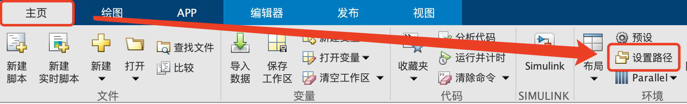
</div>


