# Python 3 教程

---

## Python3 迭代器与生成器

### 迭代器

迭代是Python最强大的功能之一，是访问集合元素的一种方式。
迭代器是一个可以记住遍历的位置的对象。
迭代器对象从集合的第一个元素开始访问，直到所有的元素被访问完结束。迭代器只能往前不会后退。
迭代器有两个基本的方法：**iter()** 和 **next()** 。
字符串，列表或元组对象都可用于创建迭代器：

实例：
```python {.line-numbers}
list=[1,2,3,4]
it = iter(list)     # 创建迭代器对象
print(next(it))     # 输出迭代器的下一个元素
print(next(it))
```
<br>
<div align=center>
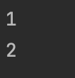
<div>输出结果</div>
</div>
<br>
<br>

迭代器对象可以使用常规for语句进行遍历：

实例：
```python {.line-numbers}
list=[1,2,3,4]
it = iter(list)     #创建迭代器对象
for x in it:
    print(x, end=" ")
```

执行以上程序，输出结果如下：

<br>
<div align=center>
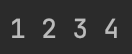
<div>输出结果</div>
</div>
<br>

也可以使用 next() 函数：

```python {.line-numbers}
import sys

list=[1,2,3,4]
it = iter(list)

while True:
    try:
        print(next(it))
    except StopIteration:
        sys.exit()
```

执行以上程序，输出结果如下：

<br>
<div align=center>
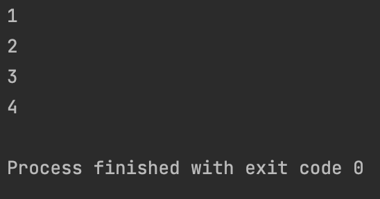
<div>输出结果</div>
</div>
<br>

### 创建一个迭代器

把一个类作为一个迭代器使用需要在类中实现两个方法 __ iter__() 与 __ next__()。
如果你已经了解面向对象变成，就知道类都有一个构造函数，Python 的构造函数为 __ init__(), 它会在对象初始化的时候执行。更多内容查阅：<a href="#mxdx">Python3 面向对象</a>


__ iter__() 方法返回一个特殊的迭代器对象，这个迭代器对象实现了 __ next__() 方法并通过 StopIteration 异常标识迭代的完成。
__ next__() 方法 （Python 2 里是 next()) 会返回下一个迭代器对象。
创建一个返回数字的迭代器，初始值为 1，逐步递增 1：

实例：
```python {.line-numbers}
class MyNumbers:
    def __iter__(self):
        self.a = 1
        return self
    
    def __next__(self):
        x = self.a
        self.a += 1
        return x

myclass = MyNumbers()
myiter = iter(myclass)

print(next(myiter))
print(next(myiter))
print(next(myiter))
print(next(myiter))
print(next(myiter))
```
执行输出结果为：

<br>
<div align=center>
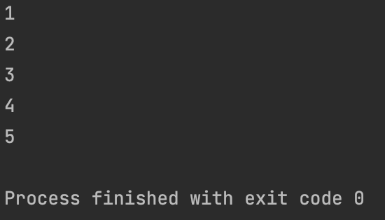
<div>输出结果</div>
</div>
<br>
<br>

### StopIteration

StopIteration 异常用于标识迭代的完成，防止出现无线循环的情况，在 __ next__() 方法中我们可以设置在完成指定循环次数后触发 StopIteration 异常来结束迭代。

在 20 次迭代后停止执行：
```python {.line-numbers}
class MyNumbers:
    def __iter__(self):
        self.a = 1
        return self

    def __next__(self):
        if self.a <= 20:
            x = self.a
            self.a += 1
            return x
        else:
            raise StopIteration

myclass = MyNumers()
myiter = iter(myclass)

for x in myiter:
    print(x,end=" ")
```

执行输出结果为：

<br>
<div align=center>
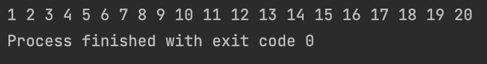
<div>输出结果</div>
</div>
<br>
<br>


### 生成器

在 Python 中，使用了 yield 的函数被称为生成器 (generator) 。
跟普通函数不同的是，生成器是一个返回迭代器的函数，只能用于迭代操作，更简单点理解生成器就是一个迭代器。
在调用生成器运行的过程中，每次遇到 yield 时函数会暂停并保存当前所有的运行信息，返回yield的值，并在下一次执行 next() 方法时从当前位置继续运行。
调用一个生成器函数，返回的是一个迭代器对象。

以下实例使用 yield 实现斐波那契数列：
(从第三项开始，每一项都等于前两项之和)

```python {.line-numbers}
import sys

def fibonacci(n):
    a, b, counter = 0, 1, 0
    while True:
        if (counter > n):
            return
        yield a
        a, b = b, a + b
        counter += 1

f = fibonacci(10)   # f 是一个迭代器，由生成器返回生成

while True:
    try:
        print(next(f), end = " ")
    except StopIteration:
        sys.exit()
```

执行以上程序，输出结果如下：

<br>
<div align=center>
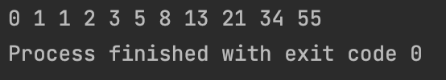
<div>输出结果</div>
</div>
<br>
<br>

---

## Python3 函数

函数是组织好的，可重复使用的，用来实现单一，或相关联功能的代码段。
函数能提高应用的模块性，和代码的1重复利用率。你已经知道 Python 提供了许多内建函数，比如 print() 。 但你也可以自己创建函数，这被叫做用户自定义函数。

<br>

### 定义一个函数

你可以定义一个由自己想要功能的函数，以下是简单的规则：

- 函数代码块以 **def** 关键词开头，后接函数标识符名称和圆括号 **()** 。
- 任何传入参数和自变量必须放在圆括号中间，圆括号之间可以用于定义参数。
- 函数的第一行语句可以选择性地使用文档字符串-用于存放函数说明。
- 函数内容以冒号 `:` 起始，并且缩进。
- **return [表达式]** 结束函数，选择性地返回一个值给调用方，不带表达式的 return 相当于返回 None.


<br>
<div align=center>
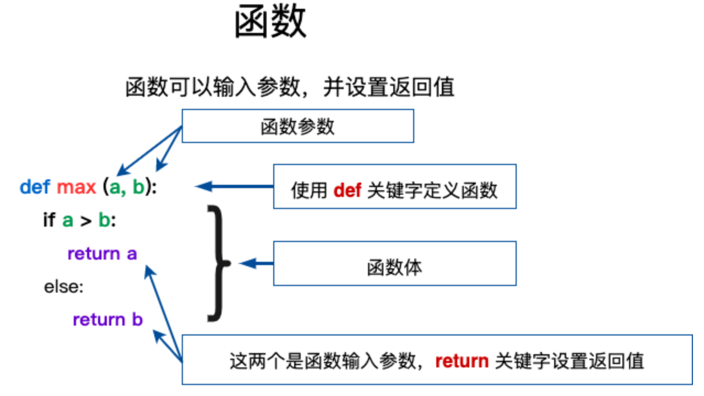
<div></div>
</div>
<br>
<br>

### 语法

Python 定义函数使用 def 关键字，一般格式如下：

```
def 函数名 (参数列表)：
    函数体
```

默认情况下，参数值和参数名称是按函数声明中定义的顺序匹配起来的。

### 实例

让我们使用函数来输出 "Hello World! ":

```python {.line-numbers}
def hello():
    print("Hello World!")

hello()
```

更复杂点的应用，函数中带上参数变量：

```python {.line-numbers}
def max(a, b):
    if a > b:
        return a
    else:
        return b

a = 4
b = 5
print(max(a, b))
```

<br>

实例：

```python {.line-numbers}
def area(width, height):
    return width * height

def print_welcome(name):
    print("Welcome", name)

print_welcome("xxx")
w = 4
h = 5
print('width =', w, 'height =', h, 'area =', area(w, h))
```

<br>

### 函数调用

定义一个函数：给了函数一个名称，指定了函数里包含的参数，和代码块结构。
这个函数的基本结构完成以后，你可以通过另一个函数调用执行，也可以直接从 Python 命令提示符执行。
如下实例调用了 **printme()** 函数：

实例：
```python {.line-numbers}
def printme( str ):
    # 打印任何传入的字符串
    print (str)
    return

printme("我要调用用户自定义函数！")
printme("再次调用同意函数")
```


<br>
<div align=center>
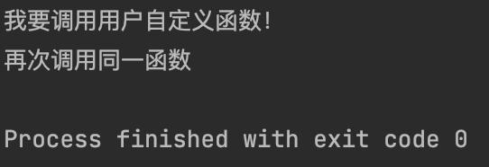
<div>输出结果</div>
</div>
<br>
<br>


### 参数传递
在 Python 中，类型属于对象，对象有不同类型的区分，变量没有类型的：

```
a = [1, 2, 3]
a = "abc"
```

以上代码中，**[1, 2, 3]** 是 List 类型，**"abc"** 是 String 类型，而变量 a 是没有类型，它仅仅是一个对象的引用 （一个指针），可以是指向 List 类型对象，也可以是指向 String 类型对象。
#### 可更改(mutable)与不可更改(immutable)对象
在 python 中，strings，tuples，和 numbers 是不可更改的对象，而 list，dict 等则是可以修改的对象。

- **不可变类型**：变量赋值 **a=5** 后再辅助 **a=10**, 这里实际是生成一个 int 值对象 10，再让 a 指向它，而 5 被丢弃，不是改变 a 的值，相当于新生了 a。
- **可变类型**： 变量赋值 **la=[1,2,3,4]** 后再赋值 **la[2]=5** 则是将 list la 的第三个元素值更改，本身la没有动，只是其内部的一部分值被修改了。

Python 函数的参数传递：

- **不可变类型**：类似 C++ 的值传递，如整数、字符串、元组。如 fun(a)，传递的只是 a 的值，没有影响 a 对象本身。如果在 fun(a) 内部修改 a 的值，则是新生成一个 a 的对象。
- **可变类型**：类似 C++ 的引用传递，如 列表，字典。如 fun(la), 则是将 la 真正的传过去，修改后 fun 外部的 la 也会受影响

Python 中一切都是对象，严格意义我们不能说值传递还是引用传递，我们应该说穿不可变对象和传可变对象。

#### Python 传不可变对象实例
通过 **id()** 函数来查看内存地址变化：
```python {.line-numbers}
def change(a):
    print(id(a))    # 指向的是同一个对象
    a = 10
    print(id(a))    # 一个新对象

a = 1
print(id(a))
change(a)
```


<br>
<div align=center>
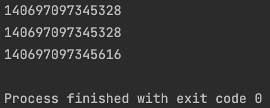
<div>输出结果</div>
</div>
<br>
<br>

可以看见在调用参数前后，形参和实参指向的是同一个对象 (对象 id 相同)，在函数内部修改形参后，形参指向的是不同的 id。

<br>

#### 传可变对线实例

可变对象在函数里修改了参数，那么在调用这个函数的函数里，原始的参数也被改变了。例如：
实例：
```python {.line-numbers}
# 写函数说明
def changeme( mylist ):
    "修改传入的列表"
    mylist.append([1, 2, 3, 4])
    print ("函数内取值：", mylist)
    return

# 调用changeme函数
mylist = [10, 20, 30]
changeme( mylist )
print("函数外取值：", mylist)
```

<br>

### 参数
以下是调用函数时可以使用的正式参数类型：

- 必须参数
- 关键字参数
- 默认参数
- 不定长参数

#### 必须参数
必须参数须以正确的顺序传入函数。调用时的数量必须和声明时的一样。
调用 printme() 函数，你必须传入一个参数，不然会出现语法错误：

实例：

```python {.line-numbers}
# 可写函数说明
def printme( str ):
    "打印任何传入的字符串"
    print (str)
    return

# 调用 printme 函数，不加参数会报错
printme()
```


<br>
<div align=center>
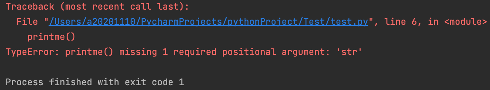
<div>输出结果</div>
</div>
<br>
<br>

#### 关键字参数

关键字参数和函数调用关系紧密，函数调用使用关键字参数来确定传入的参数值。
使用关键字参数允许函数调用时参数的顺序与声明时不一致，因为 Python 解释器能够用参数名匹配参数值。
以下实例在函数 printme() 调用时使用参数名：

```python {.line-numbers}
# 可写函数说明
def printme( str ):
    "打印任何传入的字符串"
    print(str)
    return

# 调用printme函数
printme( str = "打印内容")
```

<br>

以下实例中演示了函数参数的使用不需要使用指定顺序:
```python {.line-numbers}
# 可写函数说明
def printinfo( name, age ):
    "打印任何传入的字符串"
    print("名字："，name)
    print("年龄："，age)
    return

# 调用printinfo函数
printinfo(age=50, name='xiaoa')
```

<br>

#### 默认参数

调用参数时，如果没有传递参数，则会使用默认参数。以下实例中如果没有传入 age 参数，则使用默认值：

```python {.line-numbers}
def printinfo( name, age = 35 ):
    "打印任何传入的字符串"
    print("名字："，name)
    print("年龄："，age)
    return

# 调用printinfo函数
printinfo( age=50, name = "xiaoa")
print("-"*20)
printinfo(name="xiaob")
```

<br>

#### 不定长参数

你可能需要一个函数能处理比当初声明时更多的参数。这些参数叫做不定长参数，和上述 2 种参数不同，声明时不会命名。基本语法如下：
```
def functionname([formal_args,] * var_args_tuple ):
    "函数_文档字符串"
    function_suite
    return [expression]
```
加了星号 `*` 的参数会以元组(tuple)的形式导入，存放所有未命名的变量参数。

```python {.line-numbers}
def printinfo( arg1, *vartuple):
    "打印任何传入的参数"
    print("输出: ")
    print(arg1)
    print(vartuple)

# 调用printinfo函数
printinfo(70, 60, 50)
```

<br>
<div align=center>
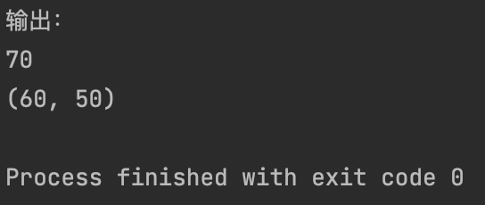
<div>输出结果</div>
</div>
<br>
<br>

如果在函数调用时没有指定参数，它就是一个空元组。我们也可以不向函数传递未命名的变量。如下实例：

```python {.line-numbers}
def printinfo(arg1, *vartuple):
    "打印任何传入的参数"
    print("输出: ")
    print(arg1)
    for var in vartuple:
        print(var)
    return

# 调用printinfo函数
printinfo(10)
printinfo(70,60,50)
```

<br>
<div align=center>
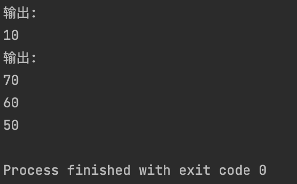
<div>输出结果</div>
</div>
<br>
<br>


还有以中就是参数带两个星号 `**` 基本语法如下：
```
def functionname([formal_args,] **var_args_dict ):
    "函数_文档字符串"
    function_suite
    return [expression]
```

加了两个星号 `**` 的参数会以字典的形式导入。
```python {.line-numbers}
def printinfo(arg1, **vardict ):
    "打印任何传入的参数"
    print("输出: ")
    print(arg1)
    print(vardict)

# 调用printinfo函数
printinfo(1, a=2, b=3)
```

<br>
<div align=center>
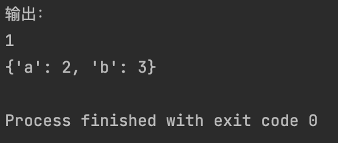
<div>输出结果</div>
</div>
<br>
<br>

声明函数时，参数中星号 `*` 可以单独出现，例如：
```
def f(a, b, *, c)
    return a+b+c
```

如果单独出现星号 `*`，则星号 `*` 后的参数必须用关键字传入：


<br>
<div align=center>
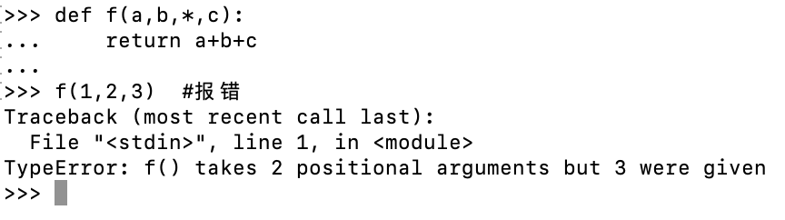
<div>输出结果</div>
</div>
<br>
<br>


<div align=center>
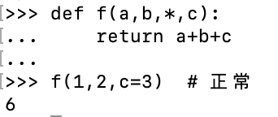
<div>输出结果</div>
</div>
<br>
<br>

### 匿名函数

Python 使用 **`lambda`** 来创建匿名函数。
所谓匿名，意即不再使用 **def** 语句这样标准的形式定义一个函数。

- **`lambda`** 只是一个表达式，函数体比 **def** 简单很多。
- lambda 的主体是一个表达式，而不是一个代码块。仅仅能在 lambda 表达式中封装有限的逻辑进去。
- lambda 函数拥有自己的命名空间，而且不能访问自己参数列表之外或全局命名空间里的参数。
- 虽然 lambda 函数看起来只能写一行，却不等同于 C 或 C++ 的内联函数，后者的目的是调用小函数时不占用栈内存从而增加运行效率。

<br>

#### 语法

lambda 函数的语法值包含一个语句，如下：
```
lambda [arg1 [,arg2,......argn]]:expression
```
设置参数 a 加上 10：
```python {.line-numbers}
x = lambda a : a + 10
print(x(5))
```
以上输出结果:
```
15
```

<br>

以下实例匿名函数设置两个参数：
```python {.line-numbers}
sum = lambda arg1, arg2: arg1 + arg2

# 调用sum函数
print("相加后的值为："，sum(10,20))
print("相加后的值为："，sum(20,20))
```


<br>
<div align=center>
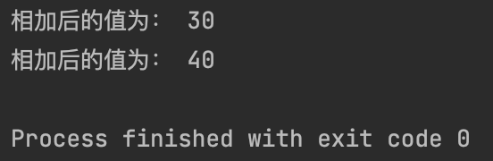
<div>输出结果</div>
</div>
<br>
<br>

我们可以将匿名函数封装在一个函数内，这样可以使用同样的代码来创建多个匿名函数。
以下实例将匿名件数封装在 myfunc 函数中，通过传入不同的参数来创建不同的匿名函数:

```python {.line-numbers}
def myfunc(n):
    return lambda a : a * n

mydoubler = mufunc(2)
mytripler = myfunc(3)

print(mydoubler(11))
print(mytripler(11))
```

<br>
<div align=center>
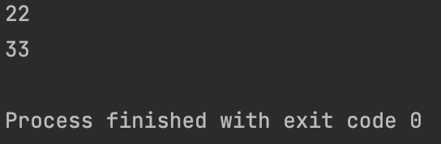
<div>输出结果</div>
</div>
<br>
<br>

### return 语句

**return [表达式]** 语句用于退出函数，选择性地向调用方返回一个表达式。不带参数值的 return 语句返回 None。 之前的例子都没有示范如何返回数值，以下实例演示了 return 语句的用法：
```python {.line-numbers}
def sum(arg1, arg2):
    # 返回两个参数的和
    total = arg1 + arg2
    print("函数体内：", total)
    return total

# 调用sum函数
total = sum(10,20)
print("函数体外: ", total)
```
```
函数体内：30
函数体外：30
```

### 强制位置参数

Python3.8 新增了一个函数形参语法 / 用来指明函数新参必须使用指定位置参数，不能使用关键字参数的形式。
在以下的例子中，形参 a 和 b 必须使用指定位置参数， c 或 b 可以是位置形参或关键字形参，而 e 和 f 要求为关键字形参：
```
def f(a, b, /, c, d, *, e, f):
    print(a, b, c, d, e, f)
```
以下使用方法是正确的：
```
f(10, 20, 30, d=40, e=50, f=60)
```
以下使用方法会发火说呢过错误：
```
f(10, b=20, c=30, d=40, e=50, f=60)     # b 不能使用关键字参数的形式
f(10, 20, 30, 40, 50, f=60)             # e 必须使用关键字参数的形式
```
---

## Python3 数据结构
本章节我们主要介个前面所学的知识点来介绍Python数据结构。

<br>

### 列表

Python中列表是可变的，这是它区别于字符串和元组的最重要的特点，一句话概括即：列表可以修改，而字符串和元组不能。
以下是 Python 中列表的方法：

方法 - 描述

- `list.append(x)`
  - 把一个元素添加到列表的结尾，相当于 `a[len(a)] = [x]`。
- `list.extend(L)`
  - 通过添加指定列表的所有元素来扩充列表，相当于 `a[len(a):] = L`。
- `list.insert(i, x)`
  - 在指定位置插入一个元素。第一个参数是准备插入到其前面的那个元素的索引，例如 `a.insert(0,x)` 会插入到整个列表之前，而 `a.insert(len(a),x)` 相当于 `a.append(x)`
- `list.remove(x)`
  - 删除列表中值为 x 的第一个元素。如果没有这样的元素，就会返回一个错误。
- `list.pop([i])`
  - 从列表的指定位置移除元素，并将其返回。如果没有指定索引，`a.pop()` 返回最后一个元素。元素随即从列表中被移除。 （方法中 i 两边的方括号表示这个参数是可选的，而不是要求你输入一对方括号，你会经常在 Python 库参考手册中遇到这样的标记。）
- `list.clear()`
  - 移除列表中的所有项，等于 `del a[:]`。
- `list.index(x)`
  - 返回列表中第一个值为 x 的元素的索引。如果没有匹配的元素就会返回一个错误。
- `list.count(x)`
  - 返回 x 在列表中出现的次数。
- `list.sort()`
  - 对列表中的元素进行排序。
- `list.reverse()`
  - 倒排列表中的元素。
- `list.copy()`
  - 返回列表的浅复制，等于 `a[:]`。


注意：类似 insert, remove 或 sort 等修改列表的方法没有返回值。

<br>

### 将列表当做堆栈使用

列表方法使得列表可以很方便的作为一个堆栈来使用，堆栈作为特定的数据结构，最先进入的元素最后一个被释放（后进先出）。用 append() 方法可以把一个元素添加到堆栈顶。用不指定索引的 pop() 方法可以把一个元素从堆栈顶释放出来。例如:


<br>
<div align=center>
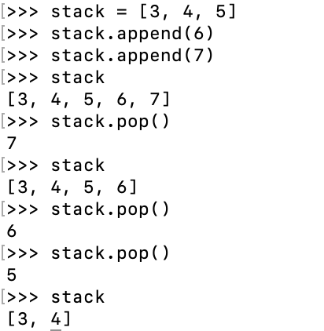
<div>实例</div>
</div>
<br>
<br>

### 将列表当作队列使用

也可以把列表当做队列用，只是在队列里第一加入的元素，第一个取出来；但是拿列表用作这样的目的效率不高。在列表的最后添加或者弹出元素速度快，然而在列表里插入或者从头部弹出速度却不快 （因为所有其他的元素都得一个一个地移动）。


<br>
<div align=center>
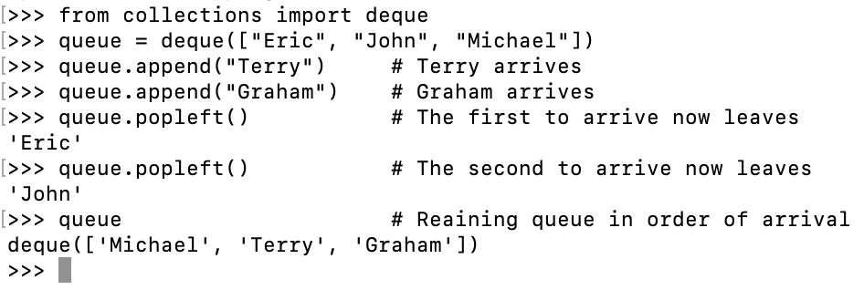
<div>实例</div>
</div>
<br>
<br>

### 列表推导式

列表推导式提供了从序列创建列表的简单途径。通常应用程序将一些操作应用于某个序列的每个元素，用其获得的结果作为生成新列表的元素，或者根据确定的判定条件创建子序列。
每个列表推导式都在 for 之后跟一个表达式，然后有零到多个 for 或 if 子句。返回结果是一个根据表达从其后的 for 和 if 上下文环境中生成出来的列表。如果希望表达式推导出一个元组，就必须使用括号。
这里我们将列表中每个数乘三，获得一个新的列表：

```python {.line-numbers}
vec = [2, 4, 6]
[3*x for x in vec]
```
```
[6, 12, 18]
```

现在我们玩一点小花样：
```python {.line-numbers}
[[x, x**2] for x in vec]
```
```
[[2, 4], [4, 16], [6, 36]]
```
这里我们对序列里每一个元素逐个调用某方法：
```python {.line-numbers}
freshfruit = [' banana', ' loganberry', 'passion fruit  ']
[weapon.strip() for weapon in freshfruit]
```
```
['banana', 'loganberry', 'passion fruit']
```
ps : `.strip()` -> 该方法用于移除字符串头尾指定的字符（默认为空格或换行符）或字符序列。 该方法只能删除开头或是结尾的字符，不能删除中间部分的字符。

我们可以用 if 子句作为过滤器：
```python {.line-numbers}
[3*x for x in vec if x > 3]
```
```
[12, 18]
```
```python {.line-numbers}
[3*z for x in vec if x < 2]
```
```
[]
```

以下是一些关于循环和其它技巧的演示：
```python {.line-numbers}
vec1 = [2, 4, 6]
vec2 = [4, 3, -9]
[x*y for x in vec1 for y in vec2]
```
```
[8, 6, -18, 16, 12, -36, 24, 18, -54]
```
```python {.line-numbers}
[x+y for x in vec1 for y in vec2]
```
```
[6, 5, -7, 8, 7, -5, 10, 9, -3]
```
```python {.line-numbers}
[vec1[i]*vec2[i] for i in range(len(vec1))]
```
```
[8, 12, -54]
```

列表推导式可以使用复杂表达式或嵌套函数：
```python {.line-numbers}
[str(round(355/113, i)) for i in range(1, 6)]
```
```
['3.1', '3.14', '3.142', '3.1416', '3.14159']
```

<br>

### 嵌套列表解析

Python的列表还可以嵌套。
以下实例展示了 3X4 的矩阵列表：
<br>
<div align=center>
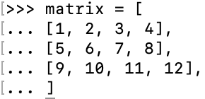
<div>实例</div>
</div>
<br>
<br>

以下实例将 3X4 的矩阵列表转换为 4X3 列表：
```python {.line-numbers}
[[row[i] for row in matrix] for i in range(4)]
```
```
[[1, 5, 9], [2, 6, 10], [3, 7, 11], [4, 8, 12]]
```
另一种实现方法：
```python {.line-numbers}
transposed = []
for i in range(4):
    # the following 3 lines implement the nested listcomp
    transposed_row = []
    for row in matrix:
        transposed_row.append(row[i])
    transposed.append(transposed_row)
```

<br>

### del 语句

使用 del 语句可以从一个列表中根据索引来删除一个元素，而不是值来删除元素。这与使用 pop() 返回一个值不同。可以用 del 语句从列表中删除一个切割，或清空整个列表（我们以前介绍的方法是给该切割赋一个空列表）。例如：


<br>
<div align=center>
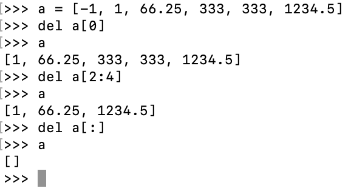
<div>实例</div>
</div>
<br>
<br>

也可以用 del 删除实体变量：
```
del a
```

<br>

### 元组和序列

元组由若干逗号分割的值组成，例如：
<br>
<div align=center>
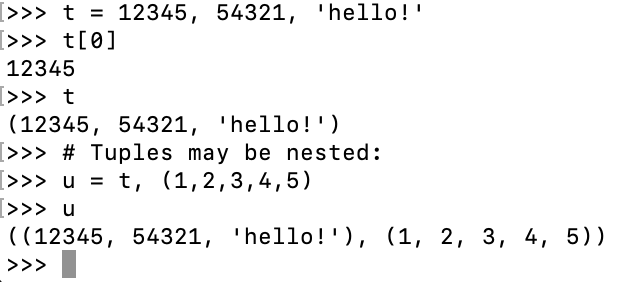
<div>实例</div>
</div>
<br>
<br>

如你所见，元组在输出时总是有括号的，以便于正确表达嵌套结构。在输入时可能有或没有括号，不过括号通常是必须的（如果元组是更大的表达式的一部分）。

<br>

### 集合

集合是一个无序不重复元素的集。基本功能包括关系测试和消除重复元素。
可以用大括号 ({}) 创建集合。注意：如果要创建一个空集合，你必须用 `set()` 而不是 {} ；后者创建一个空的字典，下一节我们会介绍这个数据结构。以下是一个简单的演示：


<br>
<div align=center>
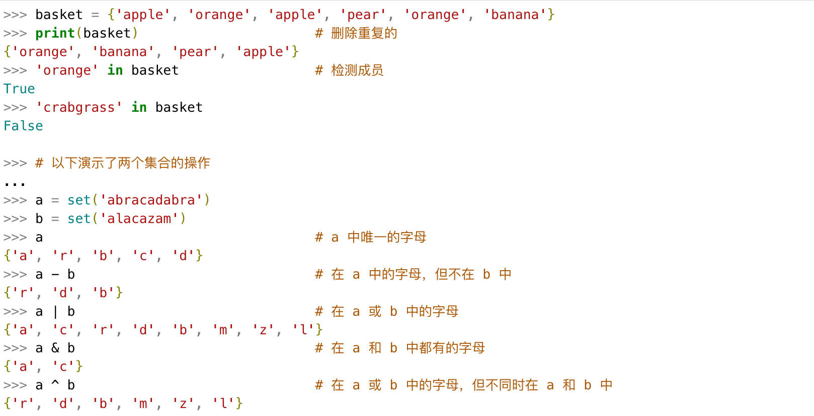
<div>实例</div>
</div>
<br>
<br>

集合也支持推导式：

<br>
<div align=center>
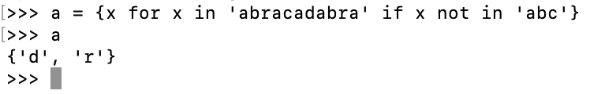
<div>实例</div>
</div>
<br>
<br>

### 字典
另一个非常有用的 Python 内建数据类型是字典。
序列是以连续的整数为索引，与此不同的是，字典以关键字为索引，关键字可以是任意不可变类型，通常用字符串或数值。
理解字典的最佳方式是把它看做无序的键=>值对集合。在同一个字典之内，关键字必须是互不相同。
一对大括号创建一个空的字典：{}

这是一个字典运用的简单例子：
```python {.line-numbers}
tel = {'jack': 4098,'sape': 4139}
tel['guido'] = 4127
tel
```
```
{'sape': 4139, 'guido': 4127, 'jack': 4098}
```
```python {.line-numbers}
tel['jack']
```
```
4098
```
```python {.line-numbers}
del tel['sape']
tel['irv'] = 4127
tel
```
```
{'guido':4127, 'irv':4127,'jack':4098}
```
```python {.line-numbers}
list(tel.keys())
```
```
['irv', 'guido', 'jack']
```
```python {.line-numbers}
sorted(tel.keys())
```
```
['guido', 'irv', 'jack']
```
```python {.line-numbers}
'guido' in tel
```
```
True
```
```python {.line-numbers}
'jack' not in tel
```
```
False
```

构造函数 dict() 直接从键值对元组列表中构建字典。如果有固定的模式，列表推导式指定特定的键值对：
```python {.line-numbers}
dict([('sape', 4139), ('guido', 4127), ('jack', 4098)])
```
```
{'sape': 4139, 'jack': 4098, 'guido': 4127}
```

此外，字典推导式可以用来创建任意键和值得表达式词典：
```python {.line-numbers}
{x: x**2 for i in (2, 4, 6)}
```
```
{2: 4, 4: 16, 6: 36}
```

如果关键字只是简单的字符串，使用关键字参数指定键值对有时候更方便：
```python {.line-numbers}
dict(sape=4139, guido=4127, jack=4098)
```
```
{'sape': 4139, 'guido': 4127, 'jack':4098}
```

<br>

### 遍历技巧

在字典中遍历时，关键字和对应的值可以使用 items() 方法同时解读出来：


<br>
<div align=center>
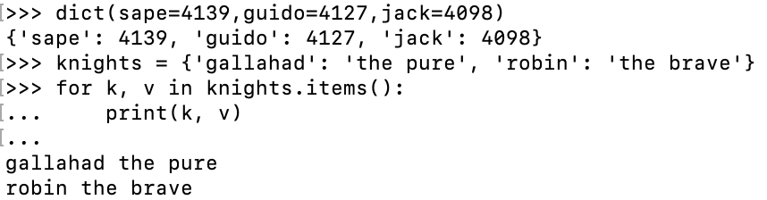
<div>实例</div>
</div>
<br>
<br>

在序列遍历时，索引位置和对应值可以使用 enumerate() 函数同时得到：

<br>
<div align=center>
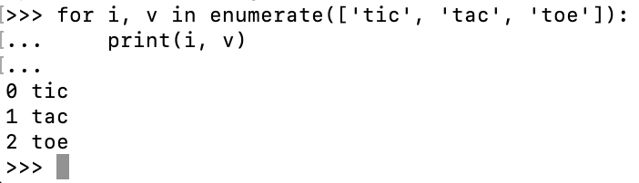
<div>实例</div>
</div>
<br>
<br>

同时遍历两个或更多的序列，可以使用 zip() 组合：

<br>
<div align=center>
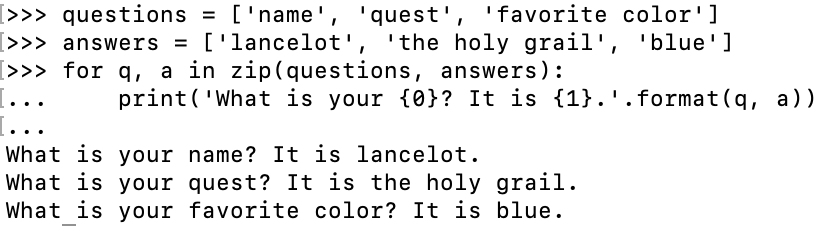
<div>实例</div>
</div>
<br>
<br>

要反向遍历一个序列，首先指定这个序列，然后调用 reversed() 函数：

```python {.line-numbers}
for i in reversed(range(1, 10, 2)):
    print(i, end="")
```
```
9 7 5 3 1
```
要顺序遍历一个序列， 使用 sorted() 函数返回一个已排序的序列，并不修改原值：

<br>
<div align=center>
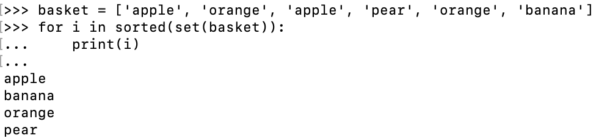
<div>实例</div>
</div>
<br>
<br>

---

## Python3 模块

在前面的几个章节中我们基本上是用 python 解释器来编程，如果你从 Python 解释器退出再进入，那么你定义的所有的方法和变量就都消失了。
为此 Python 提供了一个办法，把这些定义存放在文件中，为一些脚本或者交互式的解释器实例使用，这个文件称为模块。
模块是一个包含所有你定义的函数和变量的文件，其后缀名是.py。模块可以被别的程序引入，以使用该模块中的函数等功能。这也是使用 python 标准库的方法。
下面是一个使用 python 标准库中模块的例子。
```python {.line-numbers}
import sys

print('命令行参数如下：')
for i in sys.argv:
    print(i)

print('\n\nPython 路径为：', sys.path, '\n')
```

<br>
<div align=center>
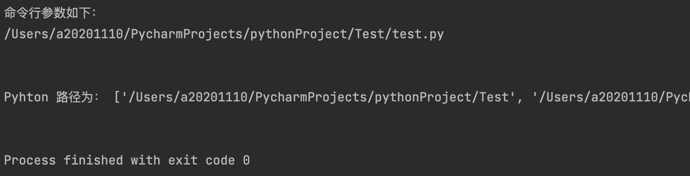
<div>实例</div>
</div>
<br>
<br>

- 1、import sys 引入 python 标准库中的 sys.py 模块；这是引入某一模块的方法
- 2、sys.argv 是一个包含命令行参数的列表。
- 3、sys.path 包含了一个 Python 解释器自动查找所需模块的路径的列表。

<br>

### import 语句

想使用 Python 源文件，只需在另一个源文件里执行 import 语句，语法如下：
```
import module1[, module2[,...moduleN]]
```

当解释器遇到 import 语句，如果模块在当前的搜索路径就会被导入。
搜索路径是一个解释器会先进行搜索的所有目录的列表。如果要导入模块 support，需要吧命令放在脚本的顶端：

```python {.line-numbers}
# support.py 文件代码

def print_func(par):
    print('Hello: ',par)
    return
```
test.py 引入 support 模块：
```python {.line-numbers}
# test.py 文件代码

import support      #导入模块

# 现在可以调用模块里包含的函数了
support.print_func("zzz")
```
以上实例输出结果：
```
Hello: zzz
```

一个模块只会被导入一次，不管你执行了多少次 import。这样可以防止导入模块被一遍又一遍地执行。
当我们使用 import 语句的时候，Python解释器是怎样找到对应的文件的呢？
这就涉及到Python的搜索路径，搜索路径是由一系列目录名组成的，Python解释器就依次从这些目录中去找所引入的模块。
这看起来很像环境变量，事实上，也可以通过定义环境变量的方式来确定搜索路径。
搜索路径是在Python编辑或安装的时候确定的，安装新的库应该也会修改。搜索路径被储存在sys模块中的path变量，做一个简单的实验，在交互式解释器中，输入以下代码：
```
import sys
sys.path
```

<br>
<div align=center>
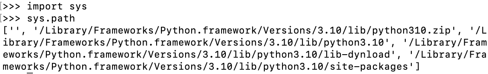
<div>实例</div>
</div>
<br>
<br>

sys.path 输出是一个列表，其中第一项是空串'',代表当前目录（若是从一个脚本中打印出来的话，可以更清楚地看出是哪个目录），亦即我们执行python解释器的目录（对于脚本的话就是运行的脚本所在的目录）。
因此若像我一样在当前目录下存在于要引入模块同名的文件，就会把要引入的模块屏蔽掉。
了解了搜索路径的概念，就可以在脚本中修改sys.path来引入一些不再搜索路径中的模块。
现在，在解释器的当前目录或者 sys.path 中的一个目录里面来创建一个 fibo.py 文件，代码入下：
```python {.line-numbers}
# 斐波那契(fibonacci)数列模块

def fib(n):     # 定义到 n 的斐波那契数列
    a, b = 0, 1
    while b < n:
        print(b, end=' ')
        a, b = b, a+b
    print()

def fib2(n):    # 返回到 n 的斐波那契数列
    result = []
    a, b =0, 1
    while b < n:
        result.append(b)
        a, b = b, a+b
    return result
```

然后进入 Python 解释器，使用下面的命令导入这个模块：

```
import fibo
```

这样做并没有把直接定义在 fibo 中的函数名称写入到当前符号表里，只是把模块 fibo 的名字写到了那里。
可以使用模块名称来访问函数：


<br>
<div align=center>
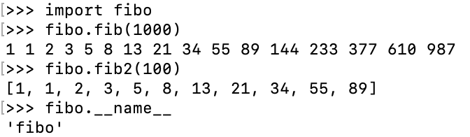
<div>实例</div>
</div>
<br>
<br>

如果你打算经常使用一个函数，你可以把它赋给一个本地的名称：

```python {.line-numbers}
fib = fibo.fib
fib(500)
```
```
1 1 2 3 5 8 13 21 34 55 89 144 233 377
```

<br>


### from ... import 语句

Python 的 from 语句让你从模块中导入一个指定的部分到当前命名空间中，语法如下：
```
from modname import name1[, name2[,...nameN]]
```
例如，要导入模块 fibo 的 fib 函数，使用如下语句：

```python {.line-numbers}
from fibo import fib, fib2
fib(500)
```
```
1 1 2 3 5 8 13 21 34 55 89 144 233 377
```

这个声明不会吧整个 fibo 模块导入到当前的命名空间中，它只会将 fibo 里的 fib函数引入进来。

<br>

### from ... import * 语句

把一个模块的所有内容全都导入到当前的命名空间也是可行的，只需使用如下声明：
```
from modname import *
```
这提供了一个简单的方法来导入一个模块中的所有项目。然而这种声明不该被过多地使用。

<br>

### 深入模块

模块除了方法定义，还可以包括可执行的代码。这些代码一般用来初始化这个模块。这些代码只有在第一次被导入时才会被执行。
每个模块有各自独立的符号表，在模块内部为所有的函数当做全局符号表来使用。
所以，模块的作者可以放心大胆的在模块内部使用这些全局变量，而不用担心把其他用户的全局变量搞混。
从另一个方面，当你确实知道你在做什么的话，你也可以通过 modname.itemname 这样的表示法来访问模块内的函数。
模块是可以导入其他模块的。在一个模块（或者脚本，或者其他地方）的最前面使用 import 来导入一个模块，当然这只是一个惯例，而不是强制的。被导入的模块的名称将放入当前操作的模块的符号表中。
还有一种导入的方法，可以使用 import 直接把模块内（函数，变量的）名称导入到当前操作模块。比如：
```python {.line-numbers}
from fibo import fib, fib2
fib(500)
```
```
1 1 2 3 5 8 13 21 34 55 89 144 233 377
```

这种导入的方法不会把被导入的模块的名称放在当前的字符表中（所以在这个例子里面，fibo 这个名称是没有定义的）。
这还有一种方法，可以一次性的把模块中的所有（函数，变量）名称都导入到当前模块的字符表：

```python {.line-numbers}
from fibo import *
fib(500)
```
```
1 1 2 3 5 8 13 21 34 55 89 144 233 377
```
这将把所有的名字都导入进来，但是那些由单一下划线 (_) 开头的名字不在此例。大多数情况，Python程序员不使用这种方法，因为引入的其它来源的命名，很可能覆盖了已有的定义。


<br>


### __ name__属性

一个模块被另一个程序第一次引入时，其主程序将运行。如果我们想在模块被引入时，模块中的某一程序块不执行，我们可以用 __ name__ 属性来使该程序块仅在该模块自身运行时执行。

```python {.line-numbers}
if __name__ == "__main__":
    print('程序自身在运行')
else:
    print('我来自另一模块')
```

运行输出如下：
```
程序自身在运行
```
```python {.line-numbers}
import using_name
```
```
我来自另一个模块
```


**说明：**每个模块都有一个 __ name__属性，当其值是 '__ main__'时，表明该模块自身在运行，否则是被引入。
说明： **__ name__** 与 **__ main__**底下是双下划线， `_ _` 是这样去掉中间的那个空格。

<br>

### dir() 函数
内置的函数 dir() 可以找到模块内定义的所有名称。以一个字符串列表的形式返回：

<br>
<div align=center>
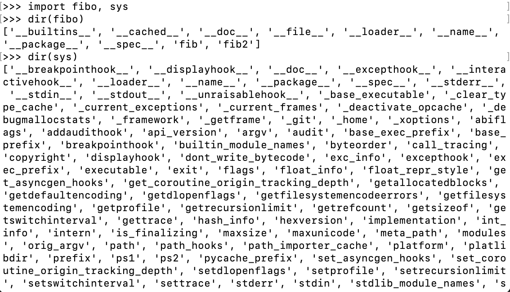
<div>实例</div>
</div>
<br>
<br>

如果没有给定参数，那么 dir() 会罗列出当前定义的所有名称：

```python {.line-numbers}
a = [1, 2, 3, 4, 5]
import fibo
fib = fibo.fib
dir()   # 得到一个当前模块中定义的属性列表
```
。。。
```python {.line-numbers}
a = 5   # 建立一个新的变量 'a'
dir()
```
...

```python {.line-numbers}
del a   # 删除变量名 a
dir()
```
...

<br>

### 标准模块
Python 本身带着一些标准的模块库，在 Python 库参考文档中将会介绍到（就是后面的"库参考文档"）。
有些模块直接被构建在解析器里，这些虽然不是一些语言内置的功能，但是他却能很高效的使用，甚至是系统级调用也没问题。
这些组件会根据不同的操作系统进行不同形式的配置，比如 winreg 这个模块就只会提供给 Windows 系统。
应该注意到这有一个特别的模块 sys，它内置在每一个 Python 解析器中。变量 sys.ps1 和 sys.ps2 定义了主提示符和副提示符所对应的字符串：

```python {.line-numbers}
import sys
sys.ps1
```
```
'>>>'
```
```python {.lien-numbers}
sys.ps2
```
```
'...'
```
```python {.line-numbers}
>>> sys.ps1 = 'C>'
```
```python {.line-numbers}
C> print('xxx')
```
```
xxx
C>
```

<br>

### 包

包是一种管理 Python 模块命名空间的形式，采用“点模式名称”。
比如一个模块的名称是 A.B, 那么他表示一个包 A中的子模块 B。
就好像使用模块的时候，你不用担心不同模块之间的全局变量相互影响一样，采用点模块名称这种形式也不用担心不同库之间的模块重名的情况。
这样不同的作者都可以提供 NumPy 模块，或者是 Python 图形库。
不妨假设你想设计一套统一处理声音文件和数据的模块 （或者称之为一个“包”）。
现在很多中不同的音频文件格式（基本上都是通过后缀名区分的，例如：.wav, :file:.aiff, :file:.au, ), 所以你需要有一组不断增加的模块，用来在不同的格式之间转换。
并且针对这些音频数据，还有很多不同的操作（比如混音，添加回声，增加均衡器功能，创建人造立体声效果），所以你还需要一组怎么也写不完的模块来处理这些操作。
这里给出了一种可能的包结构（在分层的文件系统中）：

```
sound/                      顶层包
      __init__.py           初始化 sound 包
      formats/              文件格式转换子包
              __init__.py
              wavread.py
              wavwrite.py
              aiffread.py
              aiffwrite.py
              auread.py
              auwrite.py
              ...
      effects/              声音效果子包
              __init__.py
              echo.py
              surround.py
              reverse.py
              ...
      filters/              filters 子包
              __init__.py
              equalizer.py
              vocoder.py
              karaoke.py
              ...
```

在导入一个包的时候，Python 会根据 sys.path 中的目录来寻找这个包中包含的子目录。
目录只有1包含一个叫做 __ init__.py 的文件才会被认作是一个包，主要是为了避免一些滥俗的名字（比如叫做 string) 不小心的影响搜索路径中的有效模块。
最简单的情况，放一个空的 :file:__ init__.py 就可以了。当然这个文件中也可以包含一些初始化代码或者为（将在后面介绍的） __ all__变量赋值。
用户可以每次只导入一个包里面的特定模块，比如：
```
import sound.effects.echo
```
这将会导入子模块:sound.effects.echo。他必须使用全名去访问：
```
sound.effects.echo.echofilter(input, output, delay=0.7, atten=4)
```
还有一种导入子模块的方法是：
```
from sound.effects import echo
```
这同样会导入子模块:echo，并且他不需要那些冗长的前缀，所以他可以这样使用：
```
echo.echofilter(input, output, delay=0.7, atten=4)
```
还有一种变化就是直接导入一个函数或者变量：
```
from sound.effects.echo import echofilter
```
同样的，这种方法会导入子模块：echo，并且可以直接使用他的 echofiler() 函数：
```
echofilter(input, output, delay=0.7, atten=4)
```
注意当使用 `from package import item` 这种形式的时候，对应的 item 既可以是包里面的子模块（子包），或者包里面定义的其他名称，比如函数，类或者变量。
import 语法会首先把 item 当做一个包定义名称，如果没找到，再试图按照一个模块去导入。如果还没找到，抛出一个 **:exc:ImportError** 异常。
反之，如果使用形如 **import item.subitem.subsubitem** 这种导入形式，除了最后一项，都必须是包，而最后一项则可以是模块或者是包，但是不可以是类，函数或者变量的名字。

<br>

### 从一个包中导入*

如果我们使用 `from sound.effects import *` 会发生什么呢？
Python 会进入文件系统，找到这个包里面所有的子模块，然后一个一个的把它们都导入进来。
但这个方法在 Windows 平台上工作的就不是非常好，因为 Windows 是一个不区分大小写的系统。
在 Windows 平台上，我们无法确定一个叫做 ECHO.py 的文件导入为模块是 echo 还是 Echo，或者是 ECHO。
为了解决这个问题，我们只需提供一个精确包的索引。
导入语句遵循如下规则：如果包定义文件 __ init__.py 存在一个叫做 __ all__ 的列表变量，那么在使用 `from package import *` 的时候就把这个列表中的所有名字作为包内容导入。
作为包的作者，可别忘了在更新包之后保证 __ all__ 也更新了啊。
以下实例在 file:sounds/effects/__ init__.py 中包含如下代码：
```
__all__ = ["echo", "surround", "reverse"]
```
这表示当你使用 from sound.effects import * 这种用法时，你只会导入里面这三个子模块。
如果 __ all __真的没有定义，那么使用 `from sound.effects import *` 这种语法的时候，就不会导入包 sound.effects 里的任何子模块。他只是把包 sound.effects 和它里面定义的所有内容导入进来 (可能运行 __ init __.py 里定义的初始化代码)。
这会把 __ init __.py 里面定义的所有名字导入进来。并且他不会破坏掉我们在这句话之前导入的所有明确指定的模块。看下这部分代码：
```
import sound.effects.echo
import sound.effects.surround
from sound.effects import *
```
这个例子中，在执行 from...import 前，包 sound.effects 中的 echo 和 surround 模块都被导入到当前的命名空间中了。（当然如果定义了 __ all __ 就更没问题了)
通常我们并不主张使用 `*` 这种方法来导入模块，因为这种方法经常会导致代码的可读性降低。不过这样倒的确是可以省去不少敲键盘的功夫，而且一些模块都设计成了只能通过特定的方法导入。
记住，使用 **from Package import specific_submodule** 这种方法永远不会有错。事实上，这也是推荐的方法。除非是你要导入的子模块有可能和其他包的子模块重名。
如果在结构中包是一个子包（比如这个例子中对于包sound来说），而你又想导入兄弟包（同级别的包）你就得使用导入绝对的路径来导入。比如，如果模块 sound.filters.vocoder 要使用包 sound.effects 中的模块 echo, 你就要写成 from sound.effects import echo。
```
from . import echo
from .. import formats
from ..filters import equalizer
```
无论是隐式的还是显式的相对导入都是从当前模块开始的。主模块的名字永远是"__ main __"，一个Python应用程序的主模块，应当总是使用绝对路径引用。
包还提供一个额外的属性 __ path __。这是一个目录列表，里面每一个包含的目录都有为这个包服务的 __ init __.py，你得在其他 __ init __.py被执行前定义。可以修改这个变量，用来影响包含在包里面的模块和子包。
这个功能并不常用，一般用来扩展包里面的模块。

<br>

---

## Python3 输入和输出

在前面几个章节中，我们其实已经解除了 Python 的输入输出的功能。本章节我们将介绍 Python 的输入输出。

<br>

### 输出格式美化

Python 两种输出值得方式：表达式语句和 print() 函数。
第三种方法是使用文件对象的 write() 方法，标准输出文件可以用 sys.stdout 引用。
如果你希望输出的形式更加多样，可以使用 str.format() 函数来格式化输出值。
如果你希望将输出的值转成字符串，可以使用 repr() 或 str() 函数来实现。

- **str()**：函数返回一个用户易读的表达式形式。
- **repr()**：产生一个解释器易读的表达形式。

```python {.line-numbers}
s = 'Hello, xxx'
str(s)
```
```
'Hello, xxx'
```
```python {.line-numbers}
repr(s)
```
```
"'Hello, xxx'"
```
```python {.line-numbers}
str(1/7)
```
```
'0.14285714285714285'
```
```python {.line-numbers}
x = 10 * 3.25
y = 200 * 200
s = 'x 的值为： ' + repr(x) + ', y 的值为：' + repr(y) + '...'
print(s)
```
```
x 的值为： 32.5，y 的值为：40000...
```
```python {.line-numbers}
# repr() 函数可以转义字符串中的特殊字符
hello = 'hello, xxx\n'
hellos = repr(hello)
print(hellos)
```
```
'hello, xxx\n'
```
```python {.line-numbers}
# repr() 的参数可以是 Python 的任何对象
repr((x, y, ('aaa','bbb')))
```
```
"(32.5, 40000, ('aaa','bbb'))"
```

这两种方式输出一个平方与立方的表:

```python {.line-numbers}
for x in range(1, 11):
    print(repr(x).rjustu(2),repr(x*x).rjust(3),end=" ")
    print(repr(x*x*x).rjust(4))
```

<br>
<div align=center>
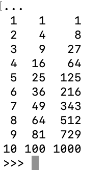
<div>实例</div>
</div>
<br>
<br>

```python{.line-numbers}
for x in range(1, 11):
    print('{0:2d} {1:3d} {2:4d}'.format(x, x*x, x*x*x))
```

**注意**：在第一个例子中，每列间的空格由 print() 添加。
这个例子展示了字符串对象的 rjust() 方法，它可以将字符串靠右，并在左边填充空格。
还有类似的方法，如 ljust() 和 center()。这些方法并不会写任何东西，它们仅仅返回新的字符串。
另一个方法 zfill()，它会在数字的左边填充 0，如下所示：

<br>
<div align=center>
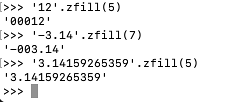
<div>实例</div>
</div>
<br>
<br>

str.format() 的基本使用如下：

```python {.line-numbers}
print('姓名：{}，住址："{}"'.format("小米","xxx"))
```
```
姓名：小米，住址："xxx"
```
括号及其里面的字符（称作格式化字段）将会被 format() 中的参数替换。
在括号中的数字用于指向传入对象在 format() 中的位置，如下所示：
```python {.line-numbers}
print('{0} and {1}'.format('Jack','Tom'))
```
```
Jack and Tom
```
```python {.line-numbers}
print('{1} and {0}'.format('Jack','Tom'))
```
```
Tom and Jack
```

如果在 format() 中使用了关键字参数，那么它们的值会指向使用该名字的参数。
```python {.line-numbers}
print('{name}网站： {site}'.format(name='学习',site='www.pilipili.com'))
```
```
学习网站： www.pilipili.com
```

位置及关键字参数可以任意的组合：
```python {.line-numbers}
print('{0},{1} and {other} are frends.'.format('Jack','Tom',other='Jane'))
```
```
Jack,Tom and Jane are frends.
```

`!a` （使用 **ascii()**），`!s` （使用 **str()**）和 `!r`（使用 **repr()**）可以用于在格式化某个值之前对其进行转化：
```python {.line-numbers}
import math
print('常量 PI 的近似值为：{}'.format(math.pi))
```
```
常量 PI 的近似值为：3.141592653589793
```
```python {.line-numbers}
print('常量 PI 的近似值为：{}'.format(math.pi))
```
```
常量 PI 的近似值为：3.141592653589793
```
可选项 `:` 和格式标识符可以跟着字段名。这就允许对值进行更好的格式化。下面的例子将 Pi 保留到小数点后三位：
```python {.line-numbers}

```


----

## <a id='mxdx' style='text-decoration:none'>Python3 面向对象</a>