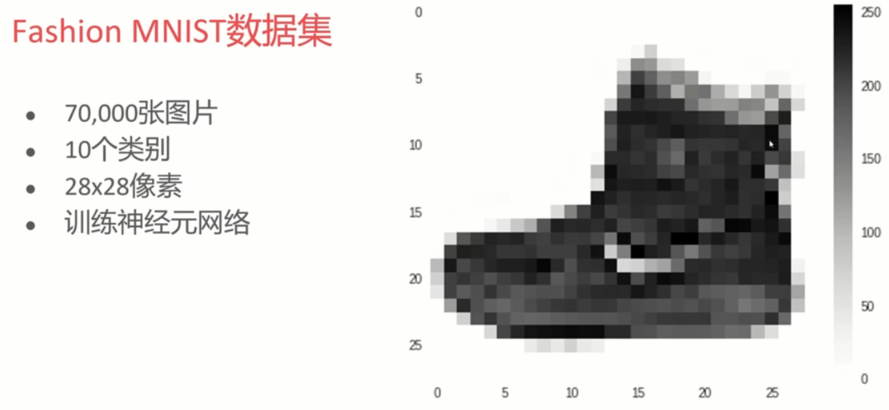
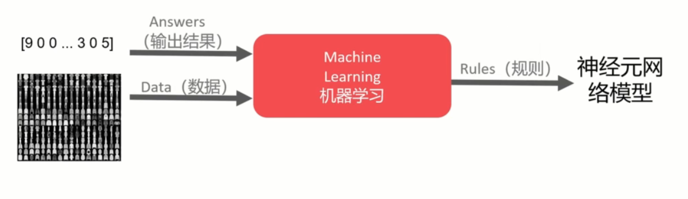

### 2.5.1--一个神经元的网络

如何根据X得到Y？
X = -1, 0, 1, 2, 3, 4
Y = -3, -1, 1, 3, 5, 7

Y = 2X - 1

``` python {.line-numbers}
from tensorflow import keras
import numpy as np

# 构建模型
model = keras.Sequential([keras.layers.Dense(unites=1, input_shape=[1])])
model.compile(optimizer='sgd', loss='mean_squared_error')
        # 指定模型的 loss function，根据什么来检测它的损失函数
        # 指定模型的 optimizer，根据什么来优化

# 准备训练数据
xs = np.array([-1.0, 0.0, 1.0, 2.0, 3.0, 4.0], dtype=float)
ys = np.array([-3.0, -1.0, 1.0, 3.0, 5.0, 7.0], dtype=float)

# 训练模型
model.fit(xs, ys, epochs=500)
        # 使用fit方法，去使模型去训练，对应x和y的值
        # epochs 指的是训练的次数

# 使用模型
print(model.predict([10.0]))
        # 最后用这个模型去检测 10 
        # 根据式子去算(2x-1) 应该是 2x10-1=19
        # 最后的值可能是一个比较接近19的一个值，因为这里是当做概率来做

```

***

### 3.1.1_计算机视觉

Fsshion MNIST数据集

- 70，000张图片
- 10个类别
- 28x28像素
- 训练神经元网络


<div align = center>

</div>

数据集中的第一张图片，它的宽和高都是28个像素，每个像素就是个灰度值，从0-255。

我们的设想就是用这些数据和标签做训练，最后得到一个神经网络模型。在这个模型中再来进行物品分类。


<div align = center>

</div>

---

### 3.2.1_加载FashionMNIST

加载FashionMNIST数据集代码如下：

```python {.line-numbers}
# 加载Fashion MNIST数据集

from tensorflow import keras
fashion_mnist = keras.datasets.fashion_mnist
(train_images, train_labels),(test_images, test_labels)=fashion_mnist.load_data()

# 查看加载数据

print(train_images.shape)
print(train_images[0])          #查看具体值
print(train_labels.shape)       #查看标签
print(train_labels[:3])         #查看前三个标签
print(train_labels[:5])         #~~~ 每个标签就对应相对位置上的一张图片

print(test_images.shape)        #查看test image数量
        # 总共70000张，train 60000，test 10000
        # 之所以分为train 和 test 是为了后面要验证模型的准确度
        # 验证模型准确度是不能用训练数据的，一定要用模型未见过的数据
        # 所以一开始就把这个数据集进行了切分

# 查看图片具体样子

import matplotlib.pyplot as plt
plt.imshow(train_images[0])

```

### 3.3.1_构造神经元网络模型


