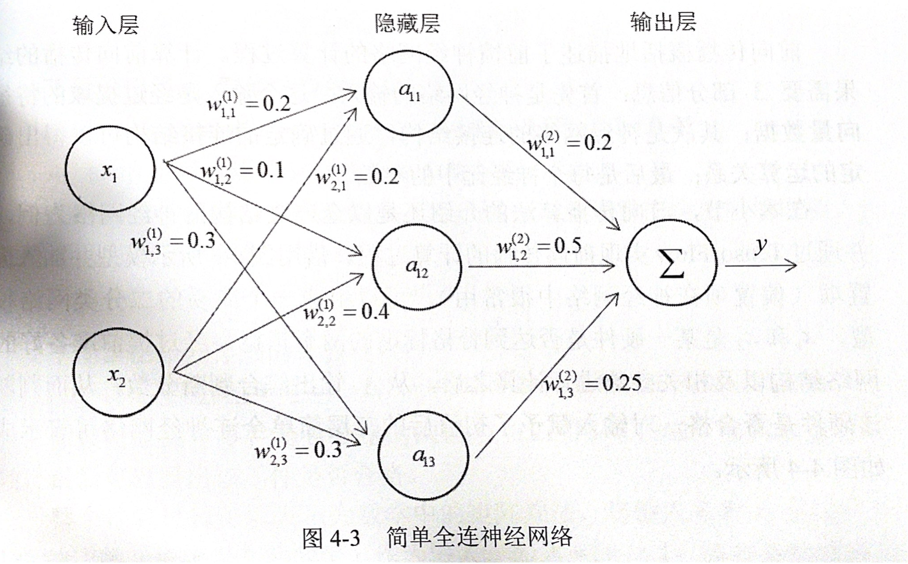
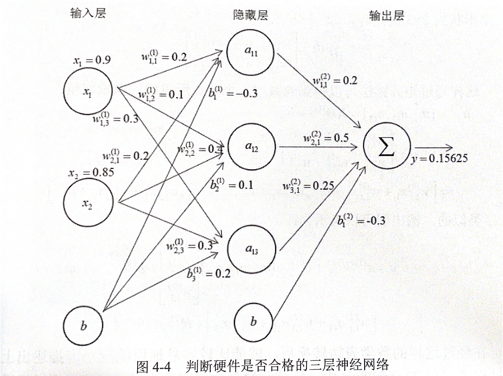

### 4.2.2 前向传播算法

前向传播概括地描述了前馈神经网络的计算过程。计算前向传播的结果需要3部分信息：首先是神经网络的输入，这个输入是经过提取的特征向量数据；其次是神经网络的链接结构，通过确定的连接件结构可以得出确定的运算关系；最后是每个神经元中的参数。

前向传播算法的介绍还是以全连接结构的神经网络为例，并通过TensorFlow实现前向传播的计算过程。借用图4-3所示模型并加入偏置项，可以组成一个简易的二分网络模型。


<div align = center>

</div>

x1和x2是某一硬件是否达到合格标准的两个指标，经过提前准备好的网络结构以及相关参数进行计算之后，从y输出综合判断分数，从而判断该硬件是否合格。对输入赋予了初值后的三层简单全连神经网络可以表示成图4-4所示。


<div align = center>

</div>

首先隐藏层有 3 个节点，每一个节点的取值都是输入层取值的加权和。a 的值可由以下公式算出：
<div align = center>

$a^{(1)}=\displaystyle\sum_{i}w^{(1)}_ix_i+b^{(1)}$

</div>

下面给出了 $a_{11}$ 取值的详细计算过程：
<div align = center>

$a_{11}=w^{(1)}_{1,1}x_1+w^{(1)}_{2,1}x_2+b^{(1)}_1=0.18+0.17-0.3=0.05$
</div>

$a_{12}$和$a_{13}$也可以通过类似的计算方法的得到。
在得到第一层的节点的取值后，可以进一步推导得出输出层的取值。y的值可以由以下计算公式得出：
<div align = center>

$y=\displaystyle\sum_{i}a^{(1)}w^{(2)}+b^{(2)}$
</div>

下面给出了其详细的计算过程：
<div align = center>

$y=w^{(2)}_{1,1}a_{11}+w^{(2)}_{2,1}a_{12}+w^{(2)}_{3,1}a_{13}+b^{(2)}_1=0.01+0.265+0.18125-0.3=0.15625$
</div>

假设一个判断零件是否合格的阈值为 0.2，用0.15625和阈值进行比较，最后可以得出该零件是否合格。

整个计算过程可以表示为数学中的矩阵乘法，将输入$x_1$和$x_2$组成一个 1x2 的矩阵（长度为2的向量）作为输入，即$X=[x_1,x_2]$;将权重参数组成一个形状为 2x3 的矩阵，即
<div align=center>

$W^{(1)}= \begin{bmatrix}
    w^{(1)}_{1,1} & w^{(1)}_{1,2} & w^{(1)}_{1,3}\\
    w^{(1)}_{2,1} & w^{(1)}_{2,2} & w^{(1)}_{2,3}\\
\end{bmatrix}$ 
</div>

这样通过举证乘法可以得到隐藏层3个节点所组成的向量取值：

$a^{(1)}=[a_{11},a_{12},a_{13}]=XW^{(1)}+b$
$ \qquad =[x_1,x_2]\begin{bmatrix}
    w^{(1)}_{1,1} & w^{(1)}_{1,2} & w^{(1)}_{1,3}\\
    w^{(1)}_{2,1} & w^{(1)}_{2,2} & w^{(1)}_{2,3}\\
\end{bmatrix}+[b^{(1)}_1\ b^{(2)}_2\ b^{(3)}_3]$
$\qquad=[w^{(1)}_{1,1}x_1+w^{(1)}_{2,1}x_2+b^{(1)}_1,w^{(1)}_{1,2}x_1+w^{(1)}_{2,2}x_2+b^{(1)}_2,w^{(1)}_{1,3}x_1+w^{(1)}_{2,3}x_2+b^{(1)}_3]$

类似的，输出层可以表示为：

<div align = center>

$y=a^{(1)}W^{(2)}+b^{(2)}_1=[a_{11},a_{12},a_{13}]\begin{bmatrix}
    w^{(2)}_{1,1}\\
    w^{(2)}_{2,1}\\
    w^{(2)}_{3,1}\\
\end{bmatrix}+b^{(2)}_1$
$=[w^{(2)}_{1,1}a_{11}+w^{(2)}_{2,1}a_{12}+w^{(2)}_{3,1}a_{13}]+b^{(2)}_1$
</div>

在经过这样的数学表达转换之后，就能比较容易地用编程语言描述出上述的过程了。在TensorFlow中，矩阵乘法是非常容易实现的。可以通过函数 matmul() 函数来完成，以下是这个函数的原型及参数说明：

```
# 函数原型：
# matmul (a,b,transpose_a,transpose_b,adjoint_a,adjoint_b,
#           a_is_sparse,b_is_sparse,name)
# 其中参数 transpose_a、transpose_b、adjoint_a、adjoint_b、
# a_is_sparse 和 b_is_
```
