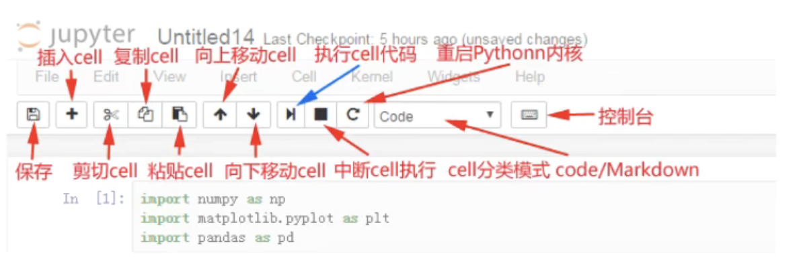

1. CONDA 环境安装
        conda ：data science package & enviroment manager
        创建环境：
        $\quad$conda create --name python3 python==3
        切换环境：
        $\quad$windows :activate python3
        $\quad$linux/mac :source activate python3

        官网地址：https://www.anaconda.com/download

2. Jupyter notebook
   
   jupyter notebook:一款编程/文档/笔记/展示软件
    启动命令：jupyter notebook

    


    ---
    ### Matplotlib 折线图

    例：假设一天中每隔两个小时 (range(2,26,2)) 的气温($^oC$)分别是：[15,13,14.5,17,20,25,26,26,27,22,18,15]

    ```
        from matplotlib import pyplot as plt    -->导入pyplot

        x = range(2,26,2)
                # 数据在x轴的位置，是一个可迭代对象
        y = [15,13,14.5,17,20,25,26,26,24,22,18,15]
                # 数据在y轴的位置，是一个可迭代对象
                --> x轴和y轴的数据一起组成了所有要绘制的坐标
                --> 分别是(2,15),(4,13),(6,14.5),(8,17)...
        plt.plot(x,y)           -->传入x和y，通过plot绘制出折线图
        plt.show()              -->在执行程序的时候展示图形
    ```


但是目前还存在一下几个问题：
1- 设置**图片大小**（想要一个高清无码大图）
2- **保存到本地**
3- **描述信息**，比如x轴和y轴表示什么，这个图表示什么
4- 调整x或者y的**刻度的间距**
5- **线条的样式**（比如颜色，透明度等）
6- **标记出特殊的电**（比如告诉别人最高点和最低点在哪里
7- 给图片**添加一个水印**（防伪，防止盗用）


#### 设置图片大小
```
import matplotlib.pyplot as plt

fig = plt.figure(figsize=(20,8),dpi=80)
        --> figure图形图标的意思，在这里指的就是我们画的图
        --> 通过实例化一个figure并且传递参数，能够在后台自动使用该figure实例
        --> 在图像模糊的时候可以传入**dpi参数**,让图片更加清晰
x = range(2,26,2)
y = [15,13,14.5,17,20,25,26,26,24,22,18,15]

plt.plot(x,y)
plt.savefig("./sig_size.png")   --> 保存图片
                                --> 可以保存为svg这种矢量图格式，放大不会有锯齿
plt.show()
```

#### 调整X或者Y轴上的刻度

```
import matplotlib.pyplot as plt

fig plt.figure(figsize = (10,5))

x = range(2,26,2)
y = [15,13,14.5,17,20,25,26,26,24,22,18,15]

plt.plot(x,y)
plt.xticks(x)   --> 设置x的刻度
#plt.xticks(x[::2])
                --> 当刻度太密集时候使用**列表的步长（间隔取值）来解决，matplotlib会自动帮我们对应**
plt.show()
```

```
_xtick_labels = [i/2 for i in range(4,49)]
plt.xticks(range(25,50))
plt.xticks(range(min(y),max(y)+1))
```

问题：
&emsp;如果列表a表示10点到12点的每一分钟的气温，如何绘制折线图观察每分钟气温的变化情况？
<div align = center>

`a = [random.randint(20,35) for i in range(120)]`

</div>


