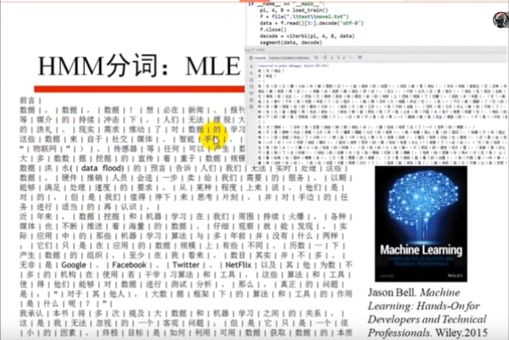

## 第一节：Python基础-Python及其数学库1

### 主要内容

- 机器学习、深度学习与本课程示例概述
- 及其学习的角度看数学：
  - 数学分析
    - 导数与梯度
    - Taylor 展式的应用
  - 概率论基础
    - 古典概型
    - 频率学派与贝叶斯学派
    - 常见概率分布
    - Sigmoid/Logistic 函数的引入
- Python 基础

</br>


### 什么是机器学习

- 对于某给定的**任务T**，在合理的**性能度量方案P**的前提下，某计算机程序可以自主学习**任务T**的**经验E**；随着提供合适、优质、大量的**经验E**，该程序对于**任务T**的**性能**逐步提高。
- 这里最重要的是机器学习的对象
  - 任务Task，T，一个或者多个
  - 经验Experience, E
  - 性能Performance, P
- 即：随着任务的不断执行，经验的积累会带来计算机性能的提升
  - Tome Michael Mitchell, 1997

**换个表述**
-

- 机器学习是**人工只能**的一个分支。我们使用计算机设计一个**系统**，使它能够根据提供的**训练数据**按照一定的方式来**学习**；随着训练次数的增加，该系统可以在**性能**上不断学习和改进；通过**参数优化**的学习模型，能够用于**预测**相关问题的输出。
- 思考：
  - 如何设计无人驾驶机动车？

</br>

### 人类的学习

- 如何从完全 “无知” 到掌握知识
  - 语言/颜色/形状等特征统计
- 有监督学习
  - 月亮
- 无监督学习
  - 阅兵
- 增强学习
  - 走路、踢球

### 机器学习的一般流程

- 数据挖掘/机器学习的流程

数据收集 -> 数据清洗 -> 特征工程 -> 数据建模

### 机器学习方法

- different assumptions on data
- different scalability profiles at training time
- different latencies at prediction time
- different model sizes (embedability in mobile devices)


### 思考：机器如何发现新词

- 频数：Count(X)
- 凝固程度
  - X = A.B
  - P(A)P(B) vs P(X)
- 自由程度
  - aXb
  - 信息熵H(a)、H(b)
- 凝固程度和自由程度缺一不可。只考虑凝固程度，会找出 “巧克”、“俄罗”、“颜六色”、“柴可夫” 等 “半个词” ； 只考虑自由程度，会把 “吃了一顿” 、 "看了一遍" 、 “睡了一晚” 、“去了一趟” 中的 “了一” 提取出来，因为它的左右领字都太丰富了。
  - 调参 
- 问题：给顶某长文本，如何利用上述参数设计**可行算法**？

### Python Code 示例1

```python {.line-numbers}
import math
import matplotlib.pyplot as plt

if __name__ == "__main__":
    x = [float(i)/100.0 for i in range(1,300)]
    y = [math.log(i) for i in x]
    plt.plot(x,y, 'r-', linewidth=3, label='log curve')
    a = [x[20],x[175]]
    b = [y[20],y[175]]
    plt.plot(a, b, 'g-', linewidth=2)
    plt.plot(a, b, 'b*', markersize=15, alpha=0.75)
    plt.legend(loc='upper left')
    plt.grid(True)
    plt.xlabel('x')
    plt.ylabel('log(x)')
    plt.show()
```

### Python Code 示例2

```python {.line-numbers}
if __name__ == "__main__":
    u = numpy.random.uniform(0.0, 1.0, 10000)
    plt.hist(u, 80, facecolor='g', alpha=0.75)
    plt.grid(True)
    plt.show()

    times = 10000
    for time in rang(times):
        u += numpy.random.uniform(0.0, 1.0, 10000)
    print len(u)
    u /= times
    print len(u)
    plt.hist(u, 80, facecolor='g', alpha=0.75)
    plt.grid(True)
    plt.show()
```


### 线性回归、rate、Loss


<div></div>

### EM Code

<div></div>

### EM算法

<div></div>

### GMM与图像

<div></div>

### 图像的卷积

<div></div>

### 去均值ICA分离

<div></div>

### 带噪声的信号分离

<div></div>

### SVM: 高斯核函数的影响

<div></div>

### Crawler爬取数据

<div></div>

### HMM分词：MLE

<div></div>

### LDA


<div></div>


### 舆情


<div></div>

### 例：石油例检结果处理

<div></div>

### 其他内容

<div></div>

### 本课程参考文献（部分）

<div></div>

### 回忆知识

- 求S的值

<div align=center></div>

### 对数函数的上升速度

<div align=center></div>

```python {.line-numbers}
import math
import matplotlib.pyplot as plt
import numpy as np

if __name__ == "__main__":
    x = np.arange(0.05, 3, 0.05)
    y1 = [math.log(a, 1.5) for a in x]
    plt.plot(x, y1, linewidth=2, color='#007500', label='log1.5(x)')
    plt.plot([1, 1], [y1[0], y1[-1]], "r--", linewidth=2)
    y2 = [math.log(a, 2) for a in x]
    plt.plot(x, y2, linewidth=2, color='#9F35FF', label='log2(x)')
    y3 = [math.log(a, 3) for a in x]
    plt.plot(x, y3, linewidth=2, color='#F75000', label='log3(x)')
    plt.legend(loc='lower right')
    plt.grid(True)
    plt.show()
```

### 问题分析

<div align=center></div>

### 附：构造数列{$x_n$}

<div align=center></div>

### 附：自然常数


<div align=center></div>


### 导数

- 简单的说，导数就是曲线的斜率，使曲线变化快慢的反应
- **二阶导数**是斜率变化快慢的反应，表征曲线**凹凸性**
  - 二阶导数连续的曲线，往往称之为 “**光顺**”的。
  - 还记得高中物理老师市场念叨的吗：**加速度**的方向总是指向轨迹曲线凹的一侧。
- <div ></div>

### 应用1


<div align=center></div>

### 求解$x^x$


<div align=center></div>

### 积分应用2：

<div align=center></div>


