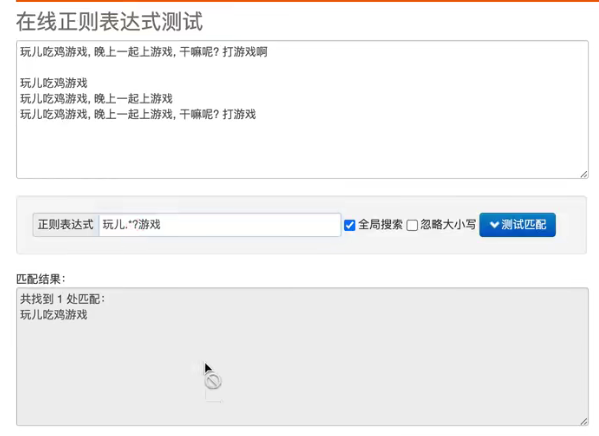
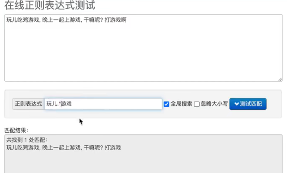
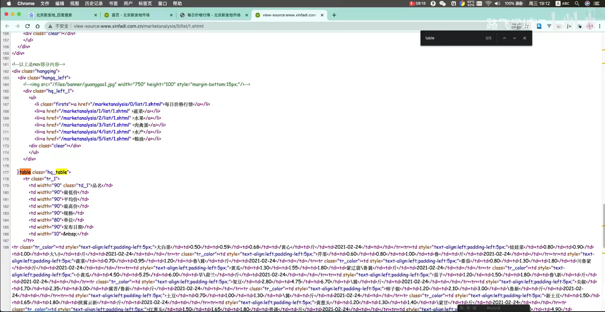
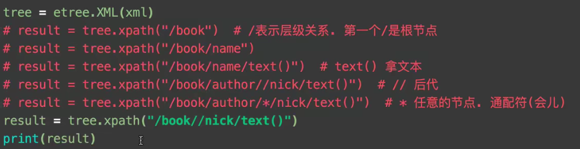
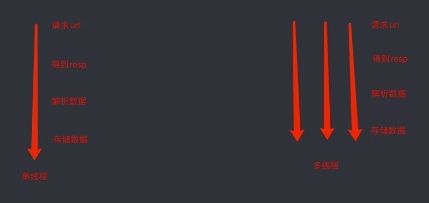

# 第一章 初识爬虫

## 3. 第一个爬虫程序

```python {.line-numbers}
from urllib.request import urlopen

url = "http://www.baidu.com"
resp = urlopen(url)

##print(resp.read().decode("utf-8"))

with open("mybaidu.html",mode='w') as f:
    f.write(resp.read().decode("utf-8"))
print("over!")

```


## 4. Web 请求解析

1. 服务器渲染：在服务器那边直接把数据和html整合在一起，统一返回给浏览器在页面源代码中能看到数据
2. 客户端渲染：第一次请求只要一个html骨架，第二次请求拿到数据，进行数据展示在页面代码中，看不到数据

熟练使用浏览器抓包工具

---

## 5. HTTP协议


请求方式：

    GET:显示提交（查询东西）
    POST：隐示提交（输入、修改东西）


---

## 6. Requests入门

安装requests
pip install requests

### Requests 01 案例 搜狗浏览器

```python {.line-numbers}
import requests

url = 'https://www.sogou.com/web?query=周杰伦'

headers = {
        "User-Agent": "Mozilla/5.0 (Windows NT 10.0; Win64; x64) AppleWebKit/537.36 (KHTML, like Gecko) Chrome/96.0.4664.45 Safari/537.36"    
}

resp = requests.get(url, headers = headers) #处理一个小小的反爬

print(resp)
print(resp.text) #拿到网页源代码

```


```python {.line-numbers}
import requests

query = input("输入一个你喜欢的明星")
url = f'https://www.sogou.com/web?query={query}' #f 在一段字符中插入

headers = {
        "User-Agent": "Mozilla/5.0 (Windows NT 10.0; Win64; x64) AppleWebKit/537.36 (KHTML, like Gecko) Chrome/96.0.4664.45 Safari/537.36"    
}

resp = requests.get(url, headers = headers) #处理一个小小的反爬

print(resp)
print(resp.text) #拿到网页源代码

```

### Requests 02 案例 百度翻译

```python {.line-numbers}
import request 

url = "https://fanyi.baidu.com/sug"

s = input("请输入你要翻译的英文单词")
data = {
    "kw": s
}

# 发送post请求， 发送的数据必须放在字典中，通过data参数进行传递
resp = requests.post(url, data=data)
print(resp.json())  # 将服务器返回的内容直接处理成json() => dict

```

### Requests 03 案例 豆瓣排行榜

```python {.line-numbers}
import requests

url = "https://movie.douban.com/j/chart/top_list"

header = {
    "User-Agent": "Mozilla/5.0 (Windows NT 10.0; Win64; x64) AppleWebKit/537.36 (KHTML, like Gecko) Chrome/96.0.4664.45 Safari/537.36"
}

# 重新封装参数
params = {

    "type": "24",
    "interval_id": "100:90",
    "action":"",
    "start": 0,
    "limit": 20,
}

resp = requests.get(url ,headers= header, params= params)

#print(resp.text)
#print(resp.json())
#print(resp.request.headers)

resp.close() # 使用完之后关掉resp 否则会被服务器拒绝访问

```

---


# 第二章 数据解析与提取

## 1.数据解析概述

在上一章中，我们基本上掌握了抓取整个网页的基本技能。但是大多数情况下，我们并不需要整个网页的内容，只是需要那么一小部分，怎么办呢？ 这就涉及到了数据提取的问题。

本课程中，提供三种解析方式：

1. re解析
2. bs4解析
3. xpath解析

这三种方式可以混合进行使用，完全以结果做导向，只要能拿到你想要的数据，用什么方案并不重要。当你掌握了这些之后，再考虑性能的问题。

---

## 2.正则表达式

Regular Expression 正则表达式，一种使用表达式的方式对字符串进行匹配的语法规则

我们抓取到的网页源代码本质上就是一个超长的字符串，想从里面提取内容。用正则再合适不过了。

正则的优点：速度快，效率高，准确性高
正则的缺点：新手上手难度有点儿高。

不过只要掌握了正则编写的逻辑关系，写出一个提取页面内容的正则其实并不复杂

正则的语法：使用元字符进行排列组合用来匹配字符串 在线测试正则表达式https://tool.oschina.net/regex/

元字符：具有固定含义的特殊符号
常用元字符：


>1 $\quad$. $\quad\;$ 匹配除换行符以外的任意字符
>2 $\quad$\w $\quad$匹配字母或数字或下划线
>3 $\quad$\s $\quad$匹配任意的空白符
>4 $\quad$\d $\quad$匹配数字
>5 $\quad$\n $\quad$匹配一个换行符
>6 $\quad$\t $\quad$匹配一个制表符
>7
>8 $\quad$^ $\quad$匹配字符串的开始
>9 $\quad$\$ $\quad$匹配字符串的结尾
>10 $\quad$
>11 $\quad$ \W $\quad$匹配非字母或数字或下划线
>12 $\quad$ \D $\quad$匹配非数字
>13 $\quad$ \S $\quad$匹配非空白符
>14 $\quad$ a|b $\quad$匹配字符a或字符b
>15 $\quad$ () $\quad$匹配括号内的表达式，也表示一个组
>16 $\quad$ [...]$\quad$匹配字符组中的字符
>17 $\quad$ [^...]$\quad$匹配除了字符组中字符的所有字符

量词：控制前面的元字符出现的次数

>1$\quad$*$\quad$重复零次或更多次
>2$\quad$+$\quad$重复一次或更多次
>3$\quad$？$\quad$重复一次或更多次
>4$\quad${n}$\quad$重复n次
>5$\quad${n,}$\quad$重复n次或更多次
>6$\quad${n,m}$\quad$重复n到m次

贪婪匹配和惰性匹配

>1$\quad$.\*$\quad$贪婪匹配（与惰性相反）
>2$\quad$.\*?$\quad$惰性匹配（匹配某俩表达式最短距离）

爬虫用的最多的就是惰性匹配。

惰性匹配：

贪婪匹配：


---

## 3.re模块

那么接下来的问题是，正则我会写了，怎么在python程序中使用正则呢？答案是re模块

re模块中我们只需要记住这么几个功能就足够我们使用了。

1. findall 查找所有. 返回list
   > 1 lst = re.findall("m","mai le fo len, mai ni mei!")
   2 print(lst) # ['m', 'm', 'm']
   3 lst = re.findall(r"\d+", "5点之前. 你要给我5000万")
   4 print(lst) # ['5', '5000']

2. search 会进行匹配. 但是如果匹配到了第一个结果. 就会返回这个结果. 如果匹配不上search返回的则是None
   ```python {.line-numbers}
   ret = re.search(r'\d', '5点之前. 你要给我5000万').group()
   print(ret)   #5
   ```

3. match 只能从字符串的开头进行匹配
   ```python {.line-numbers}
   ret = re.match('a', 'abc').group()
   print(ret)   # a
   ```

4. finditer, 和findall差不多. 只不过这时返回的是迭代器(重点)
   ```python {.line-numbers}
   it = re.finditer("m", "mai le fo len, mai ni mei!")

   for el in it:
       print(el.group())    # 依然需要分组
   ```

5. compile() 可以将一个长长的正则进行预加载. 方便后面的使用
   ```python {.line-numbers}
   obj = re.compile(r'\d{3}')   # 将正则表达式编译成为一个 正则表达式对象，规则要匹配的是3个数字
   ret = obj.search('abc123eeee')   # 正则表达式对象调用search，参数为待匹配的字符串
   print(ret.group())   # 结果：123
   ```

6. 正则中的内容如何单独提取？
    单独获取到正则中的具体内容可以给分组起名字
    ```python {.line-numbers}
    s="""
    <div class='西游记'><span id='10010;'>中国联通</span></div>
    """
    obj = re.compile(r"<span id='(?P<id>\d+)'>(?P<name>\w+)</span>",re.S) # re.S 让. 能匹配换行符/?P<xx>组名 把\d+匹配到的值赋予它
    # (?P<分组名字>正则) 可以单独从正则匹配的内容中进一步提取内容

    result = obj.search(s)
    print(result.group())   # 结果：<span id='10010'>中国联通</span>
    print(result.group("id"))   # 结果：10010 # 获取id组的内容
    print(result.group("name")) # 结果：中国联通 # 获取name组的内容
    ```
    这里可以看到我们可以通过使用分组. 来对正则匹配到的内容进一步的进行筛选.

关于正则. 还有一个重要的小点也非常的简单，在本节中就不继续扩展了，下一借的案例中会把这个小点进行简单的介绍。

---

## 4.案例 

### 案例1 豆瓣250

1. 使用requests get爬取代码
2. 使用正则 re模块提取内容
3. 存入csv

代码：

```python {.line-numbers}
import requests
import re
import csv

url = "XXX"

headers = {
    "user-agent": "Mozilla/5.0 (Windows NT 10.0; Win64; x64) AppleWebKit/537.36 (KHTML, like Gecko) Chrome/96.0.4664.45 Safari/537.36"
}

resp = requests.get(url, headers= headers )
resp.close()

result = re.compile(r'<div class="item">.*?<span class="title">(?P<name>.*?)</span>.*?'
                    r'<div class="bd">.*?<br>(?P<year>.*?)&nbsp;.*?'
                    r'<div class="star">.*?average">(?P<rate>.*?)</span>.*?'
                    r'<span>(?P<number>.*?)</span>',re.S)

it = result.finditer(resp.text)

f = open("data.csv",mode="w",encoding="utf-8")
csvwriter = csv.writer(f)

for i in it:
    # print(i.group("name"))
    # print(i.group("year").strip())
    # print(i.group("rate"))
    # print(i.group("number"))
    # print("-"*10)

    dic = i.groupdict()
    dic['year'] = dic['year'].strip()
    csvwriter.writerow(dic.values())

f.close()
```

### 案例2 电影天堂

- 定位到2020必看片
- 从2020必看片中提取到子页面的链接地址
- 请求子页面的链接地址，拿到我们想要的下载地址
- 存入csv

```python {.line-numbers}
import requests
import re
import csv

url = "XXX"

headers = {
    "user-agent": "Mozilla/5.0 (Windows NT 10.0; Win64; x64) AppleWebKit/537.36 (KHTML, like Gecko) Chrome/96.0.4664.45 Safari/537.36"
}

resp = requests.get(url, headers=headers)   # verify=False 去掉安全验证
resp.encoding = 'gb2312'
resp.close()

obj1 = re.compile(r"2021必看热片.*?<ul>(?P<ul>.*?)</ul>",re.S)
obj2 = re.compile(r"<li><a href='(?P<li>.*?)'",re.S)
obj3 = re.compile(r'<title>(?P<title>.*?)</title>.*?<td style="WORD-WRAP: break-word" bgcolor="#fdfddf"><a href="(?P<link>.*?)">',re.S)

result1 = obj1.finditer(resp.text)
child_href_list = []
for i in result1:
    #print(i.group('ul'))
    ul = i.group("ul")

    result2 = obj2.finditer(ul)
    for i in result2:
        #print(i.group('li'))
        child_href = url + i.group('li').strip("/")
        child_href_list.append(child_href)
    
f = open('movie_list2.csv',mode='w',encoding='utf-8')
csvwriter = csv.writer(f)

for i in child_href_list:

    child_resp = requests.get(i,headers=headers)
    child_resp.encoding='gb2312'
    child_resp.close()

    result3 = obj3.finditer(child_resp.text)
    for i in result3:
        dic = i.groupdict()
        csvwriter.writerow(dic.values())

f.close()

```

---

## 5.解析前戏-Html语法规则

**bs4解析-HTML语法**

bs4解析比较简单，但是呢，首先你需要了解一丢丢的html只是，然后再去使用bs
4去提取，逻辑和编写难度就会非常简单和清晰

HTML(Hyper Text Markup Language)超文本标记语言，是我们编写网页的最基本也是最核心的一种语言，其语法规则就是用不同的标签对网页上的内容进行标注，从而是网页显示出不同的展示效果。

```html {.line-numbers}
<h1>
    我爱你
</h1>
```
上述代码的含义是在页面中显示'我爱你'三个字，但是我爱你三个字被\<h1>和\</h1>标记了，白话就是被括起来了，被H1这个标签括起来了。这个时候，浏览器在展示的时候就会让**我爱你**变粗变大，俗称**标题**，所以HTML的语法就是用类似这样的标签对页面内容进行标记，不同的标签表现出来的效果也是不一样的。
``` 
1 h1: 一级标题
2 h2: 二级标题
3 p： 段落
4 font： 字体(被弃用了，但能用)
5 body:  主体
```

接下来就是属性了

```html {.line-numbers}
<h1>
    我爱你
</h1>
<h1 align='right'>
    我爱你妹
</h1>
```
首先这两个标签都是h1标签，都是一级标题，但是下面这个会显示在右边 也就是说，通过xxx=xxx这种形式对h1标签进一步的说明了 那么这种语法在html中被称为标签的属性，并且这个属性可以有很多个，例如：
```html {.line-numbers}
<body text="green" bgcolor="#eee">
    XXXX
</body>
```
总结，html语法：
```html {.line-numbers}
<标签 属性='值' 属性='值'>
    被标记的内容
</标签>
```
有了这些知识，我们再去看bs4就会得心应手了，因为bs4就是通过标签和属性去定位网页上的内容的。


---

## 6.BS解析入门

- 安装
- pip install bs4 (直接安装)
- pip install -i XXX (xxx源)


<div align=center></div>

```python {.line-numbers}
import requests
from bs4 import BeautifulSoup
import csv

url = 'xxx'
resp = requests.get(url)

f = open('xxx',mode='w')
csvwriter = csv.writer(f)

# 解析数据
# 1.把页面源代码交给BeautifulSoup进行处理，生成bs对象
page = BeautifulSoup(resp.text, "html.parser")  # 指定html解析器
# 2.从bs对象中查找数据
# find(标签，属性=值)
# find_all(标签，属性=值)
# table = page.find("table",class_="hq_table")  # class是python的关键字
table = page.find("table", attrs={"class":"hq_table"})  # 和上一行是一个意思. 此时可以避免class
# 拿到所有数据行
trs = table.find_all("tr")[1:]
for tr in trs:
    tds = tr.find_all("td") # 拿到每行中的所有td
    name = tds[0].text  # .text 表示拿到被标签标记的内容
    low = tds[1].text   # .text 表示拿到被标签标记的内容
    avg = tds[2].text  # .text 表示拿到被标签标记的内容
    high = tds[3].text  # .text 表示拿到被标签标记的内容
    gui = tds[4].text  # .text 表示拿到被标签标记的内容
    kind = tds[5].text  # .text 表示拿到被标签标记的内容
    date = tds[6].text  # .text 表示拿到被标签标记的内容
    csvwriter.writerow([name,low,avg,high,gui,kind,date])

f.close()
```

---

## 7 BS4解析案例-抓取优美图库图片

```python {.line-numbers}
# 1.拿到主页面的源代码，然后提取到子页面的连接地址，href
# 2.通过href拿到子页面的内容，从子页面中找到图片的下载地址 img -> src
# 3.下载图片

import requests
from bs4 import BeautifulSoup
import time

url = "xxx"
headers = {"xx":"xxx"}
resp = requests.get(url,headers=headers)
resp.encoding = "utf-8"
resp.close()

# 把源代码交给bs
main_page = BeautifulSoup(resp.text,"html.parser")
alist = main_page.find("div",class_="TypeList").find_all("a")

for a in alist:
    href = a.get("href")    # 直接通过get就可以拿到属性的值
    # 拿到子页面的源代码
    child_page_resp = requests.get(url,headers)
    child_page_resp.encoding = "utf-8"
    child_page_text = child_page_resp.text
    child_page_resp.close()
    # 从子页面中拿到图片的下载路径
    child_page = BeautifulSoup(child_page_text,"html.parser")
    p = child_page.find("p",align="center")
    img = p.find("img")
    src = img.get("src")
    # 下载图片
    img_resp = requests(src,headers)
    # img_resp.content  #这里拿到的是字节
    img_name = src.split("/")[-1]
    with open("images/"+img_name,mode="wb")as f:
        f.write(img_resp.content)

    print("over",img_name)
    time.sleep(1)
```

---

## 8.Xpath入门

<div align='center'></div>

---


---
## 3_1 Requests进阶概述

我们在之前的爬虫中其实已经使用过headers了，headers为HTTP协议中的请求头，一般存放一些和请求内容无关的数据，有时也会存放一些安全验证信息，比如常见的User-Agent,token,cookie等。

通过requests发送的请求，我们可以把请求头信息放在headers中，也可以单独进行存放，最终由requests自动帮我我们拼接成完整的http请求头。

本章内容：

1. 迷你浏览器登陆->处理cookie
2. 防盗链处理->抓取梨视频数据
3. 代理->防止被封IP

综合训练：

抓取网易云音乐评论信息

---

## 3_2 处理cookie 登录小说网


```python {.line-numbers}

# 登录 -> 得到cookie
# 带着cookie 去请求到书架url -> 书架上的内容

# 必须把上面的两个操作连起来
# 我们可以使用session进行请求 -> session你可以认为是一连串的请求。在这个过程中的cookie不会丢失

import requests

headers = {
    "user-agent": "Mozilla/5.0 (Windows NT 10.0; Win64; x64) AppleWebKit/537.36 (KHTML, like Gecko) Chrome/96.0.4664.45 Safari/537.36"
}

url = "XXX"

data = {
    "loginName": "XXX",
    "password": "XXX"
}

# 会话
session = requests.session()

# 1.登录
session.post(url,headers=headers,data=data)

#print(resp.cookies)
#print(resp.text)

# 2.拿到书架上的数据
# 刚才的那个session中是有cookie的

resp = session.get("XXX")
resp.close()

print(resp.json())

###

resp = requests.get(url,headers={"Cookie": "GUID=24c30d19-7ad7-435f-a5f5-b8d7d069db65; BAIDU_SSP_lcr=http://www.baidu.com/link?url=wlrr0pmfUBWR08CNn0BRDY2_BWZUUrSckoNoj4Z59Xi&wd=&eqid=ae58e48d00130e5d0000000661a5470a; Hm_lvt_9793f42b498361373512340937deb2a0=1638221586; c_channel=0; c_csc=web; accessToken=avatarUrl%3Dhttps%253A%252F%252Fcdn.static.17k.com%252Fuser%252Favatar%252F13%252F73%252F46%252F86194673.jpg-88x88%253Fv%253D1638229470000%26id%3D86194673%26nickname%3D%25E4%25B9%25A6%25E5%258F%258Bvos28S1bo%26e%3D1653783026%26s%3Dbf2de04f087861eb; sensorsdata2015jssdkcross=%7B%22distinct_id%22%3A%2286194673%22%2C%22%24device_id%22%3A%2217d6d9d9d93255-03ac6d384c7193-978183a-2073600-17d6d9d9d94c8f%22%2C%22props%22%3A%7B%22%24latest_traffic_source_type%22%3A%22%E8%87%AA%E7%84%B6%E6%90%9C%E7%B4%A2%E6%B5%81%E9%87%8F%22%2C%22%24latest_referrer%22%3A%22http%3A%2F%2Fwww.baidu.com%2Flink%3Furl%3Dwlrr0pmfUBWR08CNn0BRDY2_BWZUUrSckoNoj4Z59Xi%26wd%3D%26eqid%3Dae58e48d00130e5d0000000661a5470a%22%2C%22%24latest_referrer_host%22%3A%22www.baidu.com%22%2C%22%24latest_search_keyword%22%3A%22%E6%9C%AA%E5%8F%96%E5%88%B0%E5%80%BC%22%7D%2C%22first_id%22%3A%2224c30d19-7ad7-435f-a5f5-b8d7d069db65%22%7D; Hm_lpvt_9793f42b498361373512340937deb2a0=1638231044"})

print(resp.text) # 在headers中直接添加cookie

```

---

## 3_3 防盗链 抓取梨视频


```python {.line-numbers}
# 1. 拿到contID
# 2. 拿到videoStatus返回的json。 -> srcURL
# 3. srcURL里面的内容进行修整
# 4. 下载视频


import requests

# 拉取视频的网址
url = "https://www.XXX.com/video_1746463"
contId = url.split("_")[1]

videoStatusUrl = f"https://www.XXX.com/videoStatus.jsp?contId={contId}&mrd=0.5829384196767642"

headers = {
    "user-agent": "Mozilla/5.0 (Windows NT 10.0; Win64; x64) AppleWebKit/537.36 (KHTML, like Gecko) Chrome/96.0.4664.45 Safari/537.36",
    # 防盗链：溯源，当前本次请求的上一级是谁
    "Referer": url
}

resp = requests.get(videoStatusUrl,headers=headers)
resp.encoding= "utf-8"
resp.close()

#print(resp.text)

dic = resp.json()
systemTime = dic['systemTime']
srcUrl = dic['videoInfo']['videos']['srcUrl']
srcUrl = srcUrl.replace(systemTime,f"cont-{contId}")

# 下载视频
with open("a.mp4",mode="wb") as f:
    f.write(requests.get(url=srcUrl).content)
```

---

## 3_4 代理


---

## 3_5 综合训练 抓取网易云音乐评论信息


---

## 4_1 第四章概述

**本章内容梗概**

到目前为止，我们可以解决爬虫的基本抓取流程了，但是抓取效率还是不够高。如何提高抓取效率呢？我们可以选择多线程，多进程，协程等操作完成异步爬虫。

何为异步？这里我们不讨论蹩脚的概念性问题，直接说效果。

打个比方，我们目前写的爬虫可以理解为单线程，比喻为单车道公路，如何提高效率呢？很简单，搞成多车道就OK了啊。异步爬虫你就可以理解为多车道同时进行爬取。

<div align=center></div>

原来一股道跑，现在三股道跑，哪个快？

在这里要特殊说明一下，多线程异步爬虫中每一步都可以设立成多线程的，具体操作得实际去分析，当然，也可以像图这样，每一个url一个单线程。

本章设计内容：

1. 快速学会多线程
2. 快速学会多进程
3. 线程池和进程池
4. 扒光新发地
5. 协程
6. 多任务异步协程实现
7. aiohttp模块详解
8. 扒光一本小说
9. 综合训练-抓取一部电影

---

## 4_2 多线程

- 线程，进程
- 进程是资源单位，每一个进程至少要有一个线程
- 线程是执行单位

- 启动每一个程序默认都会有一个主线程

 
**方法一**

```python {.line-numbers}
from threading import Thread #　线程类

def func():
    for i in range(1000):
        print("main",i)

if __name__ == "__main__":
    t = Thread(target=func)
    t.start()
    for i in range(1000):
        print("main",i)
```

**方法二**

```python {.line-numbers}
from threading import Thread #　线程类

class MyThread(Thread):
    def run(self):
        for i in range(1000):
            print("子线程",i)

if __name__ == "__main__":
    t = MyThread()
    # t.run()   #方法的调用了， -> 单线程
    t.start()

    for i in range(1000):
        print("主线程",i)
```

**方法三**

```python {.line-numbers}
from threading import Thread

def func(name):
    for i in range(1000):
        print(name,i)

if __name__ == "__main__":
    t1 = Thread(target=func,args=("1",))    # 传递参数必须是元组
    t1.start()

    t2 = Thread(target=func,args=("2",))
    t2.start()

```

---

## 4_3 多进程-1

使用方法与线程类似

```python {.line-numbers}
from multiprocessing import Process

def func():
    for i in range(1000):
        print("子进程",i)

if __name__ == "__main__":
    p = Process(target = func)
    p.start()
    for i in range(1000):
        print("主进程",i)


```

***

## 4_4 线程池和进程池入门

```python {.line-numbers}
#线程池：一次性开辟一些进程。我们用户直接给线程池子提交任务。线程任务的调度交给线程池来完成
from concurrent.futures import ThreadPoolExecutor, ProcessPoolExecutor

def fn(name):
    for i in range(1000):
        print(name,i)

if __name__ == "__main__":
    # 创建线程池
    with ThreadPoolExexutor(50) as t:
        for i in range(100):
            t.submit(fn,name = i)
    # 等待线程池中的任务全部执行完毕。才能执行（守护）
    print("finish") 

```


