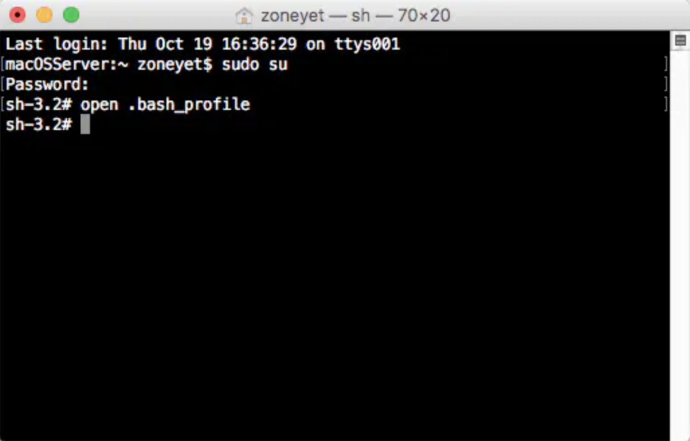
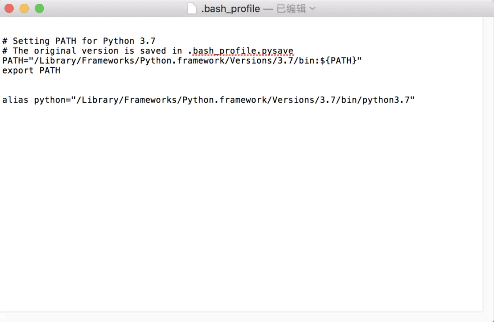

## 1. 下载Python

https://www.python.org/

## 2. 查找JDK安装目录

    1. 打开Mac自带Terminal
    2. 在终端Terminal输入：Python --version
    3. 在终端Terminal输入：which Python
   
## 3. 配置环境变量

1. 打开Terminal
2. 进入当前用户主目录：cd~ (默认用户则不需要)
3. 临时授权：sudo su；
4. 输入系统密码 (加锁密码不显示输入)
5. 创建.bash_profile文件：touch .bash_profile (如果存在则不必新建，可直接第六部验证后再选择是否执行此步)
6. 打开.bash_profile文件：open .bash_profile (能打开则新建成功)
7. 输入Python安装的路径环境变量命令：
```python {.line_numbers}
# Setting PATH for Python 3.7
# The original version is saved in .bash_profile.pysave
PATH="/Library/Frameworks/Python.framework/Versions/3.7/bin:${PATH}"
export PATH

alias python="/Library/Frameworks/Python.framework/Versions/3.7/bin/python3.7"
```
保存并退出





8. source .bash_profile #让配置文件生效
   
