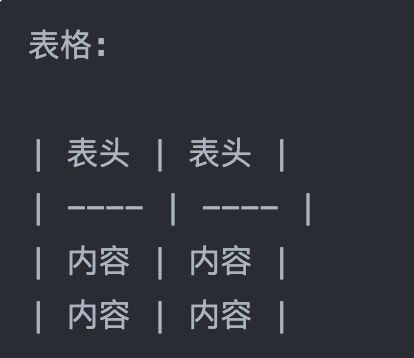
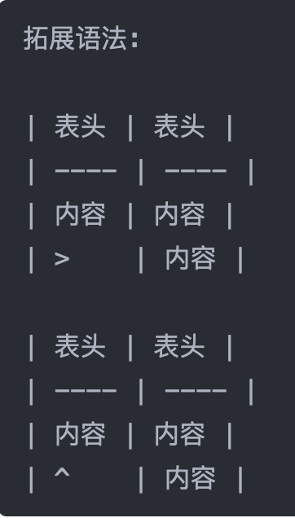
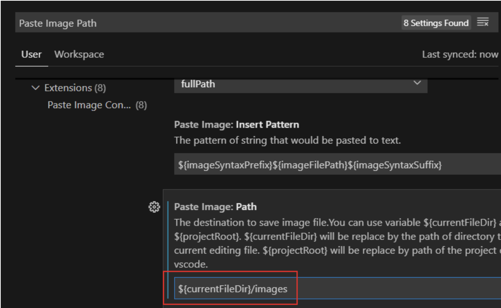

# Markdown 语法
纯粹的 Markdown 语法其实非常简单，70行的语法介绍就可以写完

# 一级标签
    # 一级标签
## 二级标签
    ## 二级标签
### 三级标签
    ### 三级标签

写完一个段落就要隔一行空行。

就像这样，隔了一行空行。

---

#分割线、加粗、斜体、删除线

分割线

**重点加粗**
    ** 重点加粗 **  （去除空格）

*斜体*
    * 斜体 *    （去除空格）

~~~删除线~~~
    ~~~ 删除线 ~~~ （去除空格）

---

# 列表：

* 无序列表
  * 嵌套无序列表
  * 嵌套无序列表
* 无序列表
* 无序列表
>     * 无序嵌套
>       * 嵌套无序列表
>       * 嵌套无序列表
>     * 无序列表
>     * 无序列表

1. 有序列表 1
   1. 嵌套有序列表 1
   2. 嵌套有序列表 2
2. 有序列表 2
3. 有序列表 3
>   1. 有序列表 1
>       1. 嵌套有序列表 1
>       2. 嵌套有序列表 2
>   2. 有序列表 2
>   3. 有序列表 3

## Markdown Preview Enhanced拓展功能

任务列表：

- [x] 已经做完的事 1
- [ ] 已经做完的事 2
- [ ] 已经做完的事 3
- [ ] 仍未完成的事 4
- [ ] 仍未完成的事 5

>   \- [X] 已经做完的事 1
>   \- [ ] 仍未完成的事 2

快捷键：
---
要进行**缩进**（书写嵌套列表），你可以使用VSCode的快捷键```Ctrl+[```和```Ctrl+]```.
这个快捷键可以将代码向左或向右进行缩进。


---

#引用文本：

    > 引用别人说的话
    > 就这样写
    > xxx

---

# 这是‘行内代码’语法

``` python
print("Hello, World!")
```

''' python
print("hellow, world!")
'''

' 替换为 `

Markdown Preview Enhanced 拓展功能
---

``` javascript {.line-numbers}
function add(x,y){
    return x+y
}
```

''' javascropt {.line-numbers}
function add(x,y){
    return x+y
}
'''

```python {.line-numbers}
print('hellow,world!')

```

---

# 链接

[超链接名称](链接地址)
>   [超链接名称] (链接地址)


>   ![图片提示语] (图片地址)


---

# 表格：

你可以很方便地在做笔记的时候加入表格：

| 表头 | 表头 |        
| ---- | ----|
| 内容 | 内容 |
| 内容 | 内容 |

Markdown Preview Enhanced 拓展功能：
---




快捷键：
---

自动表格对齐：```Shift + Alt + F```


---

# 注释

注释不会被渲染出来。

你可以随手做点草稿，如果还想保留着，但是不显示，就可以按下**快捷键** ```Ctrl + \``` **将当前行注释 / 反注释**。

<!-- 你看不见我 -->
>   <! -- xxxx -->  
>   去除！后空格
>   <! -- 多行注释
>   就像这样 -->

有一点很重要的就是，**VSCode 会在你每次修改代码之后，重新渲染一遍**。

**如果有很多很多的数学公式，渲染会很慢**，这时候有两个建议：
* **分成多个文件，避免单文件过大**
* **将你暂时不看的部分注释掉，加快渲染速度**

---


# 标题
你可以用
#一级标题
##二级标题
###三级标题
段落.

或

一级标题
=======

二级标题
------

---

#段落

段落和段落之间要隔一行。

就像这样。

---

# 分割线

三条横线（或者更多的横线）表示分割线。

---

# 加粗，斜体和删除线

**重点加粗**
>   ** 重点加粗 **
>   去除空格

*斜体*
>   *斜体 *

~~删除线~~
>   ~~ 删除线 ~~

## Markdown Preview Enhanced 拓展功能：

==高亮==
>   == 高亮 ==

## 快捷键

选中文本之后，按下 ```Ctrl + B``` 可以给选中文本加粗
同理```Ctrl + I```可以让选址那个文本变为斜体。


# 剪贴板图片插入

看了上面的插入图片语法，也许你会觉得，好麻烦啊。
我就插入一张图片，居然还要把图片上传到网上。或者把图片保存到本地，还要移动图片，命名啥的。

就不能像 Word 那样，直接**剪贴板粘贴图片**吗？

万能的 VSCode 当然可以做到类似的事！

其实，使用你已经安装了的 **Past Image** 插件就行。

不过在使用之前，你要做一点小调整：

按下```Ctrl + ,```打开设置窗口，输入```Paste Image Path```并搜索，将框内的文本改成```${currentFileDir}/image```.



注意标题是 **Paste Image:Path**,不要弄错了！

设置好之后，你就可以使用剪贴板粘贴功能了。

**按下快捷键** ```Ctrl + Alt + V```,(MAC:```Opt + Com + V```)
>   Mac截屏 ```Shift + Com + 4```

就能把图片自动保存到当前目录下，并以正确的格式粘贴到当前的 Markdown 文件中。

如果你需要上传到图床，便于再互联网中分享的话，也可以用 **Better Markdown & Latex Shortcuts** 中的功能，**按下快捷键** ```Shift + Ctrl + Alt + V```,就可以上传到图床并自动以正确格式粘贴到当前 Markdown 文件中。


