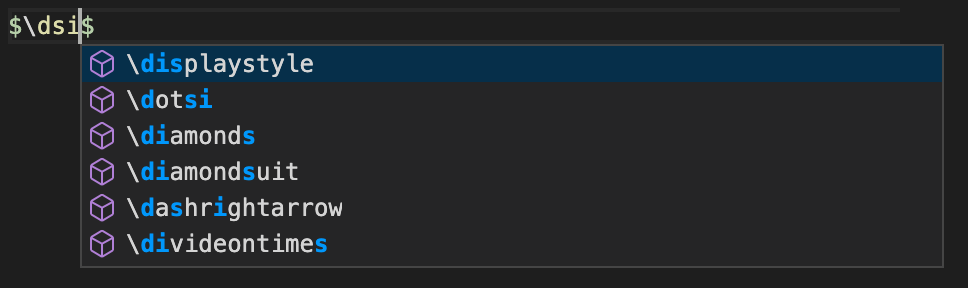
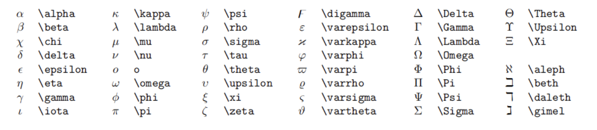
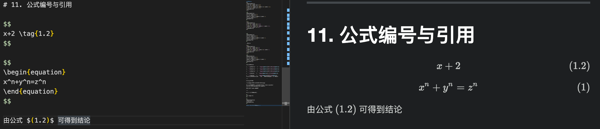

# 数学公式支持
有一点很重要的就是，**VSCode 会在你每次修改代码之后，重新渲染一遍。**

**如果有很多很多的数学公式，渲染会很慢，**这时候有两个建议：
* **分成多个文件，避免单文件过大！**
* **将暂时不看的部分注释掉，加快渲染速度！**


Markdown 的数学公式吸纳了大部分的 Latex 语法，你可以以一种简单的方式在 VSCode 中书写数学公式。

> 行内公式：
> 单位圆 $x\^2+y^2=1\$
>
>公式块：
>
>$\$
>
>\begin{cases}
>x=\rho\cos\theta \\
>y=\rho\sin\theta \\
>\end{cases}
>$$

行内公式：
单位圆 $x^2+y^2=1$
公式块：
$$
\begin{cases}
x=\rho\cos\theta \\
y=\rho\sin\theta \\
\end{cases}
$$

**VSCode 有着非常便捷好用的自动补全功能**，只需要简单地打出你想打的内容的几个字母（**乱序**也行），再使用↑↓进行选择，最后按下回车就可以打出你想要的内容。



还有，**不要在公式内使用中文**，除非是 ```\text{中文}}```（但是也不推荐）

---
# 1.上标和下标

上标 \$x^2 + y^{12} = 1\$
下标 \$x_1 + y_{12} = 1\$

> 上标  $x^2 + y^{12} = 1$
> 下标  $x_1 + y_{12} = 1$

**自动补全：**

* ```\\-1\\```  → ```^{-1}``` 
* ```\\comma``` → ```\alpha_1,\alpha_2,\cdots,\alpha_n```
  

---
# 2.分式

较小的行内行分数 \$\frac{1}{2}$
展示型的分式 \$\displaystyle\frac{x+1}{x-1}\$

其中 ```\displaystyle``` 用于将行内展示转为块状展示。

> 较小的行内行分数 $\frac{1}{2}$
> 展示型的分式 $\displaystyle\frac{x+1}{x-1}$

**自动补全：**
**选中文本时**，```x+1``` + ```\\frac``` → ```\frac{x+1}{}```
**在自动补全之后，按下 ```Tab``` 键可以切换到下一个位置！**

---

# 3.根式

开平方 \$\sqrt{2}$
开 \$n\$ 次方 \$\sqrt[n]{2}\$

> 开平方 $\sqrt{2}$
> 开n次方 $\sqrt[n]{2}$

**自动补全：**
**选中文本时，** ```x + 1``` + ```\\sqrt``` → ```\sqrt{x+1}```

---

# 4. 空格

数学公式中的**空格和换行**都会在编译时**被忽略**。

输入空格：

紧贴 \$\\!b$
>   $a\!b$

没有空格 \$ab\$
> $ab$

小空格 \$a\\,b\$
>$a\,b$

中等空格 \$a\\;b\$
>$a\;b$

大空格 \$a\\ b\$
>$a\ b$

quad 空格 \$a\\quad b\$
>$a\quad b$

两个 quad 空格 \$a\\qquad b\$
>$a\qquad b$

---
# 5.累加，累乘和积分

**累加** 
\$\\sum_{k=1}\^n\\frac{1}{k}  \\quad  \\displaystyle\\sum_{k=1}\^n\\frac{1}{k}\$
> $\sum_{k=1}^n\frac{1}{k}  \quad  \displaystyle\sum_{k=1}^n\frac{1}{k}$

**累乘**
\$prod_{k=1}\^n\\frac{1}{k}  \\quad  \\displaystyle\prod_{k=1}\^n\\frac{1}{k}\$
>$\prod_{k=1}^n\frac{1}{k}  \quad  \displaystyle\prod_{k=1}^n\frac{1}{k}$

**积分**
\$\displaystyle \\int_0\^1x{\\rm d}x  \\quad \\iint_{D_{xy}}  \\quad  \\iiint_{\\omega_{xyz}}\$
>$\displaystyle \int_0^1x{\rm d}x  \quad  \iint_{D_{xy}}  \quad  \iiint_{\omega_{xy}}$

**自动补全：**
* ```\\sum``` → ```\sum_{i=1}```
* ```\\prod``` → ```\prod_{i=1}```
* ```\\lim``` → ```\lim_{x\to \infty}```
  
---

# 6.括号修饰

用 ```\left``` 和 ```\right``` 可以让括号适配内部大小

**圆括号**
\$\\displaystyle \\left(\\sum_{k=1}\^{n}\\frac{1}{k} \\right)\^2\$
> $\displaystyle \left(\sum_{k=1}^{n}\frac{1}{k} \right)^2$

**方括号**
\$\\displaystyle \\left[\\sum_{k=1}\^{n}\\frac{1}{k} \\right]\^2\$
>$\displaystyle \left[\sum_{k=1}^{n}\frac{1}{k} \right]^2$

**花括号**
\$\\displaystyle \\left{\\sum_{k=1}\^{n}\\frac{1}{k} \\right}\^2\$
>$\displaystyle \left\{\sum_{k=1}^{n}\frac{1}{k} \right\}^2$

**尖括号**
\$\\displaystyle \\left\\langle\\sum_{k=1}\^{n}\\frac{1}{k} \\right\\rangle^2\$
>$\displaystyle \left\langle\sum_{k=1}^{n} \frac{1}{k} \right\rangle^2$

**自动补全：**
* ```\\angle``` → ```\lange \rangle```
* ```\\set``` → ```\{ \}```
* ```\\bracket``` → ```\left( \right)```
* ```\\square_bracket``` → ```\left[  \right]```
* ```\\curly_bracket``` → ```\left\{  \right}```
  
  ---

  # 7. 多行算是对齐

  **居中**
  \$$
  \begin{aligned}
  y &=(x+5)\^2-(x+1)\^2\\\\
  &=(x\^2+10x+25)-(x\^2+2x+1)\\\\
  &=8x+24\\\\
  \\end{aligned}
  \&&

  >$$
  >\begin{aligned}
  >y &=(x+5)^2-(x+1)^2 \\
  >&=(x^2+10x+25)-(x^2+2x+1) \\
  >&=8x+24 \\
  >\end{aligned}
  >$$

  **左对齐**

  \$
  \\begin{aligned}
  y &=(x+5)\^2-(x+1)\^2 \\\\
  &=(x\^2+10x+25)-(x\^2+2x+1)\\\\
  &=8x+24 \\\\
  \end{aligned}
  \$
  >$
  >\begin{aligned}
  >y &=(x+5)^2-(x+1)^2\\
  >&=(x^2+10x+25)-(x^2+2x+1)\\
  >&=8x+24
  >\end{aligned}
  >$

  **自动补全：**
  **选中文本时**，```x+1``` + ```\\aligned``` → ```x+1 \begin{aligned}
   \\
  \end{aligned}```

  ---

  # 8.方程组

  \$$
  \\begin{cases}
  k_{11}x_1+k_{12}x_2+\\cdots+k_{1n}x_n=b_1 \\\\
  k_{21}x_1+k_{22}x_2+\\cdots+k_{2n}x_n=b_2 \\\\
  \cdots \\\\
  k_{n1}x_1+k_{n2}x_2+\\cdots+k_{nn}x_n=n_n \\\\
  \\end{cases}
  \$\$
>$$
>\begin{cases}
>k_{11}x_1+k{12}x_2+\cdots+k_{1n}x_n=b_1 \\
>k_{21}x_1+k_{22}x_2+\cdots+k_{2n}x_n=b_2 \\
>\cdots \\
>k_{n1}x_1+k_{n2}x_2+\cdots+k_{nn}x_n=b_n \\
>\end{cases}
>$$

**自动补全：**

**选中文本时**,```x+1=2``` + ```\\cases``` → ```\begin{cases} x+1=2 \\ \end{cases}```

---

# 9.矩阵

**矩阵：**
$\$
\\begin{pmatrix}
1 \& 1 \& \\cdots \& 1 \\\\
1 \& 1 \& \\cdots \& 1 \\\\
\\vdots \& \\vdots \& \\ddots \& \\vdots \\\\
1 \& 1 \& \\cdots \& 1 \\\\
\\end{pmatrix}
\$\$

>$$
\begin{pmatrix}
1 & 1 & \cdots & 1 \\
1 & 1 & \cdots & 1 \\
\vdots & \vdots & \ddots & \vdots \\
1 & 1 & \cdots & 1 \\
\end{pmatrix}
$$

\$\$
\\begin{bmatrix}
1 \& 1 \& \\cdots \& 1 \\\\
1 \& 1 \& \\cdots \& 1 \\\\
\\vdots \& \\vdots \& \\ddots & \\vdots \\\\
1 \& 1 \& \\cdots \& 1\\\\
\\end{bmatrix}
$\$


>$$
\begin{bmatrix}
1 & 1 & \cdots & 1 \\
1 & 1 & \cdots & 1 \\
\vdots & \vdots & \ddots & \vdots \\
1 & 1 & \cdots & 1 \\
\end{bmatrix}
$$

行列式：

\$\$
\\begin{vmatrix}
1 \& 1 \& \\cdots \& 1 \\
1 \& 1 \& \\cdots \& 1 \\
\\vdots \& \\vdots \& \\cdots \& \\vdots \\
1 \& 1 \& \\cdots \& 1 \\
\\end{vmatrix}
\&\&

>$$
\begin{vmatrix}
1 & 1 & \cdots & 1 \\
1 & 1 & \cdots & 1 \\
\vdots & \vdots & \ddots & \vdots \\
1 & 1 & \cdots & 1 \\
\end{vmatrix}
$$ 

**自动补全：**

* ```\\p22matrix``` → ```\begin{pmatrix}1&1\\1&1\end{pmatrix}```
* ```\\b22matrix``` → ```\begin{bmatrix}1&1\\1&1\end{bmatrix}```
* ```\\v22matrix``` → ```\begin{vmatrix}1&1\\1&1\end{vmatrix}```
* ```\\c3vector``` → ```\begin{pmatrix}1\\1\\1\end{pmatrix}```
* ```\\r3vector``` → ```\begin{pmatrix}1&1&1\end{pmatrix}```
**在自动补全之后，按下 ```Tab``` 键可以切换到下一个位置！**

---

# 10.特殊字符



更多特殊符号可以 [上网查询](https://oeis.org/wiki/List_of_LaTeX_mathematical_symbols)

可以搜索 "Latex 符号表"

---

# 11. 公式编号与引用



$$
x+2 \tag{1.2}
$$

$$
\begin{equation}
x^n+y^n=z^n
\end{equation}
$$

由公式 $(1.2)$ 可得到结论

---

#12.零碎的重要语法

* 点乘 ```$\cdot$```,叉乘 ```$\times$```,异或```$\otimes$```,直和 ```$\oplus$```,加减 ```$\pm$```,复合 ```$\circ$```.
  
>点乘 $\cdot$ , 叉乘 $\times$ , 异或 $\otimes$ , 直和 $\oplus$ , 加减 $\pm$ , 复合 $\circ$

* 小于等于 ```$\leq$```,大于等于 ```$\geq$```,不等 ```$\neq$```,恒等 ```$\equiv$```,越等 ```$\approx$```,等价 ```$\cong```,相似```$\sim$```,相似等于 ```$\simq$```,点等 ```$\doteq$```.
* 