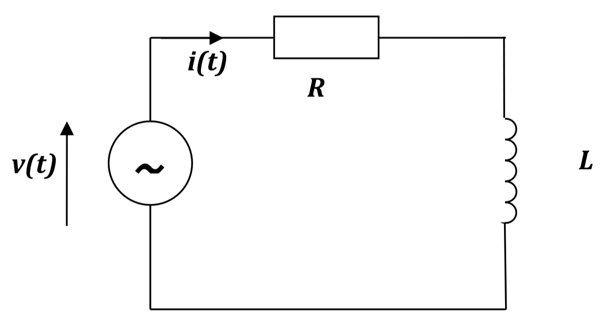

---
# 6.First Order AC Circuits

## 6.1 First Order Series AC Circuits

Consider a circuit containin g both resistance, R, and inductance, L, connected in series across an a.c. sinusoidal voltage source. The characteristics of each component must remian even when they are connected together.

Define the **Impedance**, $Z$, which is the opposition to current flow of both components combined. Since this circuit consist of two components in series (i.e the same current flows through each) we simply add the resistance and reactance: 

$$\begin{aligned}
\ Z = R + j \omega L
\end{aligned}$$ The overall magnitude of the impedance is given by:

