### Chapter 1 INTRODUCTION AND BASOC CONCEPTS
 

#### THERMODYNAMICS AND HEAT TRANSFER
 

- **Heat:** The form of energy that can be transferred from one system to another as a result of temperature difference.
- **Thermodynamics** is concerned with the <u>*amount*</u> of heat transfer as a system undergoes a process from one equilibrium state to another.
- **Heat Transfer** deals with the determination of the <u>*rates*</u> of such energu transfers as well as variation of temperature.
- The transfer of energy as heat is always from the high-temperature medium to the lower-temperature one.
- Heat transfer stops when the two mediums reach the same temperature.
- Heat can be transferred in three different modes:

 

**conduction, convection,radiation**

 

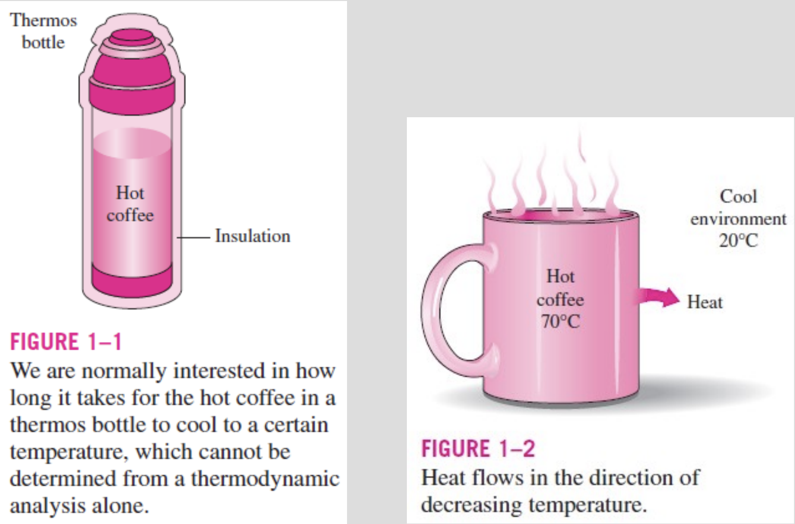

#### ENGINEERING HEAT TRANSFER

Heat transfer equipment such as heat exchangers, boilers, condensers, radiators, heaters, furnaces, refrigerators, and solar collectors are designed primarily on the basis of heat transfer analysis.
 

The heat transfer problems encountered in practice can be considered in two groups: (1) <u>**rating**</u> and (2) <u>**sizing**</u> problems.

<u>**The rating problems**</u> deal with the determination of the heat transfer rate for an existing system at a specified temperature difference.

<u>**The sizing problems**</u> deal with the determination of the size of a system in order to transfer heat at a specified temperature difference. 

An engineering device or process can be studied either <u>**experimentally**</u> (testing and taking measurements) or <u>**analytically**</u> (by analysis or calculations).

<u>**The experimental approach**</u> has the advantage that we deal with the actual physical system, and the desired quantity is determined by measurement, within the limits of experimental error. However, this approach is expensive, timeconsuming, and often impractical.

<u>**The analytical approach**</u> (including the numerical approach) has the advantage that it is fast and inexpensive, but the results obtained are subject to the accuracy of the assumptions, approximations, and idealizations made in the analysis.

##### Modeling in Engineering

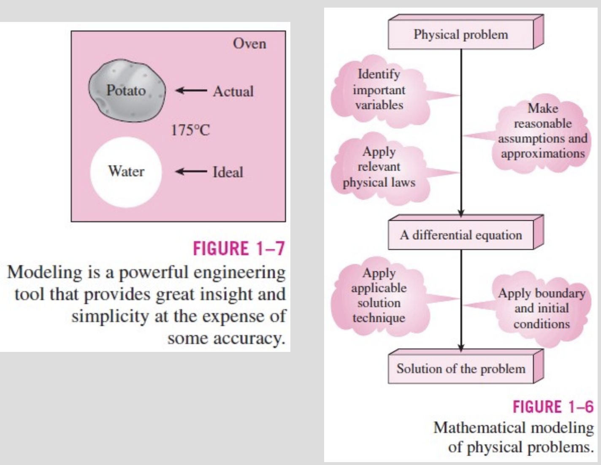

##### Specific Heats of Gases, Liquids, and Solids

- <u>**Specific heat:**</u> The energy required to raise the temperature of a unit mass of a substance by one degree.
 
- Two kinds of specific heats:
  - specific heat at constant volume $C_v$
  - specific heat at constant pressure $C_p$
 
-  The <u>**specific heats**</u> of a substance, in general, depend on <u>**two independent properties**</u> such as temperature and pressure. 
 
- At <u>**low pressures**</u> all real gases approach <u>**ideal gas**</u> behavior, and therefore their specific heats depend on temperature only.

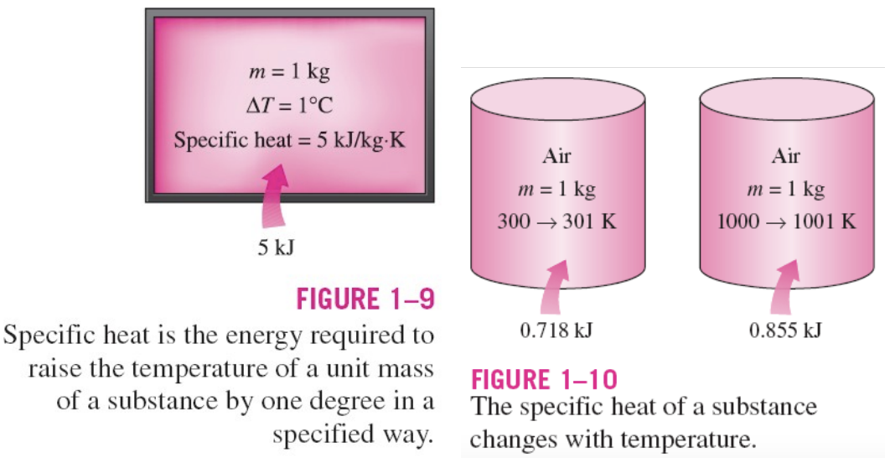

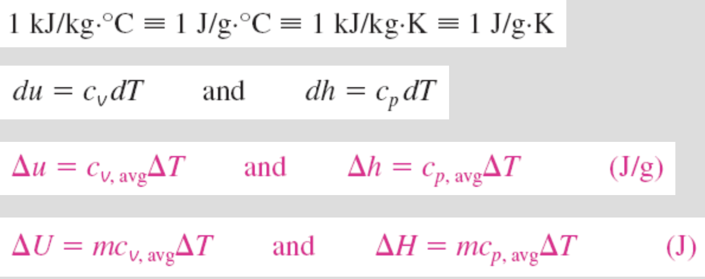 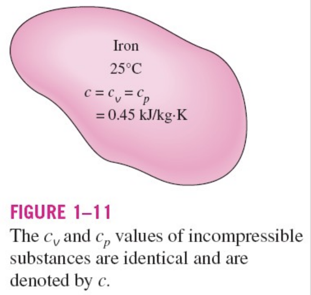

 

- <u>**Incompressible substance:**</u> A substance whose specific volume (or density) does not change with temperature or pressure.

- The constant-volume and constant-pressure specific heats are identical for incompressible substances.

- The specific heats of incompressible substances depend on temperature only

 

##### Energy Transfer

Energy can be transferred to or from a given mass by two mechanisms: 

**heat transfer** and **work**

<u>**Heat transfer rate:**</u> The amount of heat transferred per unit time.
<u>**Heat flux:**</u> The rate of heat transfer per unit area normal to the direction of heat transfer.
<u>**Pwoer:**</u> The work done *per unit time*.

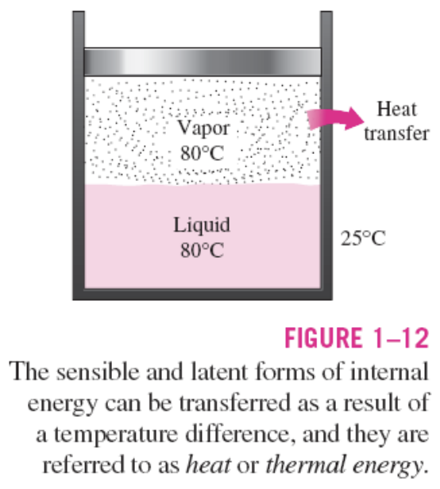

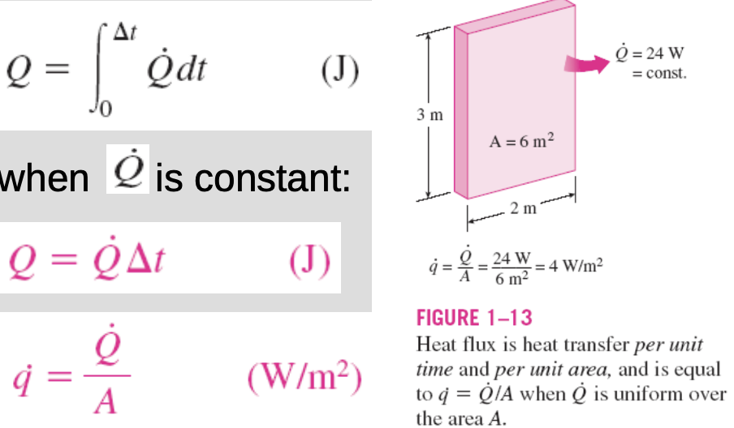

 

#### THE FIRST LAW OF THERMODYNAMICS

The <u>**first law of thermodynamics**</u> (<u>**conservation of energy principle**</u>) states that energy can neither be created nor destroyed during a process; it can only change forms.

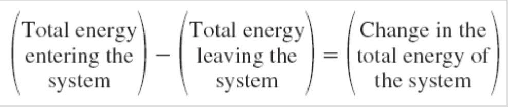

The net change (increase or decrease) in the total energy of the system during a process is equal to the difference between the total energy entering and the total energy leaving the system during that process.

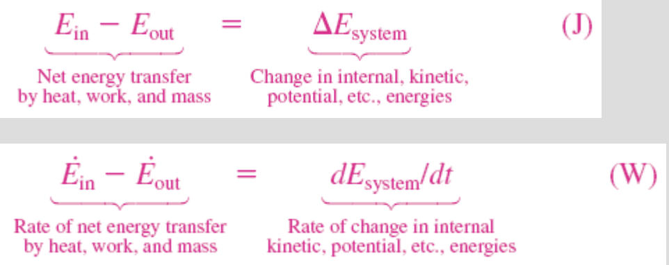

The <u>**energy balance**</u> for any system undergoing any process in the rate form

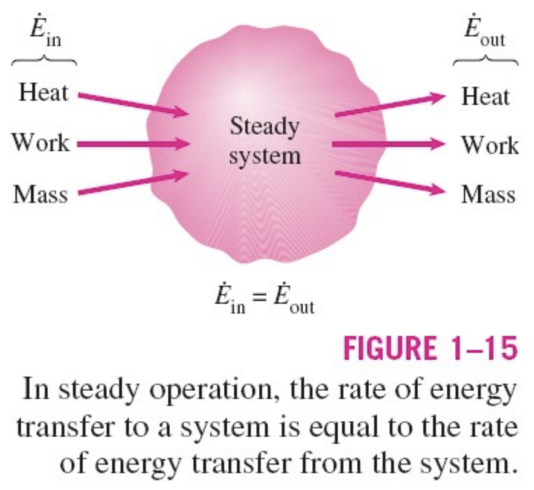

In heat transfer problems it is convenient to write a <u>**heat balance**</u> and to treat the conversion of nuclear, chemical, mechanical, and electrical energies into thermal energy as <u>**heat generation**</u>.

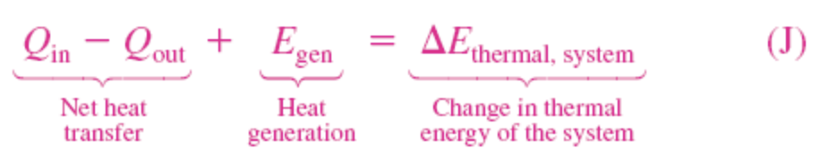

 

##### Energy Balance for Closed Systems (*Fixed Mass*)

 

<table border = "0">
<tr>
    <td>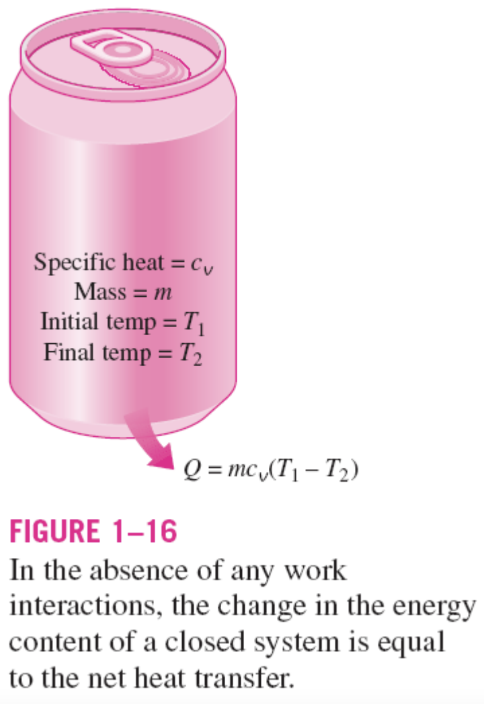</td>
    <td>
    A closed system consists of a <i>fixed</i> mass.   
    The total energy E for most systems encountered in practice consists of the internal energy <i>U</i>.  
    This is especially the case for stationary systems since they don’t involve any changes in their velocity or elevation during a process.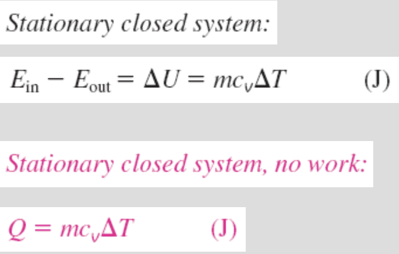
    </td>
</tr>
</table>

 

##### Energy Balance for Steady-Flow Systems

