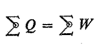
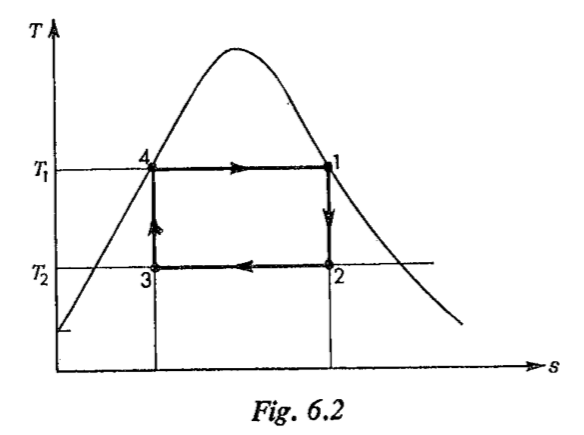
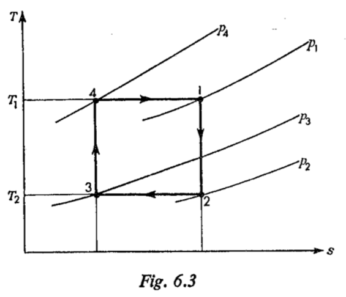
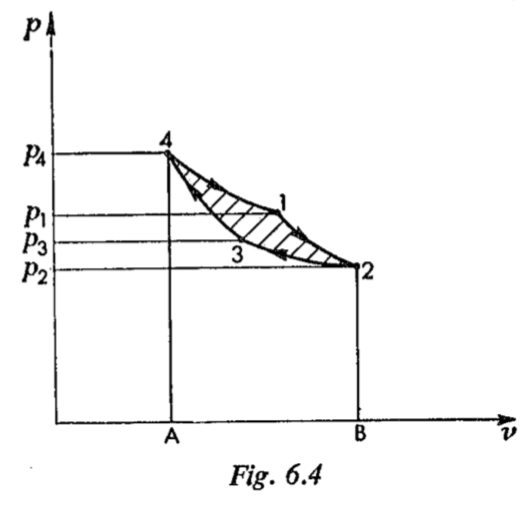

---
# Tutorial 4. Friday 22 October. Calculations

## 02 Eastop&McConkey P148-P175

Applied Thermodynamics for Engineering Technologists

### 6. The Heat Engine Cycle

In this chapter the heat engine cycle is discussed more fully and gas  power cycles are considered . It can be shown that there is an ideal theoretical cycle which is the most efficient conceivable ; this cycle is called the Carnot cycle . The highest thermal efficiency possible for a heat engine in practice is only about half that of the ideal theoretical Carnot cycle ,between the same temperature limits . This is due to irreversibilities in the actual cycle , and to deviations from the ideal cycle , which are made for various practical reasons . The choice of a power plant in practice is a compromise between thermal efficiency and various factors such as the size of the plant for a given power requirement , mechanical complexity , operating cost , and capital cost .

#### 6.1 The Carnot cycle

It can be shown from the Second Law of Thermodynamics that no  heat engine can be more efficient than a reversible heat engine working between the same temperature limits ( see reference 6.1 ) .Carnot , a French engineer , showed in a paper written in 1824 * that the most eficient possible cycle is one in which all the heat supplied is supplied at one fixed temperature , and all the heat rejected is refected at a lower fixed temperature . The cycle therefore consists of two isothermal processes joined by two adiabatic processes . Since all processes are reversible  then the adiabatic processes in the cycle are  also isentropic . The cycle is most conveniently represented on a ***T-s*** diagram as shown in fig. 6.1.

$\qquad$Process 1 to 2 is isentropic expansion from **$T_1$** to **$T_2$**
$\qquad$Process 2 to 3 is isothermal heat rejection.
$\qquad$Process 3 to 4 is isentropic compression from **$T_2$** to **$T_1$**.
$\qquad$Process 4 to 1 is isothermal heat supply.

$\quad$* This paper, called 'Reflections on the Motive Power of Heat' (see reference 6.2) was written by Carnot before the enunciation of the First and Second Laws of Thermodynamics. It is a remarkable piec of original thinking, and it laid the foundations for the work of Kelvin, Clausius, and others on the second law and its corollaries.

The cycle is completely independent of the working substance used.
$\quad$The thermal efficiency of a heat engine, defined in Section 5.1, was shown to be given vy equation 5.3,
$$\begin{aligned}
\ \eta = 1 - \frac{Q_1}{Q_2}
\end{aligned}$$
In the Carnot cycle, with reference to fig. 6.1, it can be seen that the heat supplied, $Q_1$, is given by the area 41BA4,
i.e. $\qquad\qquad$$Q_1=area\;41BA4=T_1(s_B-s_A)$

Similarly the heat rejected, $Q_2$, is given by the area 23AB2,
i.e.$\qquad$ $Q_2= area\;23AB2=T_2(s_B-s_A)$
Hence we have
$\qquad$Thermal efficiency of Carnot cycle, $\eta_{Carnot}=1-\frac{T_2(s_B-s_A)}{T_1(s_B-s_A)}$
i.e. 
$$\begin{aligned}
\eta_{Carnot}=1-\frac{T_2}{T_1} \tag{6.1}
\end{aligned}$$

If a sink for heat rejection is available at a fixed temperature $T_2$ (e.g.a large supply of cooling water), then the ratio $T_2/T_1$ will decrease as the temperature of the source $T_1$ is increased. From equation 6.1 it can be seen that as $T_2/T_1$ decreases, then the thermal efficiency increases. Hence for a fixed lower temperature for heat rejection, the upper temperature at which heat is supplied must be made as high as possible. The maximum possible thermal efficiency between any two temperatures is that of the Carnot cycle.

$\quad$The work output of the Carnot cycle can be found very simply from the $T-s$ diagram. From the first law,

therefore, the work output of the cycle is given by
$$\begin{aligned}
W=Q_1-Q_2 \\
\end{aligned}$$Hence for the Carnot cycle, referring to fig. 6.1,
$$\begin{aligned}
W_{Carnot}=area\;12341=(T_1-T_2)(s_B-s_A) \\
\end{aligned}$$

**Example 6.1**
What is the highest possible theoritical efficiency of a heat engine operating with a hot reservoir of furnace gases at $2000^oC$ when the cooling water available is at $10^oC$?
$\quad$From equation 6.1,
$$\begin{aligned}
\eta_{Carnot}=1-\frac{T_2}{T_1}=1-\frac{10+273}{2000+273}=1-\frac{283}{2273} \\
\end{aligned}$$i.e. $\qquad$ Highest possible efficiency = $1-0.1246 = 0.8754\quad or\quad 87.54% $

$\qquad$It should be noted that a system in practice operating between similar temperatures (e.g. a stem generating plant) would have a thermal efficiency of about 30%. The discrepancy is due to losses due 

to irreversibility in the actual plant ,and also because of deviations from the ideal Carnot cycle made for various practical reason.

$\quad$It is difficult in practice to devise a system which can receive and reject heat at constant temperature. A wet vapour is the only working substance which can do this conveniently, since for a wet vapour the pressure and temperature remain constant as the latent heat is supplied or rejected. A Carnot cycle for a wet vapour is as shown in fig .6.2.Although this cycle is the most efficient possible vapour cycle, it is not used in steam plant. The theoretical cycle on which steam cycles are based is known as the Rankine cycle. This will be discussed in detail in Chapter 7, and the reasons for using it in preference to the Carnot cycle will be given.

#### 6.2 Absolute temperature scale

In the preceeding chapters a temperature scale based on the perfect gas thermometer has been assumed. Using the Second Law of Thermodynamics it is possible to establish a temperature scale which is independent of the working sustance.
$\qquad$We have, for any heat engine from equation 5.3,
$$\begin{aligned}
\eta = 1- \frac{Q_2}{Q_1} \tag{6.2}
\end{aligned}
$$Also the efficiency of an engine operating on the Carnot cycle depends only on the temperatures of the hot and cold reservoirs. Denoting temperature on any arbitrary scale by $X$, we have
$$\begin{aligned}
 \eta = \phi(X_1,X_2) \tag{6.3}
\end{aligned}$$(where $\phi$ is a function, and $X_1$ and $X_2$ are the temperatures of the hot and cold reservoirs).
$\qquad$Combining equations 6.2 and 6.3 we have
$$\begin{aligned}
\frac{Q_2}{Q_1}=F(X_1,X_2) \\
\end{aligned}$$(where $F$ is a new function).
$\qquad$There are a large number of possible temperature scales which are alla in dependent of the working substance. Any working scale can be chosen by suitably selecting the value of the function F. The function can be chosen such that
$$\begin{aligned}
\frac{Q_2}{Q_1}=\frac{X_2}{X_1} \tag{6.4} \\
\end{aligned}$$Also from equation 6.1, we have
$$\begin{aligned}
\eta = 1-\frac{T_2}{T_1} \\
\end{aligned}$$Hence using equation 6.2,
$$\begin{aligned}
\eta = 1-\frac{Q_2}{Q_1}=1-\frac{T_2}{T_1} \\
\end{aligned}$$**or**
$$\begin{aligned}
\frac{Q_2}{Q_1}=\frac{T_2}{T_1} \tag{6.5}\\
\end{aligned}$$
$\qquad$Comparing equations 6.4 and 6.5 it can be seen that the temperature $X$ is equivalent to the temperature $T$. Thus by suitably choosing the function F, the ideal temperature scale is made equivalent to the scale based on the perfect gas thermometer.

#### 6.3 The Carnot cycle for a perfect gas

A Carnot cycle for a perfect gas is shown on a $T-s$ diagram in fig. 6.3. Note that the pressure of the gas changes continuously from $p_4$ to $p_1$ during the isothermal heat supply, and from $p_2$ to $p_3$ during the isothermal heat rejection. In practice it is much more convenient to heat s gas at approcimstely constant pressure or at constant volume, hence it is difficult to attempt to operate an actual heat engine on the Carnot cycle using a gas as working substance. Another important reson for not attempting to use the Carnot cycle in practice is illustrated by drawing the cycle on a $p-v$ diagram, as in fig. 6.4. The net work of the cycle is given by the area 12341. This is a small quantity compared with the gross work of the expansion processes of the cycle, given by area 412BA4. The work of the compression processes (i.e. work done on the gas) is given by the area 234AB2. The ratio of the net work output to the gross work output of the system is called the $work\;ratio$. The Carnot cycle, despite its high termal efficiency, has a low work ratio.

**Example 6.2**
A hot reservoir at 800$^oC$ and a cold reservoir at 15$^oC$ are avilable. Calculate the thermal efficiency and the work ratio of a Carnot cycle using air as the working fluid, if the maximum and minimum pressures in the cycle are 210 bar and 1 bar.
$\qquad$The cycle is shown on a $T-s$ and $p-v$ diagram in figs. 6.5a and 6.5b respectively.
$\qquad$Using equation 6.1,
$$\begin{aligned}
\eta_{Carnot}=1-\frac{T_2}{T_1}=1-\frac{15+273}{800+273}=1-0.268 \\
\end{aligned}$$
i.e.
$$\begin{aligned}
\eta_{Carnot}=0.732\;or\;73.2\% 
\end{aligned}$$

