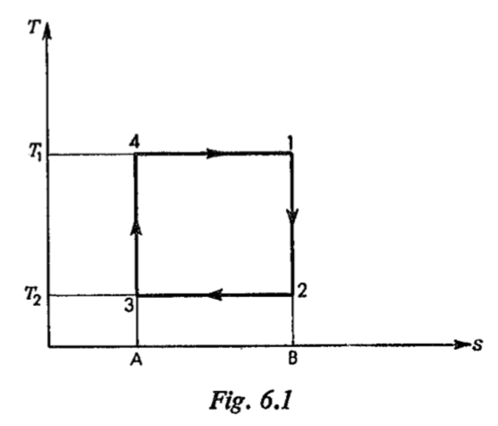

---
# Tutorial 4. Friday 22 October. Calculations

## 02 Eastop&McConkey P148-P175

Applied Thermodynamics for Engineering Technologists

### 6. The Heat Engine Cycle

In this chapter the heat engine cycle is discussed more fully and gas  power cycles are considered . It can be shown that there is an ideal theoretical cycle which is the most efficient conceivable ; this cycle is called the Carnot cycle . The highest thermal efficiency possible for a heat engine in practice is only about half that of the ideal theoretical Carnot cycle ,between the same temperature limits . This is due to irreversibilities in the actual cycle , and to deviations from the ideal cycle , which are made for various practical reasons . The choice of a power plant in practice is a compromise between thermal efficiency and various factors such as the size of the plant for a given power requirement , mechanical complexity , operating cost , and capital cost .

**6.1 The Carnot cycle**

It can be shown from the Second Law of Thermodynamics that no  heat engine can be more efficient than a reversible heat engine working between the same temperature limits ( see reference 6.1 ) .Carnot , a French engineer , showed in a paper written in 1824 * that the most eficient possible cycle is one in which all the heat supplied is supplied at one fixed temperature , and all the heat rejected is refected at a lower fixed temperature . The cycle therefore consists of two isothermal processes joined by two adiabatic processes . Since all processes are reversible  then the adiabatic processes in the cycle are  also isentropic . The cycle is most conveniently represented on a ***T-s*** diagram as shown in fig. 6.1.

$\qquad$Process 1 to 2 is isentropic expansion from **$T_1$** to **$T_2$**
$\qquad$Process 2 to 3 is isothermal heat rejection.
$\qquad$Process 3 to 4 is isentropic compression from **$T_2$** to **$T_1$**.
$\qquad$Process 4 to 1 is isothermal heat supply.

$\quad$* This paper, called 'Reflections on the Motive Power of Heat' (see reference 6.2) was written by Carnot before the enunciation of the First and Second Laws of Thermodynamics. It is a remarkable piec of original thinking, and it laid the foundations for the work of Kelvin, Clausius, and others on the second law and its corollaries.

The cycle is completely independent of the working substance used.
$\quad$The thermal efficiency of a heat engine, defined in Section 5.1, was shown to be given vy equation 5.3,
$$\begin{aligned}
\ \eta = 1 - \frac{Q_1}{Q_2}
\end{aligned}$$
In the Carnot cycle, with reference to fig. 6.1, it can be seen that the heat supplied, $Q_1$, is given by the area 41BA4,
i.e. $\qquad\qquad$$Q_1=area\;41BA4=T_1(s_B-s_A)$

