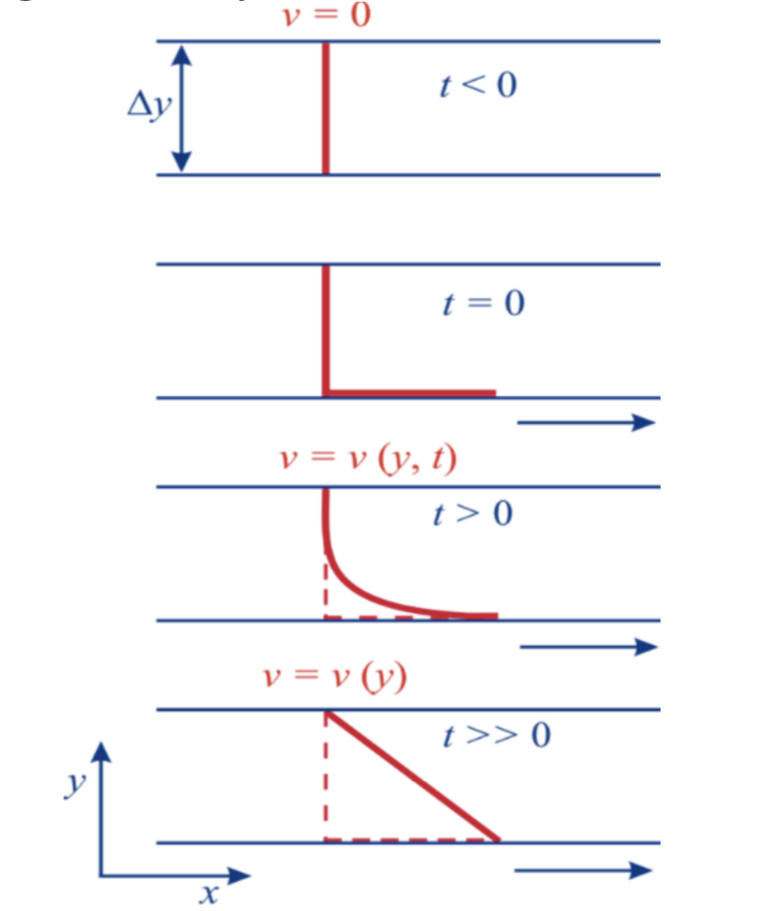

---
# Week 6 Internal Flow

## Viscosity and laminar flow

**Viscosity**

Viscoisty is the internal stickiness of a fluid. Liquids flow under the action of shear stress.
Response is not instantaneous throughout the liquid.
Viscosity measures how rapidly a liquid responds to shear stress - deforms High viscosity fluid deforms at a slower rate than a lower viscoisty fluid.

Consider 2 plates separated by a thin layer of fluid.
The lower plate is set moving Drags the fluid immediately next to it along Due to adhensive forces between the fluid and surface.
The fluid next to the top surface remains stationary.
A velocity gradient is set up between the 2 plates.

A shearing force, F, is required to make the lower plate move

where A = area,  =  

