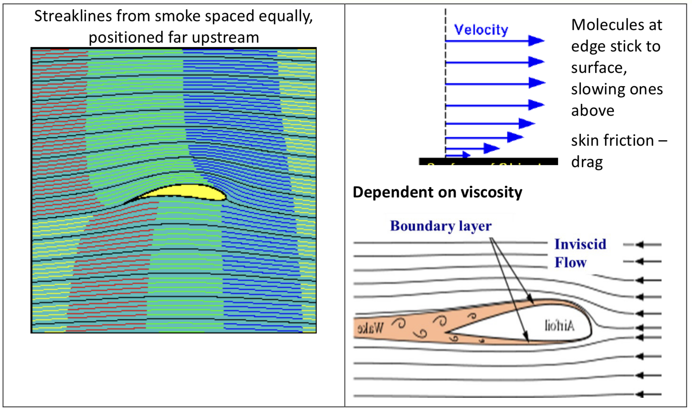

---
# Week 5 Dimensional Analysis and Similitude

## S Beck`s slides on Dimensional analysis

### 1a Dimensional analysis introduction

#### Dimensionless Numbers
Often it is useful to use things without dimensions to describe how things are related.
You will already have come across $Mach\;number.$
This is Velocity/speed of sound.
And $specific\;gravity$
Which is Density/Density of water.

#### Dimensionless groups
Any equation can be made into a dimensionless group.
Take for example
$Power = Force \times Velocity$
The units on the left must equal the units on the right.
$power = kg\,m\,s^{-2}\times m\,s^{-1}=kg\,m^2s^{-3}$

####  Dimensions
However, in dimensional analysis, we use a more basic form of these, namely
* Time (T)
* Length (L)
* Mass (M)
* Temperature ($\Phi$)

#### Dimensionless groups
$Power = Force \times Velocity$
$power = kg\,m\,s^{-2}\times m\,s^{-1}=kg\,m^2\,s^{-3}$
Has the dimensions of $ML^2T^{-3}$
So must $Force \times Velocity$
$\qquad$So,$1=\frac{Power}{Force\;Velocity}$
$\qquad$So$\qquad \frac{Power}{Force\;Velocity}\quad$ is **DIMENSIONLESS.**

So $\frac{Power}{Force\ Velocity}$ is dimensionless.
It does not have to equal unity.
If an emgime uses Q Joules of fuel per second (W) to produce F (N) at V ($ms^{-1}$)
Then the efficiency $\eta$ is $\frac{F\ V}{Q}$
Which is less than 1, but dimensionless.

Then if we use an engine if the $same efficiency$, $\eta$, we can find out how much fuel is meeded to produce a certain force at a given speed. So $efficeincy$ is a dimensionless number. It is made out of $Work\ output/Work\ input,$
Or dividing top and bottom by time, t, it is also $Power\ output/Power\ input$

So, dimensionless groups always:
1. can be produced from an equation
2. mean something (usually a ratio) and
3. can be used to scale effects $provided\ other\ things\ are\ correctly\ scaled$
4. Remain true if both top and bottom are multiplied by things with the same dimensions

---
# Week 6 Internal Flow

## Viscosity and laminar flow

### Viscosity

Viscoisty is the internal stickiness of a fluid. Liquids flow under the action of shear stress.
Response is not instantaneous throughout the liquid.
Viscosity measures how rapidly a liquid responds to shear stress - deforms High viscosity fluid deforms at a slower rate than a lower viscoisty fluid.

Consider 2 plates separated by a thin layer of fluid.
The lower plate is set moving Drags the fluid immediately next to it along Due to adhensive forces between the fluid and surface.
The fluid next to the top surface remains stationary.
A velocity gradient is set up between the 2 plates.

A shearing force, F, is required to make the lower plate move
$\qquad$ where ***A*** = Area, $\mu$ = viscosity, ***F*** = $\mu A\frac{\Delta v}{\Delta y}$
$\qquad$ Hence $\tau = \frac{F}{A} = \mu \frac{\Delta v}{\Delta y}$, where $\tau $ = shear stress
Or considering the limit $\Delta y \to 0, \tau = \mu \frac{dy}{dv}$, Which Is Newton`s law of viscosity.
So, $\mu = \tau \frac{dy}{dv}$, in terms of units, $\mu =\tau(Pa)\frac{dy(m)}{dv(ms^{-1})}=Pa.s\;or\;N.ms^{-2}s$.

$\quad$Hence units of viscosity are $N\;m^{-2} = Pa\;s$
$\quad$Can also define kinematic viscosity $v=\frac{\mu}{\rho}$ This has units of $m^2s^{-1}$
%\quad%This allows for quicker calculation of some parameters. Viscosity alters the way the fluid flows. Temperature and pressure can significantly alter the viscosity and as such the flow of the fluid. A fluid can be categorized with the way the viscosity changes.

### Newtonian Fluids

Fluids with constant viscosity, such as: Water, Most gases and Molten glass.

**Non-Newtonian Fluids**

Bingham pastes a minimum shear stress has to be exceeded for flow ***E.g.*** Toothpaste, Printing ink.
 
 

**Shear thining fluids become less viscous as a shear stress is applied ***E.g.*** paint shear thickening fluids become more viscous as a shear stress is applied E.g. constrach and (a limited amount of) water**
 
 

**Classification of fluid flow**

Steady
Unsteady
Viscous
Inviscid
Laminar
Turbulent

**Viscous and Inviscid flow**

Flows can be broadly classed as either viscous or invascid
**Viscous** - One where viscous effects are important and cannot be ignored
**Inviscid** - One where viscous effects do not significantly influence the flow and thus neglected.

To model an inviscid flow we can set the viscosity to be zero - thus all viscous effects are zero. Experimentally this is difficult as all fluids of interest (Water, air etc) have viscosity

A flow which exits ***exterior*** to a body may be treated as inviscid - **external flows**

In these cases viscious effects that may exist are cinfined to a thin layer called a **boundary layer.** These exist where there are high velocities and / or large length scales - confined to a thin layer near the wall.

$\quad$**Viscous flows** are generally found in pipes, where substanrial losses can be generated
A viscous flow can be classfied as either a laminar flow or a turbulent flow

$\quad$**Turbulen flow** - Very irregular - velocity and pressure vary with space and time. Immediate mixing of neighbouring fluid particles.

$\quad$**Laminar flow** - No significant mixing of neighbouring fluid particles.

 

Using a tap

**What type of flow?**

The transition from laminar to turbulent is depentdent on viscosity, length and velocity. From dimensional analysis we can derive a dimensionless number called the Reynolds number. This serves as a tool to predict the flow regime.
$Re = \frac{\rho Cd}{\mu}$, which is the ratio of inertial force to viscous force.
Small Re - flow is laminar
Large Re - flow is turbulent
Can define a **critical Reynolds number** $Re_{cirt}$
If $Re < Re_{crit}$ flow is laminar
The critical Reynolds number is different for every geometry e.g.
>$Re_{crit}$ ~ 1500 for flow between parallel plates
>$Re_{crit}$ ~ 2000 for inside a rough walled pipe
>$Re_{crit}$ ~ 4000 extremly smooth pipe
>$Re_{crit}$ ~ 30000 for a smooth sphere.
>$Re_{crit}$ ~ 300000 for a wing.
>$Re_{crit}$ ~ 10 flow through sand.

**Determine the Reynolds number** for - Glycerin at 25 $^oC$
**Pipe at D** = 150 mm
**Velocity** = 3.6 ms$^{-1}$
**Density of glycerin** = 1258 kg m$^3$
**Viscosity n**= 0.000763 m$^2$s$^{-1}$
$v=\frac{\mu}{\rho}\;Re=\frac{\rho uL}{\mu}=\frac{uL}{v}=\frac{3.6\times0.15}{0.000763}=708,< 2000;$ therefore flow is laminar!

### Calculating flow rates of laminar flow in pipes and between plates Between Parallel Plates

The force on the element is the same as the shear fore over that element.
$$
\begin{aligned}
\frac{d\tau}{dy}=\frac{dp}{dx}\\
\end{aligned}
$$
Which can be integrated to give
$$
\begin{aligned}
\ \tau=y \frac{dp}{dx}+C_1\\
\end{aligned}
$$
As it is laminar flow, we can use Newton`s law of viscosity
$$\begin{aligned}
\ \tau = \mu \frac{du}{dy}
\end{aligned}$$
Equating $\tau$
$$\begin{aligned}
\ \mu \frac{du}{dy} = y \frac{dp}{dx}+C_1
\end{aligned}$$
Rearranging and integrating
$$\begin{aligned}
\displaystyle \int \mu\;du = \int \left(y \frac{dp}{dx}+C_1\right)dy
\end{aligned}$$
$$\begin{aligned}
\ \mu = \frac{y^2}{2\mu} \frac{dp}{dx}+\frac{y}{\mu}C_1+C_2
\end{aligned}$$
At one wall $y=0,u=0$, so $C_2=0$
At the other wall $y=Y$,and so the other plate is moving a velocity, U, $u=U$,so

|$u=\frac{y^2}{2\mu}\frac{dp}{dx}+\frac{y}{\mu}\left(\mu \frac{Y}{2}-\frac{dp}{dx}\right)$|
---

If the top plate is moving, $u=U$, and there is no pressure variation in the system such that $\frac{dp}{dx}=0$

$$\begin{aligned}
\ u = \frac{y}{\mu}\left(\mu \frac{U}{Y}\right)=U\frac{y}{Y}
\end{aligned}$$
In this case, the profile is a straight line between the two plates.
The stress,$\tau$, on the wall is therefore

$$\begin{aligned}
\ \tau = \mu \frac{du}{dy} = \mu \frac{U}{Y}
\end{aligned}$$

So the force needed to move the plate is stress times area $\tau A$. So for a channel $b$ wide, $Y$ high and of length $l$ with the top plate moving at velocity $U$, the force on the plate is
$$\begin{aligned}
\ F = \tau A = \mu \frac{U}{Y} \times bl=\frac{\mu Ubl}{Y}
\end{aligned}$$
**If the top plate is not moving,** from
$$\begin{aligned}
\ u=\frac{y^2}{2\mu}\frac{dp}{dx}+\frac{y}{\mu}\left(\mu\frac{U}{Y}-\frac{Y}{2}\frac{dp}{dx}\right)
\end{aligned}$$
And with $U=0$
$$\begin{aligned}
\ u=\frac{y^2}{\mu}\frac{dp}{dx}-\frac{yY}{2\mu}\frac{dp}{dx}
\end{aligned}$$
so
$$\begin{aligned}
\ u = \frac{dp}{dx}\left(\frac{y^2}{2\mu}-\frac{yY}{2\mu}\right)
\end{aligned}$$
Which gives a parabolic profile. Now
$$\begin{aligned}
\ \overset{\bullet}{V} = \int^Y_{y=0} udy
\end{aligned}$$
so
$$\begin{aligned}
\ \overset{\bullet}{V}=\frac{dp}{dx}\int_{y=0}^Y\left(\frac{y^2}{2\mu}-\frac{yY}{2\mu}\right)
\end{aligned}$$
$$\begin{aligned}
\ \overset{\bullet}{V}=\frac{1}{2\mu}\left[\frac{y^3}{3}-\frac{Yy^2}{2}\right]^Y_{y=0}\frac{dp}{dx}=\frac{1}{2\mu}\frac{y^3}{6}\frac{dp}{dx}=\frac{y^3}{12\mu}\frac{dp}{dx}
\end{aligned}$$
This is per unit width. So for a channel $b$ wide, $c$ high and of length $l$, with a pressure drop $\Delta P$ down it, the volumetric flow rate is
$$\begin{aligned}
\ \overset{\bullet}{V}=\frac{bc^3\Delta P}{12\mu l}
\end{aligned}$$
As the are is $bc$, the average velocity in the channel is
\begin{aligned}
$$\begin{aligned}
\ \overline{C}=\frac{c^2\Delta P}{12 \mu l}
\end{aligned}$$ 

### From The Navier Stokes Equations
We can do the same thing from the Navier-Stokes equations. Rectangular Coordinates (x,y,z). Incompressible

$$
\begin{aligned}
\ \rho\left(\frac{\partial u}{\partial t}+u\frac{\partial u}{\partial x}+v \frac{\partial u}{\partial y}+w \frac{\partial u}{\partial z}\right)=\mu \left(\frac{\partial^2 u}{\partial x^2}+\frac{\partial^2 u}{\partial y^2}+\frac{\partial^2 u}{\partial z^2}\right)-\frac{\partial p}{\partial x}+\rho g_x
\end{aligned}
$$$$
\begin{aligned}
\ \rho\left(\frac{\partial v}{\partial t}+u\frac{\partial v}{\partial x}+v \frac{\partial v}{\partial y}+w \frac{\partial v}{\partial z}\right)=\mu \left(\frac{\partial^2 v}{\partial x^2}+\frac{\partial^2 v}{\partial y^2}+\frac{\partial^2 v}{\partial z^2}\right)-\frac{\partial p}{\partial y}+\rho g_y
\end{aligned}
$$$$
\begin{aligned}
\ \rho\left(\frac{\partial w}{\partial t}+u\frac{\partial w}{\partial x}+v \frac{\partial w}{\partial y}+w \frac{\partial w}{\partial z}\right)=\mu \left(\frac{\partial^2 w}{\partial x^2}+\frac{\partial^2 w}{\partial y^2}+\frac{\partial^2 w}{\partial z^2}\right)-\frac{\partial p}{\partial z}+\rho g_z
\end{aligned}
$$

Assume
* No velocity in x or y direction. $v=0$,$w=0$
* From continuity equation $\frac{\delta u}{\delta x}=0$
* As the plates are infinite and the flow is steady $\frac{\delta u}{\delta t}=0$
* So that $u=u(y)$
$$
0=\mu \left(\frac{\partial^2 u}{\partial y^2}\right)-\frac{\partial p}{\partial x} \tag{eq.1}
$$$$
0 = -\frac{\partial p}{\partial y} + \rho g_y \tag{eq.2}
$$$$
= -\frac{\partial p}{\partial z} \tag{eq.3}
$$
The equation (2) can be integrated to give.
$$
\begin{aligned}
p = +\rho gy +f_1(x)
\end{aligned}
$$
The equation (1) can be arranged to give
$$\begin{aligned}
\left(\frac{d^2u}{dy^2}\right)=\frac{1}{\mu} \frac{\partial p}{\partial x}
\end{aligned}
$$

