## 什么是终端？

**我们总在说终端中如何操作，那么终端到底是什么呢？为什么它会有这么大的权利**
要说清终端是什么，我们先来看看操作系统的组成。简单来说，**操作系统共分为两个部分，一个部分称作内核，另一个部分称为用户交互界面。** 内核部分负责系统的全部逻辑，由海量命令组成，这一部分是系统运行的命脉，不与用户接触；交互界面则是开机之后所有我们看到的东西，比如窗口、软件、应用程序等等。


<div align = center>

</div>

那么若我们想对系统内核的某些操作逻辑做出一些修改，应该怎么办呢？ **终端就是连接内核与交互界面的这座桥，** 它允许用户在交互界面上打开一个叫做 「Terminal 终端」的应用程序，在其中输入命令，系统会直接给出反馈。
<br/>
因为终端这座桥，实际允许用户间控制系统内核，也就是系统的大脑，因此它理论上具备控制一切的权利。
<br/>

## 如何打开终端？

**终端是系统中一个应用程序，你可以直接在所有程序中找到它，** 点击打开就行。 或者 `command` + `space` 搜索，输入 「终端」或 「Terminal」, 看到终端被选中了按下回车即可。

## 基础知识

终端启动后，就会进入一个问你要指令的状态，你只需要将指令输入在光标后，按下回车，指令就会被执行。

那什么是命令？ **命令就是你告诉电脑希望它做什么的那句话。** 若我现在希望告诉电脑说 hi, 这句话的命令就是 say hi，就这么简单。

命令由三个部分组成，第一个部分是命令对象，在 say hi 这个命令中，「say」是我们的命令对象，我们希望电脑说话；第二部分是修饰命令对象的关键词，可有可无，若我希望电脑说话时慢一点儿，可以输入 `say -r 500 hi` , 这里的 「-r 500」 则是修饰说话语速的关键词；第三部分是命令内容，这里填写希望电脑说的内容是 「hi」 这句话。

<br/>

<div align = center>

命令的组成
</div>

<br/>

我们先来尝试让电脑将我们**所打的话复述出来**，这一步的指令是 `echo “想说的话”`，将这句指令复制进终端并回车后，可以看到，它会将我们输入进去的文字再下一行重新打出来。


<div align = center>
echo
</div>

<br/>

终端运行常常离不开对文件，文件夹的操作。

当你需要使用终端对文件夹进行操作时，终端需要你告诉它，你想要修改的文件在哪里，这时我们需要了解**路径的概念**。系统中的每一个文件都有一个存放位置，这一存放位置就称作路径。

终端启动后，它的默认路径在当前用户文件夹的根目录上，为了确定这一点，你可以输入`pwd`命令来**查看当前路径**。在下图中，输入命令后，终端告诉我们当前路径是`/Users/我的名字`。


<div align = center>
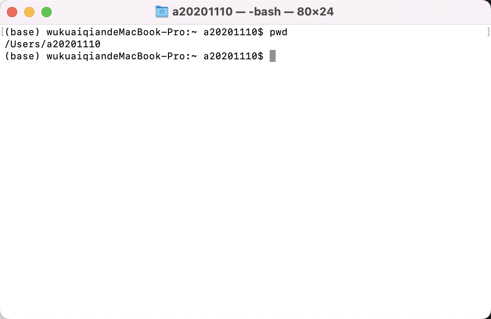
<div>pwd</div>
</div>

路径的一般写法为 `/文件夹名/文件夹名`, 但路径其实分为两种。一种叫相对路径，另一种叫绝对路径，它们俩有什么区别呢？

我们从当前路径说起，当前路径指的是现在终端所处的位置，若你想 **改变当前路径**，则可以输入 `cd /其他文件夹`。 比如我希望系统将当前路径改为所有应用程序文件夹，则输入 `cd /Applications`, 在下图中可以看到，前面出现了一个Applications，表示当前路径已经在应用程序文件夹中。


<div align = center>
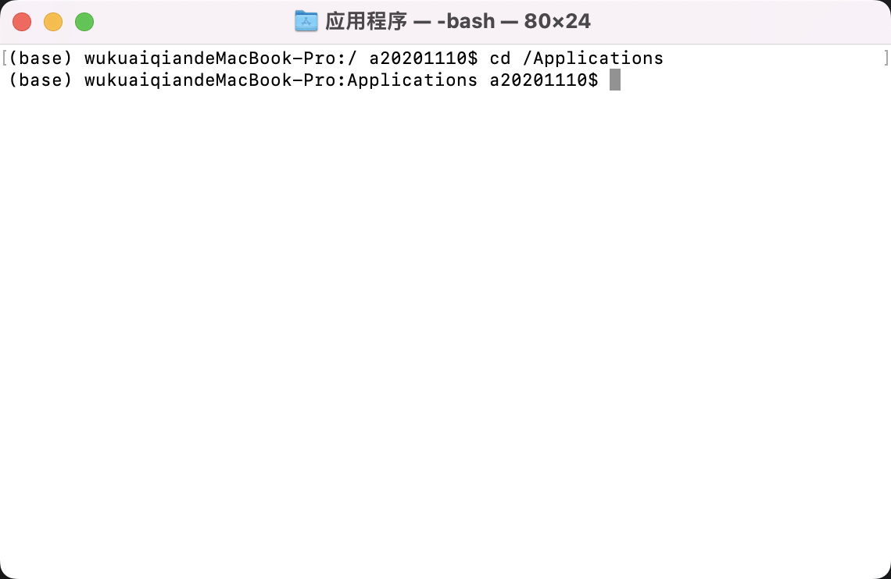
<div>cd /</div>
</div>

刚刚提到的路径的一般写法 「/文件夹名/文件夹名」，它指的其实就是 **绝对路径，你必须指定它从根目录一直到达具体的文件夹。**

与其相对的是相对路径，**相对路径允许你告诉终端从现在开始，接下来应该怎么走。** 相对路径的书写方法是在绝对路径前加一个 `.` 。

若你现在已经处在应用程序文件夹中，想前往期中的一个名叫作 Utilities 的子文件夹应该怎么办？

下图中，当前位置的绝对路径是 `/Applications/Utilities`, 但由于我已经处于 `/Applications` 文件夹中，因此可以使用相对路径的写法 `cd ./Utilities`, 表示将当前路径转到 Utilities 文件夹。


<div align = center>
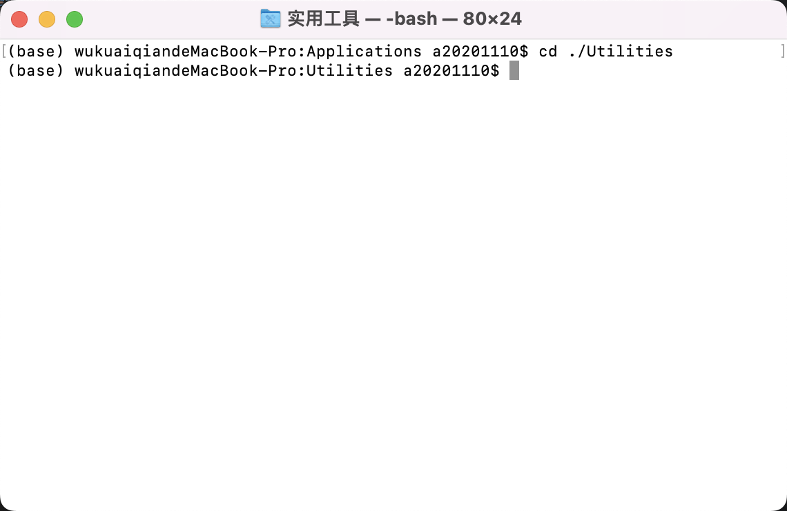
<div>cd ./</div>
</div>

**快速导入路径**的方法，直接将待编辑文件或文件夹拖入终端中即可，它会自动把绝对路径提取出来，实际情况下常用的也是这种自动提取或手动复制的方法。

<br>
<div align = center>
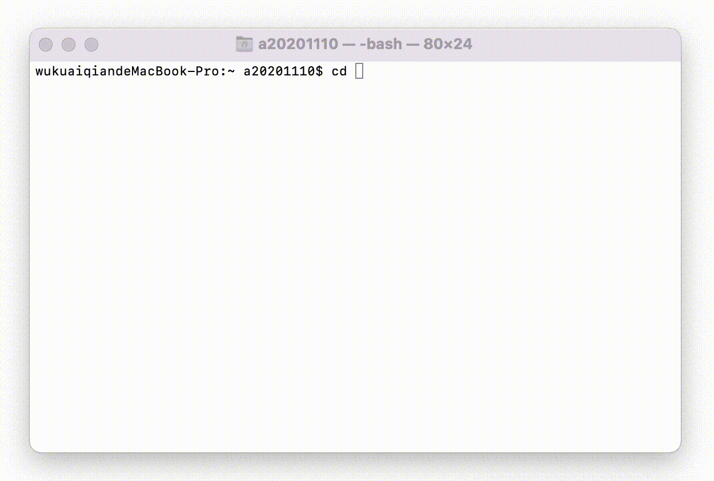
<div>快速导入路径</div>
</div>
<br>


当你想要查看当前路径下有什么文件时，可以使用`ls`命令，它会 **列举当前路径下的全部文件**，若你希查看进阶设定，比如列举当前路径下的全部文件并展开所有子文件，可以在 `ls` 命令后面加上 `-R` 的识别符，新指令就变成了 `ls -R`, 运行结果如下，可以看到我放在资源文件夹中的所有子文件都被显示出来了。

<br>
<div align = center>
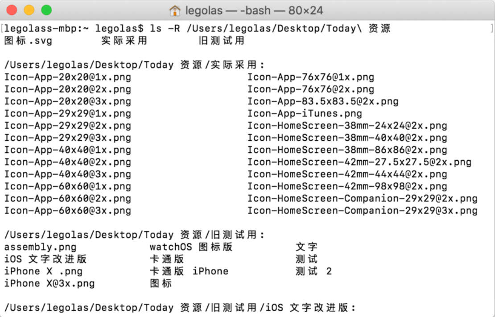
<div>ls -R</div>
</div>
<br>

讲到这里，你也许会发现自己的终端已经慢慢当当的了，看着不舒服，这时可以使用 `clear` 指令来 **清屏**。

以上讲的所有指令，都是无害指令，这里的无害指的是不会对系统文件造成破坏，但是还有一些指令，可以瞬间删掉你的整个系统，若你知道这些指令的用法那也没问题，但若是不小心根据网上的教程用了从而误删了东西就不好了。内核为了确保你知道某些指令的用法，要求你必须在这些有风险的指令前加输 `sudo`，这就是所谓的 **超级管理员指令**，它会在你密码确认后，赋予 sudo 之后的命令最高权限，可以进行任何操作。

比如我需要吧电脑上的 Windows 分区彻底删除时，只需要输入下面这串代码，一瞬间整个磁盘分区就会被删除：

`sudo diskutil eraseVolume free none diskx`


<br>

到这里为止，终端的非常基础教学已经讲完了，这只是略过了终端海量指令中最常见的一小部分，毕竟终端控制的是整个系统的内核，其指令库非常之大，没有办法全部讲完。那么，当你在网上见到一个新命令的时候，怎么知道它该如何用？ 你可以使用 man 指令 **查看其用法**，比如，当你见到了一个磁盘管理命令`diskutil`，可以使用`man diskutil`来查看这个磁盘管理命令的具体用法说明，想要退出这个说明按下键盘`Q`即可。


<br>
<div align = center>
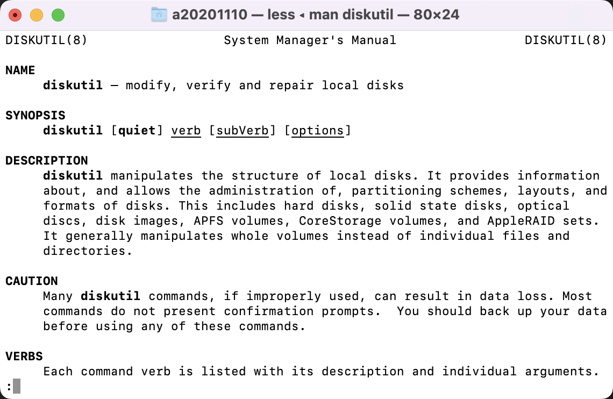
<div>man</div>
</div>
<br>

若你使用的是带有触控条的 Mac，可以点触控条按钮进行快速更改终端颜色，添加书签等操作。


<br>
<div align = center>

<div>touch bar更改颜色</div>
</div>
<br>

若你想要完全自定义终端，可以在「终端 - 偏好设置 - 描述文件」中进行更改。


<br>
<div align = center>
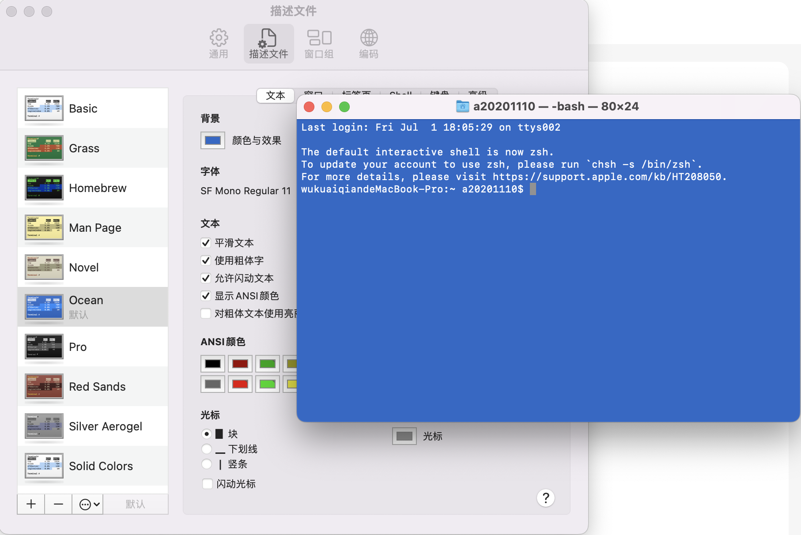
<div>自定义</div>
</div>
<br>

<br>

---

## 常见玩法

- **关闭崩溃报错**：有时候软件崩溃就已经很让人烦心了，重新打开一遍遍弹出的问题报告更是烦不胜烦。这时候你可以使用
`defaults write com.apple.CrashReporter DialogType none` 命令关闭这个问题报告。若你希望回复其显示，可以输入
`defaults write com.apple.CrashReporter DialogType crashreport`。


<br>
<div align = center>
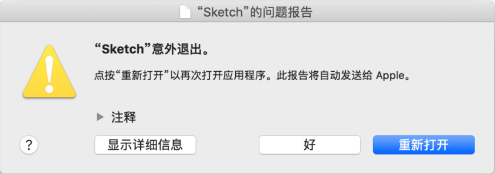
<div>烦人的崩溃提醒</div>
</div>
<br>

- **修改文件日期**：有时你可能需要修改文件创建或修改日期，这时可以使用`touch -t 199505090000 拖入文件`命令。这句命令中的数字表示 1995年5月9日 00:00分，你可以根据实际需要修改。


<br>
<div align = center>
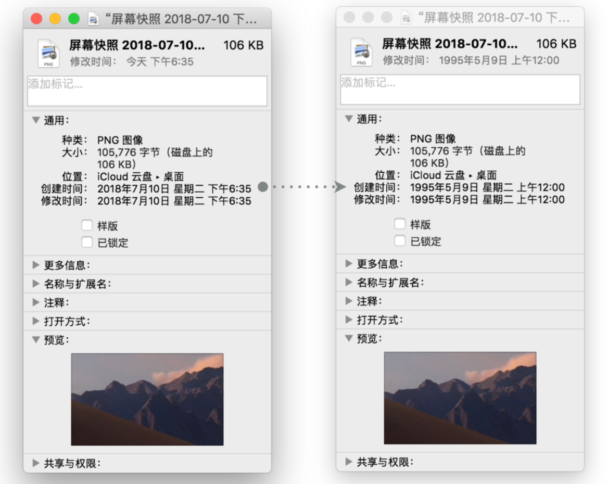
<div>任意修改文件日期</div>
</div>
<br>

- **不要进入休眠状态**：当你临时不希望电脑进入休眠状态时，可以使用 `caffeinate` 命令让电脑时刻清醒。当你需要其回复正常时，按下 `^Control - C` 即可停止该命令。(Control + c)


<br>
<div align = center>
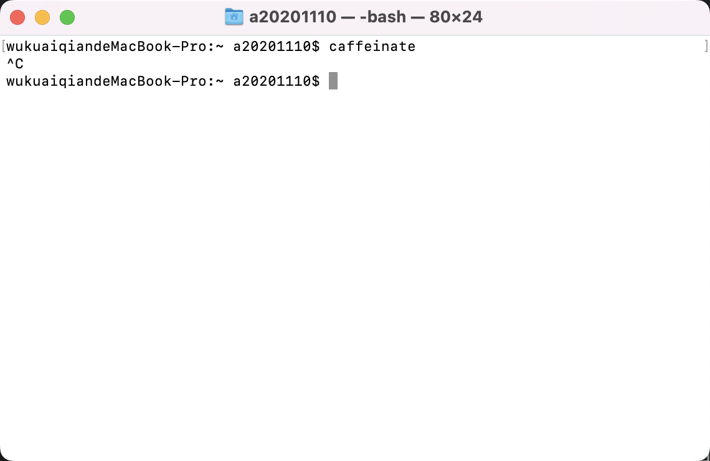
<div>caffeinate</div>
</div>
<br>

- **程序假死需要强退**：有时候程序假死了，强行退出也没用，这时候可以使用 `killall` 命令。以微信为例，若想强退它，只需要输入 `killall WeChat` 即可。


<br>
<div align = center>
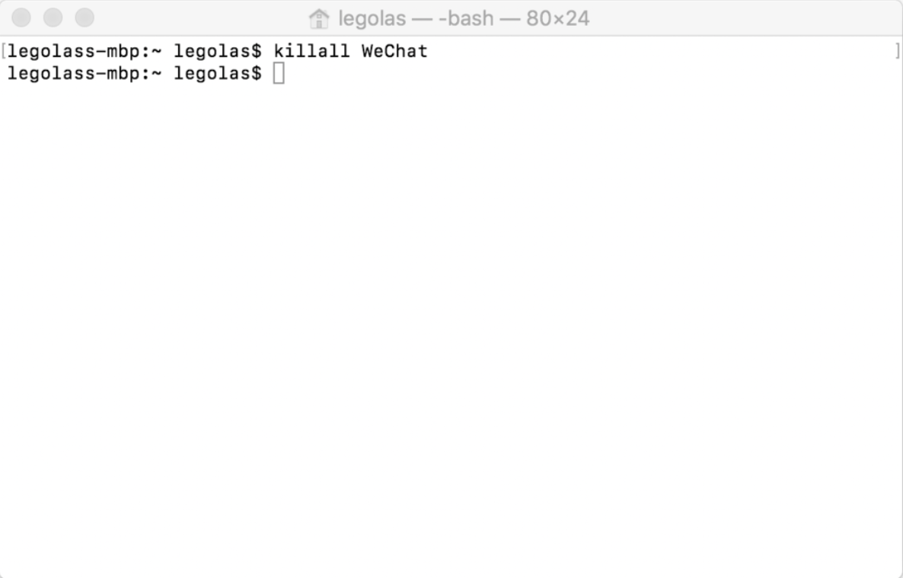
<div>killall</div>
</div>
<br>


- **截图保存为 JPEG**：Mac 的默认截图格式为 PNG, 若你想让默认的截图保存类型为 JPEG，可以输入如下指令 `defaults write com.apple.screencapture type jpg`, 以后的截图都会变成 JEPG 格式。如果你希望撤销这条指令，输入 `defaults write com.apple.screencapture type png` 即可。

<br>

- **关闭截图自动阴影**：若你使用 Mac 自带的截图，会发现每次的窗口截图均会自动添加阴影，当你需要后期出来这些图片时，这些阴影可能会对你造成困扰。你可以使用下面这串命令来关闭截图阴影：
```
defaults write com.apple.screencapture disable-shadow -bool true; killall SystemUIServer
```

当你希望重新启动阴影时，可以输入：

```
defaults write com.apple.screencapture disable-shadow -bool false; Killall SystemUIServer
```

<br>

- **显示隐藏文件夹**：在你跟着网上的教程进行一些操作时，难免会遇到让你寻找隐藏文件夹的情况，这时你可以使用：
    ```
    defaults write com.apple.finder AppleShowAllFiles -bool true; killall Finder
    ```
    来显示所有隐藏文件夹，当你不需要再显示时，输入：
    ```
    defaults write com.apple.finder AppleShowAllFiles -bool false; killall Finder
    ```
    即可恢复隐藏。

    (显示隐藏文件夹**快捷键**：`command + Shift + .`)

<br>

- **整理程序栏**：你也许会发现，底部的程序栏越用越乱，有时候内容多的半天找不到所需程序。这时你可以考虑为其加入几个隐藏的分界符将其归为几个区域，输入：
    ```
    defaults write com.apple.dock persistent-apps -array-add '{"title-type"="spacer-title";}'; killall Dock
    ```
    即可添加一个空白分界符，需要几个重复运行几遍命令即可。当你不需要这个歌白分界符了，将它从程序栏拖走即可删除。


<br>
<div align = center>

<div>为程序栏加分界符</div>
</div>
<br>

- **重置程序栏**：当你想要重新整理底部程序栏时，有时候从默认状态开始整理也许是个好办法。这时你可以使用 `defaults delete com.apple.dock; killall Dock` 命令将程序栏恢复为电脑刚刚激活时的状态。

<br>

- **打印机械杆十足的文字**：当你想要打出机械感十足的文字时，可以玩玩 `banner -w 80 xxx` 这句命令，只需要将代码结尾处的文字替换为你想打印的子即可。


<br>
<div align = center>
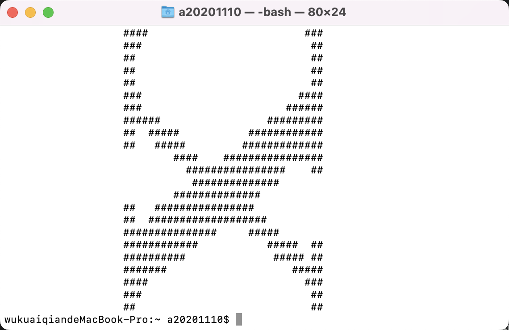
<div>打印文字</div>
</div>
<br>

---

## 进阶教程

上面讲了不少指令，你也许会好奇，**这些指令的到底修改的是什么？可以修改什么？若我想改别的，应该去哪里找？**

</br>

### 默认设置 defaults

上面这些 defaults 开始的指令，实际修改的是 **系统默认的 Plist 表单**，这些表单管理着系统中全部程序的默认设置，上面所做的修改无非是改了某些程序的默认设置罢了。

若你想查看还有那些可以修改，可以在访达中按下键盘 `⌥Option` , 点击「前往 - 资源库」，找到 Preferences 文件夹，你会发现所有的 Plist 文件君在这里，你也可以根据编号手动修改。


</br>
<div align = center>
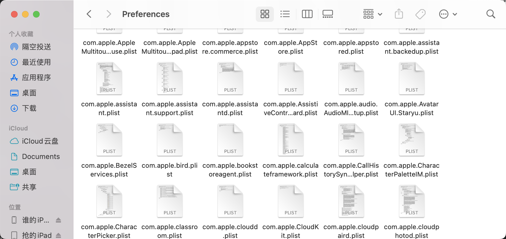
<div>Preferences 文件夹</div>
</div>
</br>

</br>

### 文件格式转换 textutil

textutil 是一个系统自带的，用于**处理文稿**的命令，其中最常用的功能是其下属功能convert，这句指令允许你将任何文件，在以下文件格式中互相转换 txt，html，rtf，rtfd，doc，docx，wordml，odt，webarchive。

若你手头有一篇 DOCX 文件需要被转换成 TXT，则可以输入 `textutil -convert txt 文件路径`，这句代码中的 txt 处，可以替换为任何你需要转换到的文件格式，文件路径则可以采用拖拽文件到终端的方法自动填充。

</br>
<div align = center>
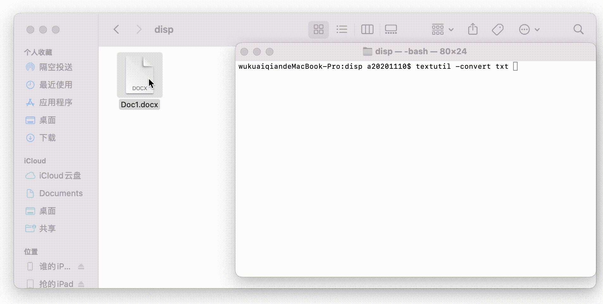
<div>textutil -convert</div>
</div>
</br>

<br>

### 磁盘处理 diskutil

磁盘处理也是常用的命令行操作之一，因为其命令需要根据具体情况具体对待，所以值简单介绍其中无风险的两个，下方列举的其余操作均会直接处理磁盘内容，请务必清楚你在做什么，然后再输入命令。

若你的电脑采用的是 APFS 磁盘分区，则应使用 `diskutil apfs` 开头的命令；若你的电脑采用的是 HFS，HFS+ 磁盘分区，则应使用 `diskutil` 开头的命令；若你的电脑采用的是 coreStorage 磁盘分区，则应使用 `diskutil cs` 开头的命令。

`diskutil list` 命令会将你的**现有磁盘状况**显示出来，如下图所示。


<br>
<div align = center>
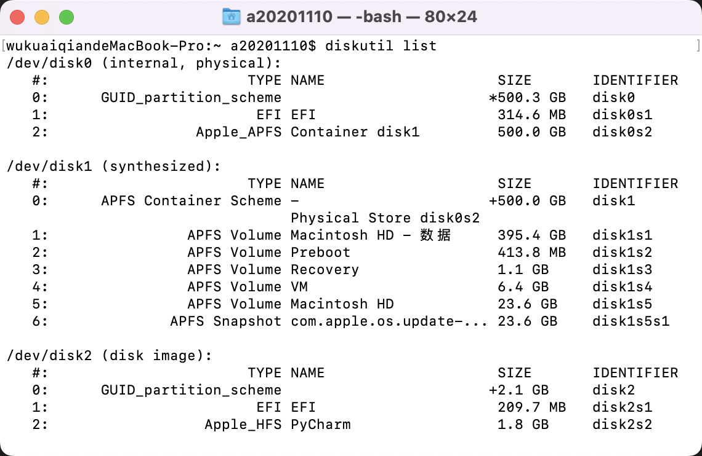
<div>diskutil list</div>
</div>
<br>

`diskutil cs list` 命令会将你的**现有的 Core Storage 逻辑分区状况**显示出来。

<br>

### 常用但有风险的命令 diskutil

- 查看分区上限：`sudo diskutil resizeVolume /dev/disk1s3 limits`
- 重置空间大小：`sudo diskutil resizeVolume /dev/disk1s2 100GB`
- 断开驱动器：`sudo diskutil unmountDisk force /dev/disk1`
- 彻底移除逻辑磁盘：`diskutil unmount /Volumes/Macintosh\ HD`
- 显示 GUID 分区结构：`gpt -r show /dev/disk1`
- 删除 EFI NO NAME；`gpt remove -I 4 /dev/disk1`
- 新增储存区块：`gpt add -I 3 -b 1362424032 -s 1269536 -t 426F6F74-0000-11AA- AA11-00306543ECAC`
- 新增分区：`newfs_hfs -J -v "Recovery HD" /dev/disk0s3`
- 物理 Core Storage 扩容：`diskutil cs resizeDisk 11111111-2222-3333-4444-55555555555555 980g`
- 逻辑 Core Storage 扩容：`diskutil cs resizeVolume 11111111-2222-3333-4444-55555555555555 980g`
  
<br>

### 自动安装 brew

Mac 有个很方便的**包管理器**，名叫 $Homebrew$，它允许你自动安装许多应用。Homebrew 不是 terminal 的自带内容，需要运行这串命令来进行安装：

```
/usr/bin/ruby -e "$(curl -fsSL https://raw.githubusercontent.com/Homebrew/install/master/install)"
```

安装完成后你可以直接使用 `brew cask install 软件英文名` 等命令来快速安装需要的软件。

<br>

### 文件删除 rm

这一指令本是 **删除文件** 用的，但正因为它可以不分敌我的删除任何文件，新手误用有极大风险，因此不详细介绍。
`sudo rm -rfv /Cool` 删除系统文件，从而使整个系统崩溃，这条命令绝对不要尝试。

我们来用前面学到的知识分析一下为什么这句命令会使得系统崩溃。首先 sudo 表示管理员命令并活的最高权限，`rm` 表示删除文件，用 `man rm` 命令查看手册，可以发现 -r 是用来修饰 rm 命令的，表示删除当前工作路径下的全部子文件，-f 也是修饰 rm 命令的，表示无视被保护的文件依旧执行删除。

前文在讲默认路径时提到，打开终端之后默认工作路径正是当前用户的根目录，因此执行 `sudo rm -rfv /Cool` 后，会从根目录开始，无视被保护的文件并删除当前路径下的所有文件及子文件夹，包括系统文件，这样一来系统就废了。

<br>

### 其它命令

当然命令远不止上面所提到的这些，常见的还有 `cp` 复制文件；`mv` 移动文件；`mkdir` 创建目录；`cat` 显示文件内容等等，这里就不再一一介绍了。

每个命令详细的介绍：

<div align=center>
<a href="https://www.cnblogs.com/peida/archive/2012/12/05/2803591.html">每天一个linux命令</a>
</div>
