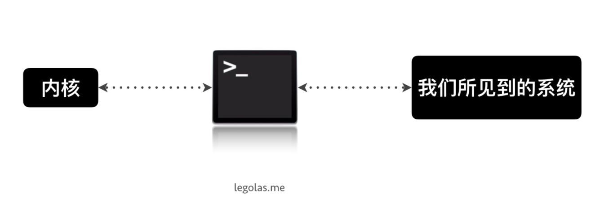
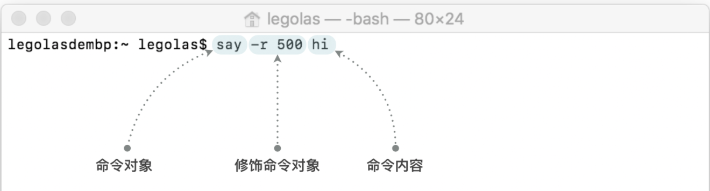
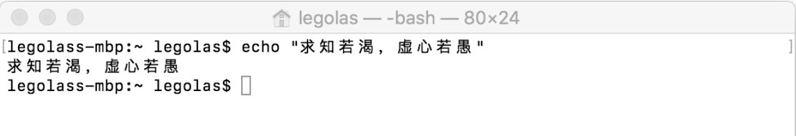

## 什么是终端？

**我们总在说终端中如何操作，那么终端到底是什么呢？为什么它会有这么大的权利**
要说清终端是什么，我们先来看看操作系统的组成。简单来说，**操作系统共分为两个部分，一个部分称作内核，另一个部分称为用户交互界面。** 内核部分负责系统的全部逻辑，由海量命令组成，这一部分是系统运行的命脉，不与用户接触；交互界面则是开机之后所有我们看到的东西，比如窗口、软件、应用程序等等。

那么若我们想对系统内核的某些操作逻辑做出一些修改，应该怎么办呢？ **终端就是连接内核与交互界面的这座桥，** 它允许用户在交互界面上打开一个叫做 「Terminal 终端」的应用程序，在其中输入命令，系统会直接给出反馈。
 
因为终端这座桥，实际允许用户间控制系统内核，也就是系统的大脑，因此它理论上具备控制一切的权利。
 

### 如何打开终端？

**终端是系统中一个应用程序，你可以直接在所有程序中找到它，** 点击打开就行。 或者 `command` + `space` 搜索，输入 「终端」或 「Terminal」, 看到终端被选中了按下回车即可。

### 基础知识

终端启动后，就会进入一个问你要指令的状态，你只需要将指令输入在光标后，按下回车，指令就会被执行。

那什么是命令？ **命令就是你告诉电脑希望它做什么的那句话。** 若我现在希望告诉电脑说 hi, 这句话的命令就是 say hi，就这么简单。

命令由三个部分组成，第一个部分是命令对象，在 say hi 这个命令中，「say」是我们的命令对象，我们希望电脑说话；第二部分是修饰命令对象的关键词，可有可无，若我希望电脑说话时慢一点儿，可以输入 `say -r 500 hi` , 这里的 「-r 500」 则是修饰说话语速的关键词；第三部分是命令内容，这里填写希望电脑说的内容是 「hi」 这句话。

 

命令的组成

 

我们先来尝试让电脑将我们**所打的话复述出来**，这一步的指令是 `echo “想说的话”`，将这句指令复制进终端并回车后，可以看到，它会将我们输入进去的文字再下一行重新打出来。

echo

 

终端运行常常离不开对文件，文件夹的操作。

当你需要使用终端对文件夹进行操作时，终端需要你告诉它，你想要修改的文件在哪里，这时我们需要了解**路径的概念**。系统中的每一个文件都有一个存放位置，这一存放
