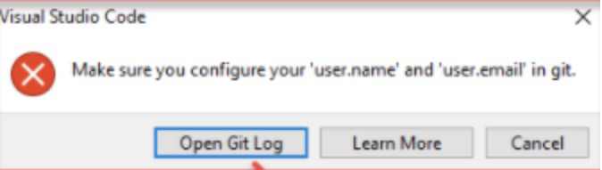

---
# 1. Visual Studio Code 遇见 "Make sure you configure your "user.name" and "user.email" in git."

**遇见的报错**

当git配置不完善时，在commit时会遇见如下报错：

**解决方案**

第一步：进入terminal
第二步：cd 到\Program Files\Git\bin 这个位置，使用如下代码
> cd C:\Program Files\Git\bin

第三步：配置 git config 中 global中的user.email 信息，使用如下代码
> git config --global user.email "your user email"

第四步：配置 git config 中 global中的user.name 信息, 使用如下代码
> git config --global user.name "your user name"

第五步：成功，现在可以使用 commit

---

