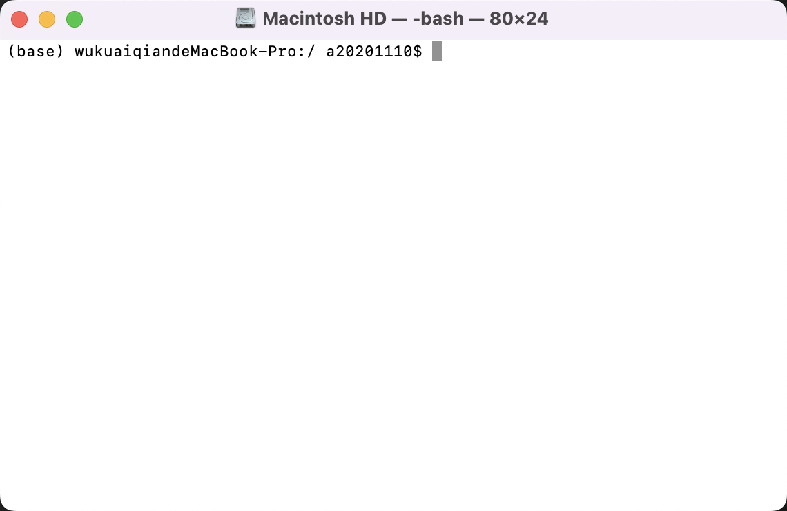

# List


***

### 1. Terminal Python 打包

**安装**
```
python -m pip install XXXX
```

**查看已经安装的包**
```
python -m pip list
```

***

### 2. 去掉Terminal命令行前面base


<div align = center>

</div>

Anaconda自动进入虚拟环境base

新版的Anaconda会在每一个新开的terminal里面自动进入虚拟环境base，解决方法是用conda config命令：

`conda config --set auto_activate_base false`

这条命令使用 `conda config --describe` 查找

你会在其中的描述中看到：
```
# # auto_activate_base (bool)
# #   Automatically activate the base environment during shell
# #   initialization.
# # 
# auto_activate_base: true
```

---


