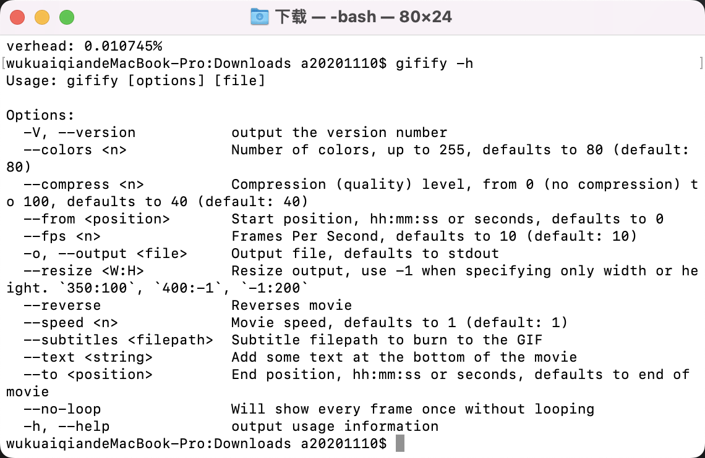

## 怎么在 Mac 上将视频文件转成 gif 文件？

怎么使用 **终端+命令行** 的方式实现 mov/mp4 等其他视频格式转成 gif 文件。

### 安装

在执行转换命令之前，我们得先安装几个软件包。

### Homebrew

首先：

``` {.line-numbers}
xcode-select --install
```
然后
```{.line-numbers}
/usr/bin/ruby -e "$(curl -fsSL https://raw.githubusercontent.com/Homebrew/install/master/install)"
```

### gifify

接下来就是要安装真正的主角了。

首先，安装 Node.js 环境（如果以前已经安装好了，就跳过这步）：
```{.line-numbers}
brew install node
```

其次，安装 FFmpeg

```{.line-numbers}
brew install ffmpeg
```

然后，安装 convert

```{.line-numbers}
brew install imagemagick
```

再安装 giflossy

```{.line-numbers}
brew install giflossy
```

最后安装 gifify
```{.line-numbers}
npm install -g gifify
```
检验是否安装成功，执行
```{.line-numbers}
gifify -h
```

如果没有问题的话，就会出现如下结果：



---

### 简单使用 

进入到你想要转换文件的目录下，执行

```
cd ~/Documents/
```

然后执行

```
gifify ru.mov -o ru.gif
```

### 使用 ffmpeg 转换

- 将视频 MP4 转化为 GIF

```
ffmpeg -i small.mp4 small.gif
```

- 将视频 MP4 指定宽高和帧率转化为 Gif

```
ffmpeg -i small.mp4 -s 414x736 -r 15 small.gif
```

- 将视频中的一部分转换为 Gif

```{.line-numbers}
# 从视频中第二秒开始，截取时长为3秒的片段转化为 gif
ffmpeg -t 3 -ss 00:00:02 -i small.mp4 small-clip.gif
```

- 转化高质量 Gif

```{.line-numbers}
# 默认转化是中等质量模式，若要转化出高质量的 gif，可以修改比特率
ffmpeg -i small.mp4 -b 2048k small.gif
```

- 将 Gif 转化为 MP4

```
ffmpeg -f gif -i animation.gif animation.mp4
```

- 将 Gif 转为其他视频格式

```{.line-numbers}
ffmpeg -f gif -i animation.gif animation.mpeg
ffmpeg -f gif -i animation.gif animation.webm
```
- 加倍速播放视频

```
ffmpeg -i input.mov -filter:v "setpts=0.5*PTS" output.mov
```

- 定义帧率 16fps:

```
ffmpeg -i input.mov -r 16 -filter:v "setpts=0.125*PTS" -an output.mov
```

- 慢倍速播放视频

```
ffmpeg -i input.mov -filter:v "setpts=2.0*PTS" output.mov
```

- 静音视频（移除视频中的音频）

```{.line-numbers}
# -an 就是禁止音频输出
ffmpeg -i input.mov -an mute-output.mov
```

- 视频提取帧

```{.line-numbers}
# 将视频提取10帧
ffmpeg -i index.mp4 -r 10 %03d.jpg;
```

- 主要参数

```{.line-numbers}
-i——设置输入档名。
-f——设置输出格式。
-y——若输出文件已存在时则覆盖文件。
-fs——超过指定的文件大小时则结束转换。
-ss——从指定时间开始转换。
-t从-ss时间开始转换（如-ss 00:00:01.00 -t 00:00:10.00即从00:00:01.00开始到00:00:11.00）。
-title——设置标题。
-timestamp——设置时间戳。
-vsync——增减Frame使影音同步。
视频参数
-b:v——设置视频流量，默认为200Kbit/秒。（单位请引用下方注意事项）
-r——设置帧率值，默认为25。
-s——设置画面的宽与高。
-aspect——设置画面的比例。
-vn——不处理视频，于仅针对声音做处理时使用。
-vcodec( -c:v )——设置视频视频编解码器，未设置时则使用与输入文件相同之编解码器。
声音参数
-b:a——设置每Channel（最近的SVN版为所有Channel的总合）的流量。（单位请引用下方注意事项）
-ar——设置采样率。
-ac——设置声音的Channel数。
-acodec ( -c:a ) ——设置声音编解码器，未设置时与视频相同，使用与输入文件相同之编解码器。
-an——不处理声音，于仅针对视频做处理时使用。
-vol——设置音量大小，256为标准音量。（要设置成两倍音量时则输入512，依此类推。）
```

